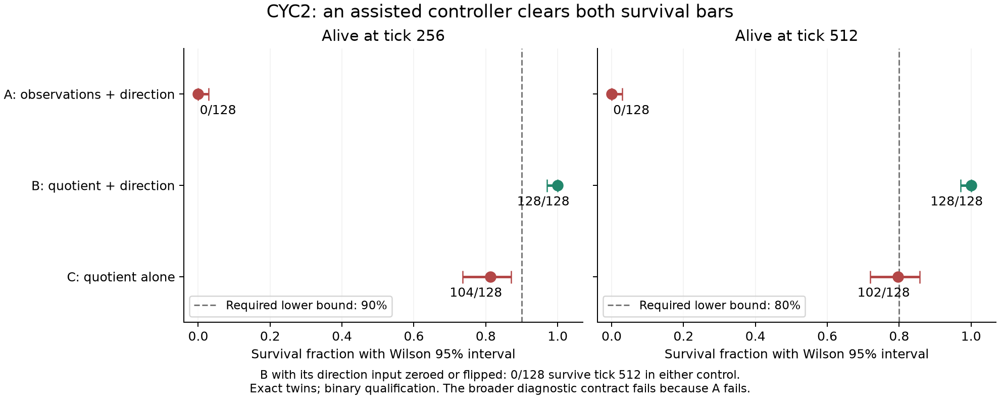

# CYC2: binary eliminations and a working assisted controller

2026-09-07. Complete. **A FAIL; B PASS; C FAIL.** The full preregistered
assistance-repair contract **FAILS** because the learned raw-input positive
control A fails. These are distinct, prespecified decisions. B's functional
pass remains a valid engineering result; it does not retroactively pass the
broader contract or a six-pillar gate.

## Results and decisions

| Condition | Survive 256 | Survive 512 | Wilson95 at 512 | Decision |
|---|---:|---:|---|---|
| A: observations + supplied direction | 0/128 | 0/128 | [0,.02914] | FAIL |
| B: quotient + supplied direction | 128/128 | 128/128 | [.97086,1] | PASS |
| C: quotient alone | 104/128 | 102/128 | [.71901,.85744] | FAIL |
| B: direction input zeroed | 0/128 | 0/128 | [0,.02914] | Acute control |
| B: direction input flipped | 0/128 | 0/128 | [0,.02914] | Acute control |
| Scripted teacher calibration | 128/128 | 128/128 | [.97086,1] | Calibration PASS |

All normal arms require a Wilson95 lower survival bound >=.90 at 256 and >=.80
at 512. Valid arms either clear both or FAIL TO QUALIFY. C's256 interval is
[.73615,.87064], entirely below its required .90; its512 interval crosses .80
but still misses the lower-bound requirement. No UNDECIDED decision or extra
samples result. A also fails decisively, with both upper bounds below the bars.

The two paired B-minus-control survival at 512 differences are each 1.0, empirical
bootstrap95 [1,1]. Every observed world changes from survival to death under
each control. That degenerate resampling interval describes this sample; it
does not imply universal survival or certain effects on every possible world.
The B-normal matched action-flip fractions are .35347 for zero and .46991 for
flipped direction. They are diagnostics, not substitutes for the survival
losses. Zero is outside the training bit values; flipping preserves +/-1 values
but supplies the wrong boundary-memory content. Neither is an emergence test.

The full assistance-repair criterion required A PASS, B PASS, C FAIL and both
acute survival gains clearing .30. A fails, so **the full criterion FAILS**.
We do not delete this requirement after exposure. The experiment therefore
does not isolate missing memory as the sole explanation of the representation
comparison. It does establish that one engineered assisted controller meets
the absolute survival requirements and depends on that assistance in the
registered interventions.

## What we can eliminate, and what remains a hypothesis

1. **Eliminate “this frozen quotient cannot participate in viable control.”**
   B is a constructive counterexample on 128 registered worlds. Preserve its
   checkpoint as a working engineered reference. This says nothing about
   unassisted discovery or universal generalization.
2. **Eliminate the A recipe as a viable learned positive control.** Its
   information is sufficient for the hand-written teacher, but this finite
   supervised learner did not learn a viable controller from it. More visible
   information does not guarantee a particular optimizer will use it.
3. **Eliminate the C recipe as a controller meeting the frozen reliability
   requirements.** Its102 survivors are real, but they do not clear the bars.
   They also argue against describing the unassisted interface as categorically
   incapable of any survival.
4. **Eliminate qualifying cycle occurrence as a sufficient survival criterion.**
   All 128 A episodes cycle, yet all128 die. B also cycles in all 128 and lives;
   the difference must be accounted for by function, not just geometry.
5. **Do not claim that direction information is proven absent from the quotient.**
   Providing an accessible bit can help even if related information is present
   but difficult to use. No direction-decoding impossibility was established.

The concrete fitting defect in A is visible in the frozen full-dataset
confusion table: only 26 of 5843 teacher REGULATE examples are correctly labeled
(0.445% recall), while movement/harvest recalls are 97–99%. Its overall teacher
accuracy 80.87% conceals this missing action class. B has 91.08% overall accuracy
and 89.25% regulation recall; C has 87.53% overall and 86.38% regulation recall.
These diagnostic differences help localize the finite fit; they neither prove
why the optimizer failed nor substitute for measured survival.

Mean ages: A 75.39; B 512; C 428.66; zero-bit 59.34; flipped-bit 56.05. CYC1 and CYC2
differ in training budget, input width/initialization and evaluation worlds;
do not attribute their performance difference solely to extra epochs.

## Design, integrity and authority

The user's instruction to focus on eliminations authorized this fresh bounded
experiment. Protocol `7deecc1` and checked instrument `c73e0b5` were committed
before compute. Every arm used the same 49->64->6 policy architecture, exact
initial tensors, 32768 saved demonstrations, 100 epochs, 6400 optimizer steps,
fixed AdamW and matching minibatch orders. CPU float32, one thread, deterministic
Torch. No best-epoch selection, class weighting, normalization or endpoint rescue.

Direction is explicitly engineered: initialize +1, set +1 at the left boundary,
-1 at the right, otherwise retain it. It reads actual visited boundaries, never
the teacher's future path, and overrides no action. The quotient remains frozen
and keeps its history throughout each lifetime. Evaluation uses 128 shared
worlds from the newly registered 202671000 seed range. Exact twins establish
repeatability of this one initialization, not robustness across independently
trained initializations. The statistical intervals concern worlds for that
fixed fitted policy.

The independent audit passed all 25 checks: unchanged source/artifact hashes,
reloaded exact training/optimizer/logit twins, identical uncompressed evaluation
archives, matched initial parameters, 128 teacher calibration replays, 640 model
episode replays, and 144826 model-episode physical transitions. Every saved
recurrent state, input, logit and action matches recomputation; every physical
energy/integrity balance and transition reconciles. Endpoint rules and both
paired bootstraps recompute exactly. All seven precompute synthetic mechanics
tests passed. Both the run and independent audit exited zero.

The single CYC2 Class E authorization is consumed. There is no automatic extra
cloning, reward variant, seed, decoder, epoch extension, or higher-pillar run.
The prior negative retention closure remains intact. Retaining B as an evidence
artifact does not silently deploy it into Zeus or declare a pillar pass.

## The user's cycle-to-cycle clarification

The user clarified that cycles need not end in a fresh start: nontrivial
information should pass between them. This is compatible with the existing
rollouts. A spatial return does not reset body, resources or recurrent state;
only independent worlds start fresh. The direction controller also carries its
bit between boundary visits, but that is minimal supplied control memory.

The stronger target is **encounter-specific information from cycle n improving
decisions in cycle n+1**, with the same present observation. For example, a
record of which cells were depleted and when they were visited could change
where the agent forages next. The useful content must matter: erasing or
substituting it should remove a direct viability benefit.

`docs/cycle_information_carryover_proposal_20260907.md` records a separate
assay-first design. It requires controlled matched histories, an explicit
observation-limited memory baseline and selective erase/wrong-history controls
before any learner run. It is a proposal, not an executed or automatically
authorized continuation. No CYC2 result is renamed as rich information carryover.

## Six emergence questions

| Question | Grade |
|---|---|
| Designed setup? | Yes: supervised teacher, engineered direction update, policy and world. B is designed engineering. |
| Unprogrammed setpoint? | The sweep target and direction rule were supplied. No emergent setpoint demonstrated. |
| Selection artifact? | All three fixed arms, all worlds and failed controls are published. No best checkpoint/seed selection. Only one initialization, repeated exactly. |
| Theory predicted anyway? | Stateful control and supervised fitting offer ordinary explanations; no new CDT or consciousness inference is needed. |
| Goal-adjacent or substrate-level? | A working assisted action component, not autonomous memory acquisition, retained lineage, authorship or initiative. |
| Survives current audit? | B clears both unchanged survival bars and acute bit removal destroys its success; A/C and the broader repair criterion fail. All integrity checks pass. |

No six-pillar status is promoted by this assisted result. Legible expression,
causal state authorship, selective memory, intrinsic resilience, endogenous
action and unsolicited initiation still require their complete independent
contracts. Functional engineering progress is recorded without imitation or
phenomenological claims.

## Evidence

- Protocol: `docs/cyc2_information_elimination_protocol_20260907.md`.
- Verdict and frozen manifest:
  `zeus_sandbox/universe/reports/cyc2_information_elimination_verdict_20260907.json`.
- Independent audit:
  `zeus_sandbox/universe/reports/cyc2_completion_audit_20260907.json`.
- Local artifacts under `runs/cyc2_20260907/`: all six policy/optimizer/logit
  checkpoints, reconstructed training data, calibration and both complete
  evaluation archives. Every file is hashed in the verdict. Large run evidence
  stays local under the repository's existing ignored-runs convention.
- Working B checkpoint: `runs/cyc2_20260907/twin_a_quotient_direction.pt`;
  canonical final policy SHA256
  `83cedb87f4f187c2896e41ec91339d6701ff6447b2b2b85986656ae008420e0d`.
- Logs: `runs/cyc2_20260907.log` and `runs/cyc2_completion_audit_20260907.log`.
- Static figure is generated from the saved verdict; its layout was inspected.
