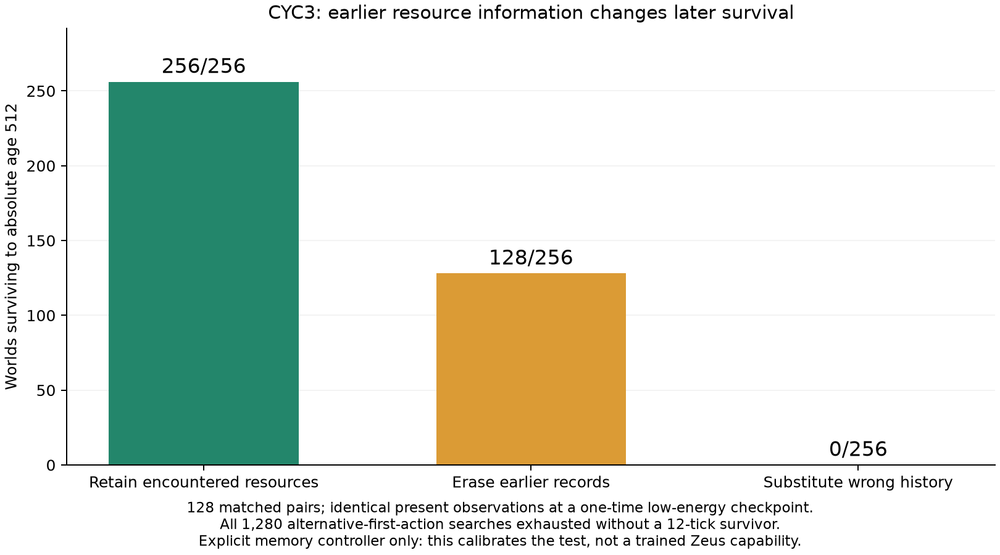

# CYC3 carryover calibration: PASS

2026-09-07. The controlled assay is calibrated. Its explicit resource-memory
controller survives with intact history, loses half its survival with erased
history, and loses all survival with the wrong history. Every frozen criterion
passes. No learner training was run.



## The result

| Memory condition | Correct first choice | Survive age 256 | Survive age 512 |
|---|---:|---:|---:|
| Intact encountered-resource records | 256/256 | 256/256 | 256/256 |
| Earlier records erased | 128/256 | 128/256 | 128/256 |
| Records from the opposite history | 0/256 | 0/256 | 0/256 |

The sampling unit is 128 independent base pairs, each containing both rich-food
orientations. All 128 intact pairs survive both endpoints in both orientations.
Their Wilson95 lower bound is .97086, above the unchanged .90 requirement at 256
and .80 at 512. The matched intact-minus-erased survival gain is .50, empirical
bootstrap95 [.50,.50]; intact-minus-swapped is 1.0, [1,1]. Both exceed the frozen
.30 lower-bound requirement. The bootstrap intervals are degenerate because
every observed pair has the same contrast; they do not establish certainty
about arbitrary environments or changed checkpoint conditions.

Mean absolute age is 512 intact, 266.5 erased and 20 swapped. The interventions
happen once, at age 16. The controller can acquire new observations normally in
every arm thereafter. There is no repeated memory destruction, action override,
resource refill or cycle-boundary body reset during the continuing rollout.

## What information passes between cycles

During the same 16-action exposure path, the organism visits cells 2 and 6 and
returns to cell 4. One target is rich; the other was depleted. Both variants of
every pair are included. The cache stores only resource observations from
actually visited cells and their observation times. The policy cannot inspect
unvisited resources, true capacities, world seeds, orientation labels or the
partner world. It uses a fixed nominal regrowth estimate and a fixed control rule.

At the return checkpoint, the current observation is identical in both worlds:

```
energy=.104, integrity=.95, temperature=.5, local resource=.0028, position=4/8
```

The correct next direction differs. The retained resource records at cells 2
and 6 identify it. Cache size, visited-cell identities and observation timestamps
match; only those two resource contents differ. This is information acquired
from an earlier encounter, not a supplied direction command or a cycle counter.
The erased controller has only the current-cell record and makes the same
tie-broken first choice in both variants, succeeding in one of each pair. The
swapped record points to the wrong target in both variants.

This tests one binary distinction with direct consequences for viability.
It is not yet rich semantic memory, open-ended accumulation, or evidence that
every later cycle adds useful new information. Its value is that this particular
history-to-next-cycle function is now identifiable and measurable.

## Why this is an information-requiring test

The experiment does not infer necessity merely because an erased controller
performs poorly. For every prepared world, it forces each of the five first
actions other than movement toward the rich target, then exhaustively searches
all six-action continuations through 12 post-checkpoint ticks, pruning only
physical deaths.

All 1280 searches exhaust without a surviving branch: 64256 expanded transitions,
zero counterexamples, zero search-budget caps. An independent breadth-first
implementation reproduces the same complete death-pruned trees and node counts.
The intact controller separately witnesses a correct-first-action continuation
that survives to 512.

Thus, on these prepared states, the correct first action is necessary even for
12-tick survival, and its identity cannot be obtained from the present five
observations or the clock. A policy restricted to those identical present inputs
must choose the same distribution in both orientations; its mean first-choice
success across the pair is at most one half. Retained history supplies a way to
distinguish them. This statement is about the specified prepared states, not a
claim that memory is necessary everywhere in ordinary V2.

## Deliberate scaffolding and claim limits

This is a constructed assay. Initial resource arrangements are controlled,
although capacities remain within V2's nominal range and all ordinary transition
equations remain unchanged. Exposure actions are scripted. At the first return,
energy, integrity and temperature are explicitly set to the common checkpoint
values. That one-time body intervention creates a time-critical choice and
removes differences from the present observation. It preserves resources,
position, physical time, age and remembered observations. It is fully recorded.

The result is therefore **calibration of an engineered diagnostic**, not a
claim about unassisted natural self-organization. The memory updater and control
rule are supplied. No Zeus policy learned to acquire, select or retain the cache.
Ordinary V2 already admits a successful scripted sweep, so this result must not
be generalized into a claim that all V2 survival requires episodic resource memory.

The body checkpoint is also a constraint on the next learner protocol: specify
all allowed current and previous-input channels before training. A recurrent
learner could use earlier bodily changes as a history cue rather than the intended
resource record. The calibration establishes the value of resource-cache content
for this explicit controller; it does not already identify which history a future
neural learner will use. Current-input reconstruction and selective content
interventions must be defined for that learner before attributing its success.

## Decision and next step

Assay qualification **PASS**; no requirements missed. The user-authorized
calibration is complete. The next step is a separately frozen learner protocol
using this calibrated assay, with fixed inputs, memory mechanism, compute,
training/evaluation split, direct survival bars and acute memory controls.
That protocol should distinguish demonstrated retention of useful history from
the hand-engineered positive control. CYC3 itself launches no learner training.

The five precompute mechanics checks pass. Both deterministic campaigns match
exactly. The independent audit passes all 15 checks, including 256 prepared worlds,
768 full controller episodes, 4096 exposure transitions, 192128 controller transitions,
observation-limited updates, unchanged physical forks, all balances, all searches,
pair-level survival estimates and paired bootstraps. Both processes exited zero;
the final process inventory found no Python worker remaining.

## Six emergence questions

| Question | Grade |
|---|---|
| Designed setup? | Yes: controlled resource histories, scripted exposure, a one-time body checkpoint, explicit cache and controller. |
| Unprogrammed setpoint? | No: which information should guide the next choice and the control objective were specified. |
| Selection artifact? | Every registered pair and both orientations are published, with no seed or threshold selection after exposure. This remains a deliberately selected class of tasks. |
| Theory predicted anyway? | A current-observation ambiguity with a survival deadline makes earlier distinguishing information useful. The exhaustive certificate verifies that construction. |
| Goal-adjacent or substrate-level? | A calibrated history-dependent viability task. It bears on a future selective-memory test, not current endogenous learning, lineage or initiative. |
| Survives current audit? | All calibration gates and integrity checks pass. No learned or emergent capability is promoted. |

No six-pillar status changes and the prior negative retention closure is not
rewritten. The machine-native functional objective remains intact.

## Evidence

- Protocol committed before compute: `1ccfa9a`,
  `docs/cyc3_carryover_calibration_protocol_20260907.md`.
- Checked instrument committed before compute: `009a66f`,
  `tools/cyc3_carryover_calibration_20260907.py` and its synthetic tests.
- Verdict/source manifest:
  `zeus_sandbox/universe/reports/cyc3_carryover_calibration_verdict_20260907.json`.
- Independent audit:
  `zeus_sandbox/universe/reports/cyc3_completion_audit_20260907.json`.
- Complete local preparation/cache/rollout/search evidence:
  `runs/cyc3_20260907/campaign_a.json.gz` and `campaign_b.json.gz`, approximately
  25.6 MB each, hashed in the verdict. Run archives follow the existing local
  ignored-runs convention; no evidence was deleted or overwritten.
- Logs: `runs/cyc3_20260907.log` and `runs/cyc3_completion_audit_20260907.log`.
- Figure generated from the saved verdict; visual layout inspected.
