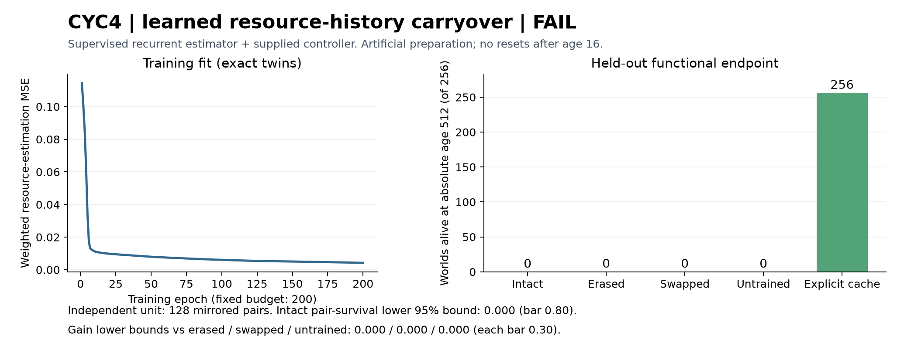

# CYC4 learned carryover review — 2026-09-07

**FAIL TO QUALIFY.** Both training/evaluation twins match exactly and the
independent 17-check audit passes. The learned estimator supports the correct
first choice after the spatial return, but every intact world dies before age
256. This specific cache-distillation recipe is eliminated as a qualified
continuing-survival component. No additional training budget is earned.

## Frozen endpoint

| Memory/controller condition | Correct first action / 256 | Alive at 256 / 256 | Alive at 512 / 256 | Mean absolute death/endpoint age |
|---|---:|---:|---:|---:|
| Learned, intact history | 256 | 0 | 0 | 183.18 |
| Learned, history erased once | 128 | 0 | 0 | 99.28 |
| Learned, opposite history substituted | 0 | 0 | 0 | 20.00 |
| Untrained, intact history | 128 | 0 | 0 | 61.87 |
| Explicit-cache positive control | 256 | 256 | 256 | 512.00 |

Intact survival succeeds on **0/128 pairs** at both horizons: Wilson 95%
interval [0, .02914], lower bound zero, missing the .90/.80 requirements.
All three survival512 gains are zero with bootstrap intervals [0, 0], missing
the .30 requirements. Five scientific requirements fail. The explicit teacher
passes on all 128 training and 256 evaluation worlds; all 1280 alternative-
first-action searches exhaust without a 12-tick survivor or a cap (64256
expanded transitions). The assay remains calibrated on these fresh seeds.

## What the elimination resolves

The diagnostic first-choice result establishes a narrow useful history effect:
intact learned history gives the correct choice in both orientations, erasure
reduces it to one orientation per pair, and donor history reverses it. Current
sensing and the physical world are held fixed. This rules against the claim
that no useful encounter information reached the return boundary in this run.
It does **not** rescue the preregistered whole-lifetime memory qualification.

The continuing resource-estimation/control combination fails. Every neural-arm
death is energy depletion; intact deaths occur at ages 146..229 (median 181).
All intact worlds reach the outer cells, and they complete a mean 1.5 additional
qualifying spatial excursions after preparation. Access to outer food and
cycle occurrence therefore do not establish sustainable operation here.

The final checkpoint's weighted teacher MSE is .00423767; its unweighted MSE
is .00362298 overall and .00351109 after exposure. On intact learner-generated
trajectories, unweighted nominal-resource MSE is .00875486. These distributions
and visited lifetimes differ; the comparison is diagnostic, not a controlled
causal decomposition. The learned estimates cause 5732/42798 decisions to differ
from the explicit-cache rule applied to the learner's same encountered history.

In the final 20 ticks across the 256 intact worlds, harvested energy totals
44.546 against 92.160 basal cost plus 31.556 action cost. Mean total resource
remaining at death is 2.324. The organism runs out of usable energy while food
still exists elsewhere in its world; these totals do not by themselves prove
which alternative route would have saved each late state.

A deterministic upper-median-age saved example (seed 202675019, rich target 2,
death age 187; sorted index 128 of 256) repeatedly moves between cells 0 and 1.
At ages 177, 180, 183 and 186 its learned estimates select LEFT at cell 1 while
the explicit cache selects RIGHT on the same observations/history. It dies with
.589 resource at cell 2. The small local harvests fail to cover expenditure.
This is a concrete estimate-driven routing failure, not a lack of motor actions.
These post-verdict readings have diagnostic authority only and alter no bar.

The next design question is maintaining decision-useful estimates during
continued interaction, including recovery from depleted routes. Any experiment
on decision-weighted learning or learner-generated histories needs a fresh
protocol and authorization; no such training was run or automatically earned.

## Question and scope

CYC3 established an engineered setting where different past encounters require
opposite first actions despite identical current observations. CYC4 tests
whether a learned recurrent resource estimator can replace its explicit cache
while the supplied controller continues to survive. Resource history passes
through a spatial return and persists thereafter; no subsequent cycle resets
the body, resources or neural state.

The learner is a fresh 10-input, 32-hidden GRU with a nine-resource sigmoid
readout. It sees current local resource and one-hot location only. Body energy,
integrity and temperature enter the supplied controller separately, preventing
the memory model from inferring the useful side from preparation energy changes.
No action, time, seed, orientation, previous body readings, explicit cache or
invisible world resources enter the network.

This is supervised cache distillation. The teacher supplies nominal resource
estimate labels; the scripted exploration, spatial encoding, controller rules
and bodily matching intervention are designed components. Neither the motor
policy nor the learning rule is acquired autonomously.

## Frozen experiment

- Protocol committed as `9c09057`, mechanics-tested instrument `64ed6fc` before
  compute. Seven mechanics checks pass. Independent audit and plotting code
  committed as `8cbe708` while training, before endpoint exposure.
- Training: 64 independent base seeds 202674000..202674063, both orientations,
  128 complete teacher sequences of up to 513 observations. Padding, if needed
  following teacher death, is masked and never replaced by new seeds.
- Loss: nine-resource MSE, weight eight on ages 0..16 and one thereafter.
  Full-sequence BPTT, AdamW .001, norm clipping 1.0, batch 16, 200 epochs,
  exactly 1600 updates per twin. Final checkpoint only.
- CPU float32, one thread; Python 3.12.10, PyTorch 2.5.1+cu121, NumPy 2.5.2.
  Exact initial/final weights, optimizer, predictions, losses and complete
  evaluation campaigns must replicate.
- Endpoint: 128 fresh base seeds 202675000..202675127, both orientations, 256
  prepared worlds. Absolute ages 256 and 512 include the 16-tick preparation.
- At age 16, intact keeps its learned history; erased starts hidden zero;
  swapped receives the other orientation's history. Each then consumes the
  same current observation once. Subsequent memory updates are normal.
  The saved untrained network supplies an additional intact-history control.
- Fresh explicit-cache controllers and 1280 exhaustive alternative-first-action
  searches check that the calibrated information requirement still holds.

The independent statistical unit is the base pair. Intact succeeds on a pair
only if both orientations survive. Wilson lower 95% bounds must reach .90 at
256 and .80 at 512. Intact-minus-erased, swapped and untrained survival512
gains each require a paired bootstrap lower 95% bound of at least .30.
Integrity-valid missed bars produce FAIL TO QUALIFY; broken integrity produces
INVALID / STOP. There is no automatic rescue budget or undecided funding state.
Confidence intervals condition on this trained checkpoint and prepared world
distribution. Exact twins test execution reproducibility; they are not
independent optimization seeds and do not establish seed robustness.

## Emergence grading

1. **Designed setup:** yes—scripted exposure, matched low-energy boundary,
   supervised cache targets and fixed controller. Any positive is engineering.
2. **Unprogrammed setpoint:** no—resource estimates and survival requirements
   were selected in advance. Learned weights do not make that setpoint emergent.
3. **Selection artifact:** fresh seeds are unselected within the deliberately
   prepared distribution; both orientations are mandatory. There is no checkpoint
   selection. The distribution itself is task-specific, not natural exploration.
4. **Theory-predicted forcing:** supervised recurrent fitting can produce useful
   state representations. Such a result would confirm engineered function,
   without establishing a special CDT mechanism.
5. **Pillar relevance:** a narrow causal resource-history component could bear
   on future memory work. It does not establish selective inheritance,
   endogenous action, self-authored goals, consciousness or any pillar pass.
6. **Survives its audit:** all 17 integrity checks pass. The narrow first-choice
   effect survives replay, but the registered continuing-survival bars fail.
   No memory qualification, phase reopening or pillar promotion follows.

## Reproducibility and closure

Both processes (registered run and independent completion audit) exited zero.
The audit verifies all training observations/labels/masks, all 1024 neural
episodes, 384 training/fresh teacher episodes, 1280 independently checked
searches, exact physical/input/history/prediction/action replay, source and
artifact hashes, optimizer budget, twin identity and independent statistics.

Initial tensor hash:
`38b80666fe09582a098018daa4d51a0a1313bee3ecf8cdd918c5f4b15d1ddaa7`.
Final tensor hash:
`dc71123a9a618615ec537ab2be090533fcf77f6cfb63cff123d3939b66bf5d97`.
The final epoch loss is .0042448160 in both runs; it is the epoch's online
average, distinct from the final checkpoint's re-evaluated teacher MSE above.

The single CYC4 Class E authorization is consumed and closed. Retain the exact
failed checkpoint and raw evidence for inspection. Eliminate this specified
recipe as a qualified component; do not generalize the failure to all recurrent
memory, longer training, other objectives, or the possibility of carryover.

## Evidence locations

Protocol: `docs/cyc4_learned_carryover_protocol_20260907.md`.
Instrument: `tools/cyc4_learned_carryover_20260907.py`.
Independent audit: `tools/cyc4_completion_audit_20260907.py`.
Large raw data, twin checkpoints and evaluation traces stay in ignored local
`runs/cyc4_20260907`; the committed verdict records their hashes.
Canonical verdict, audit and post-verdict diagnostics:
`zeus_sandbox/universe/reports/cyc4_learned_carryover_verdict_20260907.json`,
`cyc4_completion_audit_20260907.json`, and
`cyc4_failure_diagnostics_20260907.json` in that same reports directory.
