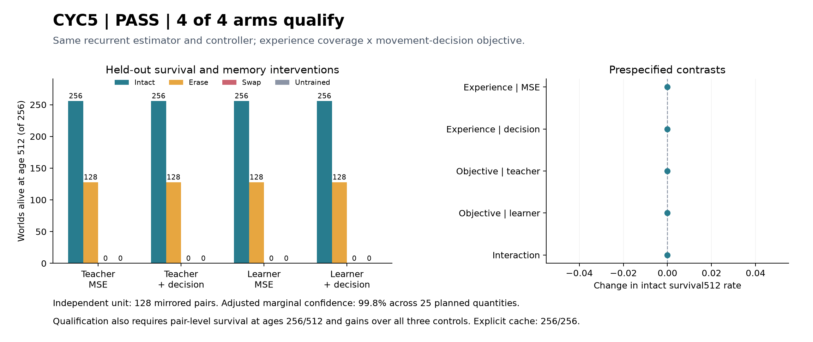

# CYC5 experience and decision-objective elimination — 2026-09-07

Status: **PASS: all four arms qualify.** Exact twins and all17 independent audit
checks pass. The experiment is complete; no automatic follow-up is authorized.

## Functional result

Every arm has the same survival counts at both absolute ages256 and512:

| Arm | Intact | Erased history | Swapped history | Shared untrained |
|---|---:|---:|---:|---:|
| T/M | 256/256 | 128/256 | 0/256 | 0/256 |
| T/D | 256/256 | 128/256 | 0/256 | 0/256 |
| L/M | 256/256 | 128/256 | 0/256 | 0/256 |
| L/D | 256/256 | 128/256 | 0/256 | 0/256 |

Each intact arm succeeds on128/128 mirrored pairs. Its adjusted Wilson lower
bound is0.930574, clearing0.90 at256 and0.80 at512. Paired survival512 gains over
erased, swapped and untrained are0.50,1.00,1.00; the frozen bootstrap intervals
are respectively[.50,.50],[1,1],[1,1], clearing every0.30 lower bar.

All five prespecified factorial contrasts are0, with empirical bootstrap
intervals[0,0]. Neither extra learner experience nor decision loss earns a
demonstrated survival improvement: the teacher-only MSE baseline also reaches
the ceiling. These degenerate empirical intervals do not prove population
equivalence or that the changes have no effect on other tasks or diagnostics.

This eliminates the claim that either addition is necessary for success in this
particular run. It does not explain the difference from CYC4: initialization,
training worlds and held-out worlds all changed between experiments. CYC4's
negative remains valid. CYC5 has one shared initialization, not four independent
initialization replications. Retain the simplest T/M as a qualified engineering
reference within this assay, without claiming a robust general recipe.

The positive is useful learned information carrying forward through continued
behavior. There are no repeated fresh starts at cycle boundaries. The controller,
training supervision and artificial preparation remain supplied by us.

## Question and matched design

CYC4's learned history supported its first resource-dependent choice, yet every
intact world died before256. Its late resource estimates sometimes selected
depleted routes despite food elsewhere. CYC5 tests two possible weaknesses:
training only on successful teacher histories and optimizing average resource
prediction without an explicit movement-decision objective.

| Arm | Experience pool | Training objective |
|---|---|---|
| T/M | Teacher only | Resource MSE |
| T/D | Teacher only | Resource MSE + movement-direction CE |
| L/M | Teacher plus own journeys | Resource MSE |
| L/D | Teacher plus own journeys | Resource MSE + movement-direction CE |

All arms use the same fresh GRU10->32 and sigmoid nine-resource readout, the
same initial tensors, and the same supplied bodily controller. Resource and
one-hot location are the only neural inputs. No bodily history, full resource
field, seed, time, action tape or explicit cache is supplied to the network.
The artificial 16-step exposure and one-time age16 body match are unchanged.
There are no subsequent cycle resets, replenishment interventions or rescues.

Training uses64 fresh base seeds202676000..202676063, both orientations, with
128 teacher histories. All arms receive1600 updates in four400-update stages,
batch16 complete padded histories, CPU float32/one thread per worker, AdamW.001,
full-sequence BPTT, norm clip1.0. Four arm workers may run concurrently; each
performs exact twin A then B. Exact twins verify reproducibility of one fixed
initialization, not robustness across optimization seeds.

Before stages2/3/4, each learner arm collects128 journeys with its own current
checkpoint and appends every trajectory, including failures. Learner pool sizes
are128/256/384/512; teacher pools remain128. The observer labels only resources
actually encountered along that particular path. Collection uses no corrective
actions or invisible world fields. Additional collection cost and different
valid lifetime lengths are explicit; padded training-step budgets are matched.

The resource objective retains weight8 for ages0..16 and weight1 thereafter.
Decision CE applies only to living post-preparation movement decisions; it
penalizes wrong LEFT/RIGHT rankings of predicted off-cell resource scores. It
has coefficient.05 and logit temperature.05. Exposure, terminal, padded and
reflex decisions receive no CE. All controls and supplied rules are unchanged
at evaluation; the teacher only provides training labels.

This is a DAgger-style supervised engineering experiment. Learner actions affect
the histories subsequently labeled for training; no guarantee from the DAgger
theorem is asserted for this finite recipe. Primary reference:
[Ross, Gordon and Bagnell, 2011](https://proceedings.mlr.press/v15/ross11a.html).

## Frozen endpoint and multiplicity

Fresh seeds202677000..202677127, both orientations:128 base pairs/256 worlds.
At age16, intact retains learned history, erased starts hidden zero, and swapped
receives the paired opposite history. All then consume the identical current
observation and continue normally. The shared saved untrained model is an
additional control. Fresh explicit-cache episodes and1280 exhaustive first-
action searches verify the assay independently. Every output is repeated.

For each arm, intact must succeed in both orientations to count as a successful
pair. Lower survival bounds must reach.90 at256 and.80 at512. Each paired
intact-minus-erased/swapped/untrained survival512 lower bound must reach.30.
These20 qualification quantities and five factorial contrasts receive nominal
Bonferroni-adjusted99.8% marginal intervals: Wilson z=Phi^-1(.999), or100000
common pair-bootstrap resamples with linear percentiles.001/.999. Their nominal
family confidence is95%; this is not a guarantee of exact finite-sample coverage.

The five contrasts are L/M-T/M, L/D-T/D, T/D-T/M, L/D-L/M and
L/D-L/M-T/D+T/M, using within-pair mean intact survival512. Positive lower bounds
support an improvement within this fixed design. They do not promote an arm
that misses a required qualification bound. Confidence concerns prepared world
draws conditional on the fixed checkpoint; it is not confidence over all tasks.

## Reproducibility plan and evidence

Protocol31c6301 and eight-test instrument681fadf precede registered compute.
Mechanics cover label provenance, decision masks, corrective gradient, excluded
body channels, current-cell exclusion, history credit and adjusted binary gates.
Independent early replay verified63488 teacher transitions and5612 transitions
in L/M's first collection, before held-out evaluation.

Raw data, initial/stage/final checkpoints, optimizer/loss records, correction
rounds, streamed pair-level evaluation and verdict live in ignored local
`runs/cyc5_20260907`. Canonical reports with artifact hashes are
`zeus_sandbox/universe/reports/cyc5_learning_elimination_verdict_20260907.json`
and `zeus_sandbox/universe/reports/cyc5_completion_audit_20260907.json`.
Sources: `tools/cyc5_learning_elimination_20260907.py`,
`tools/cyc5_completion_audit_20260907.py`, and
`docs/cyc5_learning_elimination_protocol_20260907.md`.

All17 independent checks pass: source/artifact hashes; exact training and
evaluation twins; label provenance and padding; stage-checkpoint collection
replay; optimizer budget; shared initialization; prediction reconstruction;
matched history interventions; complete neural/teacher physics and policy replay;
1280 independently repeated exhaustive searches; adjusted statistics and
consequences. All1280 searches exhaust without a counterexample or cap,64256
expanded transitions. Explicit cache survives all128 training and256 held-out
worlds. Both run and audit exit0. The plot was visually inspected.

The audit replays63488 training-teacher transitions and268928 collected learner
transitions. Per arm it checks126976 intact,63872 erased and1024 swapped
post-preparation transitions. On intact paths, resource MSE is0.007423,0.005499,
0.005782,0.005591 in table order. These differ despite identical survival; lower
estimation error alone is not an additional functional pass.

## Emergence grading and consequences

1. Designed setup: yes—scripted preparation, supplied controller, supervised
   labels and explicit loss. Any positive is an engineering result.
2. Unprogrammed setpoint: not established for the task outcome—the resource
   targets, movement objective and survival bars were specified before training.
   The learned internal encoding was not specified, but this assay does not
   characterize a particular unprescribed organization. A designed setup alone
   does not rule out emergence; learned weights alone do not demonstrate it.
3. Selection artifact: every registered seed/orientation and final checkpoint
   is evaluated; failed journeys are retained. The prepared world distribution
   itself is deliberately selected for a memory-requiring diagnostic task.
4. Theory-predicted forcing: sequential supervised learning can benefit from
   experience coverage and decision objectives. This does not establish a
   special CDT mechanism or autonomous self-organization.
5. Pillar relevance: useful learned carryover would be a component for future
   memory work. No selective inheritance, endogenous action, self-authorship,
   unsolicited initiation, consciousness or higher-pillar pass follows.
6. Audit: PASS, complete training/endpoint replay and all frozen bounds verified.

PASS retains only qualified supervised components and closes this authorization.
All arms FAIL closes this bounded compressed-estimator training route; explicit
addressable memory becomes a future substrate proposal, not an automatic run.
No result reopens an older negative phase or licenses an extra training budget.

Actual consequence: retain all four qualified supervised components; close this
bounded authorization. The all-arms-fail retirement condition did not occur.
