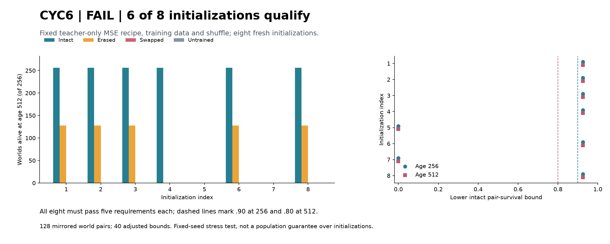

# CYC6: fixed-recipe initialization robustness, 2026-09-07

Status: **FAIL TO QUALIFY: six of eight initializations pass; all eight were
required.** All14 independent audit checks pass. Registered2026-09-07, closed
2026-09-08. No additional training or endpoint tuning was performed.

## Result

Counts below are worlds surviving absolute age512, out of256 per condition.
The intact counts are identical at age256.

| Initialization | Intact | Erased | Swapped | Own untrained | Trial |
|---|---:|---:|---:|---:|---|
| 20261101 | 256 | 128 | 0 | 0 | PASS |
| 20261102 | 256 | 128 | 0 | 0 | PASS |
| 20261103 | 256 | 128 | 0 | 0 | PASS |
| 20261104 | 256 | 0 | 0 | 0 | PASS |
| 20261105 | 0 | 0 | 0 | 0 | FAIL |
| 20261106 | 256 | 128 | 0 | 0 | PASS |
| 20261107 | 0 | 0 | 0 | 0 | FAIL |
| 20261108 | 256 | 128 | 0 | 0 | PASS |

Successful trials have128/128 intact pair successes, adjusted Wilson lower
0.924755674, clearing both survival bars. Their paired intact-minus-control
gains are.50 or1.00, with empirical bootstrap intervals equal to the point,
clearing.30. Both failed trials miss all five requirements. Every training
teacher and all256 fresh explicit teachers survive; all1280 searches exhaust
without a survivor or cap,64256 expanded transitions. The assay remains
calibrated. The overall all-eight decision is FAIL, not an average75% PASS.

The result establishes initialization sensitivity conditional on the fixed
training data, order, architecture and budget. It does not identify the cause
of the older CYC4/CYC5 difference, which also changed world draws. Six successes
remain valid evidence that this architecture/recipe can support useful carryover;
the recipe fails the preregistered reliability requirement.

## Saved-trace diagnosis after the verdict

No new model/world run was used for these diagnostics. All failed intact episodes
were included. Illustrations use the upper median sorted by age, world seed,
orientation, declared in the diagnostic record; they are not handpicked maxima.

* Initialization20261105:128/256 correct first choices; all256 energy deaths.
  Ages21..179, mean90.890625, median83.5. The128 initially correct episodes still
  die between146 and179, median161. The upper-median example dies at146 with
  food elsewhere; five of its final20 choices disagree with the explicit
  encountered-resource cache at the same observation and age.
* Initialization20261107:256/256 correct first choices; all256 energy deaths.
  Ages143..228, mean181.308594, median178.5. Upper-median world202678055/rich2
  dies at182, repeatedly visiting cells0/1 while cell2 holds approximately.478
  resource. Five of the final20 actions differ from the explicit encountered-
  resource cache. Initial memory use succeeds; sustained behavior fails.

The teacher-weighted resource MSE for failed20261107 is.00394194, versus.00402213
for successful20261102. Teacher fit does not reliably rank functional outcomes.
The trace patterns localize a problem in the learned-estimate/controller loop,
but do not isolate a single causal repair or prove representational impossibility.

## Why this test

CYC4 failed sustained survival; CYC5's four variants all passed, including the
simplest teacher-only MSE baseline. CYC5 supplied no evidence that adding learner
experience or decision loss improved survival. Initialization, training draws
and evaluation draws differed between CYC4/CYC5, preventing a causal attribution
of their difference. This experiment isolates fresh initialization conditional
on the successful CYC5 training data and ordering.

We need reproducible useful components to pursue the Zeus goal. Repeating a
training success does not itself establish a self-maintaining system. The bodily
controller, training targets and initial physical preparation are still supplied.
The history intervention occurs at age16: a positive can establish that history
enables entry into a viable trajectory without proving it remains necessary at
every later cycle. No endogenous goal or ongoing memory-renewal claim follows.

## Frozen design

Eight fresh initialization seeds20261101..20261108. Same128 saved CYC5 teacher
sequences and shuffle20261002; each trains exact twins for1600 updates. Unchanged
GRU10->32 and resource readout, local resource/location input, supplied controller,
resource MSE, AdamW and history intervention. Training uses16 runs total,25600
updates. Four hidden CPU workers maximum, one thread each, float32 deterministic.

Fresh128 mirrored evaluation seeds202678000..202678127, two orientations each.
Every trial uses the same worlds and its own untrained checkpoint. Intact,
erased, swapped and untrained trajectories are all repeated exactly. Common
explicit teacher and1280 exhaustive alternative-first-action searches calibrate
the acute information requirement. No endpoint is opened before all training
twins and teacher-data provenance are verified.

Forty quantities receive nominal Bonferroni99.875% marginal intervals: five
requirements for each trial. Intact pair-survival lower bounds must reach.90
at256 and.80 at512; paired intact-minus-each-control survival512 lower bounds
must reach.30. Wilson score intervals and100000 common pair-bootstrap resamples,
PCG64 seed20261109, percentiles.000625/.999375, no tuning.

Overall PASS requires all eight trials to qualify. One valid miss yields FAIL
TO QUALIFY; integrity failure is INVALID. No seed replacement or scientific
early stopping. This tests a fixed set of eight initializations, without claiming
80-percent or universal population reliability. The world bounds are conditional
on trained checkpoints and this prepared distribution.

## Evidence and interpretation

Protocol9c98226, instrumentb931dae and six synthetic mechanics tests precede
registered compute. Tests cover all-eight pass, one-trial failure, own-untrained
gain failure, calibration failure, pair integrity and seed/shuffle isolation.
Large artifacts remain in runs/cyc6_20260907 with source/artifact hashes. The
independent completion audit reconstructs training initialization/labels/budget,
twins, all physical and neural endpoint traces, searches and40 adjusted bounds.

All14 audit checks pass, including eight reconstructed distinct initial states,
exact stage/optimizer/loss/prediction twins, each trial's own untrained control,
all8192 neural endpoint episodes,63488 training-teacher transitions,126976
held-out teacher transitions and1280 independent search certificates. All40
adjusted bounds and the all-eight consequence are independently recomputed.
Training/evaluation and audit processes exit0. The figure was visually inspected.

Canonical files under zeus_sandbox/universe/reports:
`cyc6_initialization_robustness_verdict_20260907.json`,
`cyc6_completion_audit_20260907.json`, and
`cyc6_failure_diagnostics_20260908.json`.

## Emergence checklist and consequence

1. Designed setup: yes, supervised resource estimates and a supplied controller.
2. Unprogrammed setpoint: not established; internal weights are learned but no
   specific emergent internal organization is characterized by this assay.
3. Selection artifact: all eight fixed seeds/final checkpoints and every world
   are reported; training distribution remains selected and fixed explicitly.
4. Theory-predicted forcing: recurrent training may encode useful encounters;
   no special CDT mechanism is tested by varying initialization alone.
5. Pillar relevance: repeatable learned carryover would be a component, without
   selective inheritance, self-authorship, endogenous action or initiative.
6. Audit: PASS, all14 checks and complete independent replay.

PASS retains repeatability on these eight seeds and closes. FAIL rejects this
recipe as reliable under this stress test, preserves individual successes and
closes. Neither buys automatic retuning, new training, a memory replacement,
mouth activation or a higher-pillar experiment. Prior verdicts remain unchanged.

Actual consequence: reject the fixed teacher-only MSE recipe as reliable under
this eight-initialization stress test; preserve six qualified checkpoints and
the earlier CYC5 result without promoting the recipe. Authorization is closed.
The next design question is continuing memory necessity and maintenance, as
described in docs/zeus_continuing_self_maintenance_direction_20260907.md. This
result does not automatically authorize a new assay or another training budget.
