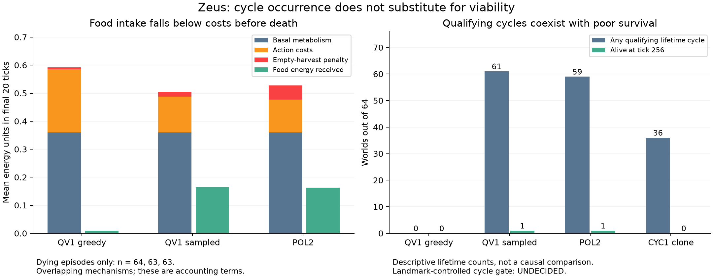

# Cycle hypothesis, death forensics and separate CYC1 representation test

2026-09-07. Execution complete. **CYC-F: UNDECIDED; CYC1: FAIL.**
The physical death mechanisms are localized below. Neither outcome authorizes
cycle-reward training, extra cloning, interface redesign, or a higher pillar.
The prior negative retention closure remains in force.



## What is killing the agents

The instrument replayed 960 saved episodes and recorded 955 death tails. Every
saved observation/transition matched the unchanged world; lifetime energy and
integrity balances reconcile within 1e-12. No model ran or chose new actions
for this analysis. The 12 QV1 arm/split/decoder cells and three POL2/control
cells are all retained in the lossless raw report.

| Held-out condition | Deaths / 64 | Mean age | Terminal failure | No actual movement in final 20, among deaths |
|---|---:|---:|---|---:|
| QV1 inherited, greedy | 64 | 39.42 | Energy:64 | 64/64 |
| QV1 inherited, sampled | 63 | 120.19 | Energy:63 | 0/63 |
| POL2 normal | 63 | 159.89 | Energy:56; integrity:7 | 39/63 |

**Greedy QV1 drains its initial store, then regulates while starving.** Its
local resource first falls below .03 at ticks 2–5, not at death around tick39.
Across the final 20 ticks, 1198/1280 actions (93.59%) are regulation; the other 82
are harvest. Every episode has mostly sub-.03 harvests and no movement. Mean
food energy intake in this window is only .00916, against .36000 basal cost,
.22463 action cost and .00769 empty-harvest penalties: net energy loss .58315.
Only one tail has any thermal damage; integrity is not the terminal failure
in these 64. These facts identify the executed energy-drain mechanism, not the
unmeasured counterfactual value of changing one final action.

The independent D5 reconstruction agrees exactly. Mean lifetime balance is:

```
initial energy                0.72766332
+ harvested energy            0.38747362
- basal metabolism            0.70959375
- action costs                0.25800000
- empty-harvest penalties      0.08709375
- energy lost at clipping     0.02578466
= terminal energy             0.03466479  (viability requires >0.05)
```

The stationary resource-budget defect is structural. Resource renewal happens
**at every cell on every tick, even when the agent does not move**. With cell
capacity at most .8, maximum one-cell renewal energy is
`.8 conversion * .008 renewal * .8 capacity = .00512/tick`, below .018 basal
metabolism even before action costs. Initial food can delay the deficit;
movement accesses other stores and regrowth. This corrects the pasted claim
that renewal requires movement. It does not prove a particular closed orbit
is necessary, or that movement alone suffices.

**Sampled QV1 moves but still cannot balance costs and intake.** Its dying
tails all contain real movement. Mean final 20 intake .16413 remains below
.50467 total energy costs; 41/63 tails have mostly sub-.03 harvests. Motion is
present, yet all 63 recorded deaths are energy failures. Thus greedy immobility
must not be generalized to sampled evaluation.

**POL2 often cycles earlier, then stalls or harvests depleted locations.**
39/63 dying tails have no real movement; 38/63 spend at least half their ticks
regulating; all 63 have mostly sub-.03 harvest attempts. These overlapping
flags are not mutually exclusive diagnoses. Mean final 20 intake .16236 is
below .52762 costs. Integrity loses .040 basal, .10338 starvation and .02230
thermal damage on average, offset by only .01952 repair. At each of the 63
deaths some cell still contains at least .03 food. That is evidence of unused
food, not proof that a safe affordable route remained from the dying state.

## Does cycling predict survival?

The definition was committed at `246a934`, and instrument at `e10c13e`, before
new statistics. It requires returning to a departure cell after >=4 real moves,
spanning >=3 cells, with an away-from-departure harvest >=.03. It excludes
standing still, wall-clamped actions, one-way travel and two-cell shuttles.
Synthetic detector checks passed. This remains a diagnostic analysis of
previously exposed outcomes, not a fresh confirmatory trial.

The primary landmark is tick64. Exposure is a completed closure by 64; outcome
is survival at 256. Comparison needs >=8 viable bodies in each exposure group
within each supported condition, including POL2 and at least one QV1 condition.

| Condition at landmark 64 | Noncycling, alive | Cycling, alive | Comparison supported? |
|---|---:|---:|---|
| Each of three greedy QV1 arms | 0 | 0 | No |
| Inherited sampled | 6 | 49 | No |
| Reset sampled | 9 | 49 | Yes |
| Fresh sampled | 7 | 50 | No |
| POL2 | 0 | 59 | No |

Only reset-sampled QV1 has support: cycle-minus-noncycle survival difference
.04082, bootstrap95 [0,.10417]. It does not identify the registered joint
question; POL2 has no noncycling landmark survivors. **UNDECIDED** is the
required verdict. The32- and128-tick sensitivities also lack identification.
No cycle-training proposal is earned and no cycle-reward arm was launched.
Sparse/nonoverlapping groups do not falsify the hypothesis.

Lifetime counts are descriptive only: 61/64 inherited sampled QV1 episodes
and59/64 POL2 episodes cycle, while each condition has only1/64 survival at 256.
This refutes using occurrence of these qualifying cycles as a sufficient
viability criterion. It does not estimate a causal effect of cycling: lifetime
exposure favors bodies that live long enough to cycle, and policy differences
cannot stand in for a matched intervention.

CYC0 remains a reported scripted feasibility witness. The teacher makes local
threshold decisions and retains direction; the greedy oracle has privileged
world access. CYC0 does not isolate learnability from representation,
observability, optimization, reward/credit assignment or distribution shift.
The earlier "pure learning failure" wording was stronger than the evidence.

## CYC1: the separately authorized representation test

The user explicitly included CYC1. The uncommitted draft was replaced by the
protocol committed at `d2140a8`, then the checked instrument at `84961c2`, before
registered compute. The draft's relaxed32/64 bar and architectural-incapacity
inference were discarded. No registered data were used in mechanics tests.
A dictionary/OrderedDict comparison defect was found and fixed by those tests
before launch; there was no endpoint hotfix.

The frozen QV0R quotient feeds the original 48-input policy interface. Only the
fresh policy learns:64 teacher worlds, 32768 pairs, 20 CE epochs, fixed AdamW and
seeds, deterministic CPU, sequential independent twins. The teacher is taught
explicitly; this is not cycle discovery. QV1's previously exposed evaluation
worlds remain held out from this training but are not an untouched benchmark.

Calibration on these same 64 worlds: teacher 64/64 survival at 256 and512; fixed
rest, fixed harvest and uniform random each 0/64 at both horizons. The teacher
and stationary controls meet the preregistered calibration rule.

| Required CYC1 measure | Result | 95% interval | Required lower bound | Clears? |
|---|---:|---:|---:|---|
| Survival256 | 0/64 | [0,.05662] | .90 | No |
| Survival512 | 0/64 | [0,.05662] | .80 | No |
| Executed movement fraction | .20599 | [.17858,.23013] | .10 | Yes |
| Matched zero-quotient action flips | .52083 | [.47949,.55595] | .20 | Yes |

Wilson intervals use 64 worlds; movement/flips use 10000 whole-world bootstrap
draws. Full training data, teacher traces, initial/final tensors, optimizer
state, training rows and all normal/zero/shuffle evaluation traces match
exactly between twins. Parent tensors remain frozen. Final policy canonical
SHA256: `3e80c0e61c805b40789a8f29a0387c394425d39677b78956b5379817ec6138cb`.

The normal clone lives a mean 73.5 ticks (range 30–141); all 64 die of energy
failure. 36/64 complete qualifying cycles. Zero-quotient mean age 23.16 and
shuffled-quotient 41.14 are diagnostic; neither survives 256. Matched shuffle
flips are .57568,95% [.54935,.60056]. All paired survival differences at 256/512
are zero. More movement, local state sensitivity, or age cannot rescue the
failed survival bars. Epoch 20 loss .82638 and online training accuracy 66.26%
are training diagnostics, not held-out function.

**CYC1 FAIL means this finite cloning recipe did not demonstrate viable
representation.** It does not prove the quotient/interface cannot represent a
successful controller. Optimization, information loss, teacher label ambiguity,
class imbalance and off-teacher trajectory shift remain unresolved alternatives.
No extra epoch, decoder, seed, threshold, redesign or discovery run follows.
Its single Class E authorization is consumed and closed.

## Mandatory emergence grading and ultimate goal

| Question | CYC-F / death analysis | CYC1 |
|---|---|---|
| Designed setup? | Designed simulator and prespecified measurement; accounting is not emergence. | Explicit teacher, CE loss and policy interface: designed engineering. |
| Unprogrammed setpoint? | No new self-maintained functional target demonstrated. | Target actions were supplied by the teacher; no viable target achieved. |
| Selection artifact? | All saved cells retained; dying tails and landmark survivors deliberately conditioned. Sparse support disclosed. | All registered 64 evaluation worlds retained; prior benchmark exposure disclosed, no result selection. |
| Theory predicted anyway? | Energy/resource equations predict depletion; cycle geometry adds no theorem about mind. | Finite supervised fit and action sensitivity do not imply discovery; no functional positive to promote. |
| Goal-adjacent or substrate-level? | Localizes failed control, bears diagnostically on endogenous action only. | Tests a taught control component, without lineage, initiative or authorship evidence. |
| Survives current audit? | Balances/replay pass; cycle gate remains UNDECIDED. | Exact twins/calibration pass; unchanged survival bars FAIL. |

No pillar changes status: legible expression, causal state authorship,
selective memory, intrinsic resilience, endogenous action and unsolicited
initiation receive no qualifying positive from these results. No imitation
score counts toward the machine-native six-pillar objective; no phenomenological
claim is licensed. Completing this bounded investigation does not complete
that ultimate research goal.

## Evidence and verification

- Lossless per-episode forensic report:
  `zeus_sandbox/universe/reports/cycle_forensics_20260907.json.gz`.
- Committed CYC1 verdict/source manifest:
  `zeus_sandbox/universe/reports/cyc1_representation_verdict_20260907.json`.
- Local CYC1 evidence under `runs/cyc1_20260907/`: both 17.1 MB tensor/data/teacher
  artifacts, both full evaluation archives, calibration archive and manifest.
  Every file is hashed in the verdict; large run artifacts remain local under
  the existing ignored-runs convention. Logs: `runs/cyc1_20260907.log` and
  `runs/cycle_forensics_20260907.log`.
- Independent audit:
  `zeus_sandbox/universe/reports/cycle_completion_audit_20260907.json`.
  All 18 checks pass, including fresh reload identity, 512 saved-action replays,
  960 lifetime balances,955 death tails, source integrity and bootstrap
  recomputation. Four synthetic CYC1 mechanics tests also pass.
- Static plot generated only from saved evidence by
  `tools/plot_cycle_forensics_20260907.py`; visual layout inspected.

Both registered processes exited zero. No additional training was authorized
by either endpoint. The remaining uncertainty is a research result, not
unfinished execution of this investigation.
