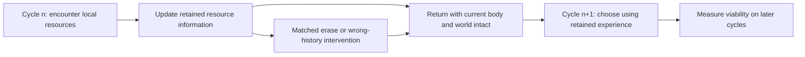

# Cycle-to-cycle information carryover: next diagnostic design

Status: proposal only, not an executed experiment or continuation authorization.
This records the user's clarification while the already frozen CYC2 runs:
"The cycles doesn't mean everything should end and cycle again from fresh.
We could do something that cycle to cycle non-trivial information passes?"

The intended object is a continuing organism whose trajectory returns to a
location while its internal organization retains useful experience. Returning
to a location does not require internal state, resources or knowledge to return
to their previous values. Recurrent state already persists throughout each
QV1/CYC1/CYC2 lifetime. It resets between independent worlds, not at detected
cycle boundaries. Persistence alone has not established useful carryover.

## The functional claim to isolate

Experience acquired during cycle n changes decisions during cycle n+1 in a
way that improves direct viability. The information must describe something
encountered, rather than just a supplied direction, fixed periodic action tape,
cycle counter, or elapsed clock. A representative candidate is which visited
cells were depleted and how long they have had to regrow.

The essential counterfactual is: with the present bodily observation held
fixed, changing only the retained record of earlier encounters changes the
appropriate later decision. Erasing or swapping that record must remove its
functional benefit. A changed hidden vector or decodable bit is insufficient.

## Build the measurement before another learner

The current cycling data cannot answer this question reliably: for example,
all viable POL2 bodies at the registered landmark already cycled. A new assay
must produce a controlled memory comparison instead of hoping observed groups
will provide one after the fact.

First specify paired history/world preparations with the same current five
observations at a cycle boundary but different previously encountered resource
conditions that imply different useful next choices. Hidden resource conditions
must be counterbalanced across locations and independent of clock, direction,
seed index or trial order. Define the preparations prospectively; do not search
for favorable post hoc pairs. Any body-state matching intervention is an
explicit artificial diagnostic preparation, not a natural self-organization
claim. The ordinary world transition equations should stay unchanged.

Before model training, calibrate this assay with an explicit observation-based
resource cache: it can record only cells it has actually visited, with visit
times, and cannot read unvisited resources. Compare intact, erased and swapped
caches while keeping physical worlds and present observations matched. This
controller is an engineered positive control. It must demonstrate that this
assay has a useful history-dependent solution and that the specified memory
interventions remove the benefit. If it cannot, retire the assay design before
spending a learner-training budget. Do not blame Zeus for an uncalibrated task.

There is no assertion yet that this precise paired preparation exists with
adequate viability margins in V2. Establishing that is the next design gate;
the current protocol does not invent a success result or authorize new worlds.

## Learner comparison, only after a fully registered assay

At a defined return boundary, fork the same physical world into matched arms:

1. Retain the candidate information across cycles.
2. Erase that information at the boundary while reconstructing the same current
   sensory input; do not confound lost memory with removing current sensing.
3. Replace it with another trial's wrong history, matched on current observation,
   memory size and timing. This asks whether the content matters.

Fresh-start or no-carryover training can provide a separate matched learning
control. It must not replace the acute same-controller interventions above.
If a proposed intervention changes other state functions, record that limit
and redesign the assay before running; random state damage is not selective
memory erasure. Preserve the real body, resource field and physical time in
all arms. No automatic reset at a cycle boundary.

Keep direct survival requirements at least as strict as the existing 256/512
bars. Freeze horizon, cycle-boundary selection, world and training seeds,
initialization replicates, samples, required paired survival gains, uncertainty
and complete stopping rules before compute. Do not choose thresholds in this
proposal without calibrating the assay. Use prospective binary qualification:
all bounds clear -> PASS; any miss -> FAIL TO QUALIFY and stop the named route.
Invalid execution is recorded separately; it cannot become a functional result.

## What a result would and would not mean

A calibrated intact-memory survival pass with the specified acute losses would
support useful information passing between cycles in this substrate. It would
be more informative than recurrence or a direction bit. An engineered cache
pass establishes only the measurement's positive control. A learned pass would
still need separate evidence about selection, retention, inheritance and
self-organization; it would not by itself reopen the six-pillar roadmap.

This proposal purchases no training. CYC2 remains the fixed information-access
comparison already authorized, with its own binary outcomes. Carryover is a
distinct mechanism question, not a post-result renaming of CYC2.
