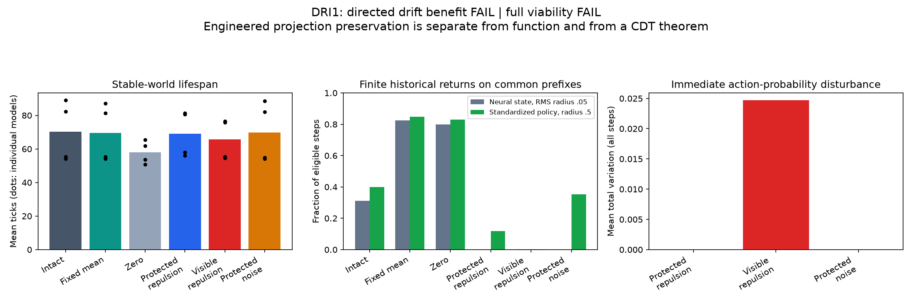

# DRI1: CDT intervention result and diagnosis — 2026-09-10

**Directed drift benefit FAIL; full viability FAIL.** The intervention substantially
changed finite neural-state recurrence, but did not improve survival over intact
recurrence or matched protected noise. All1,536 unique evaluation lifetimes failed
the1,024-step horizon. Two exact runs give3,072 total lifetimes and203,474 world
steps. The independent audit passed all101,737 unique transitions and exact twin
trace/result identities. There was no training or post-exposure parameter adjustment.

## What CDT element was applied

The canonical theory emphasizes drift location relative to a declared projection.
DRI1 used the actual centred action-logit map pi(h)=Wc*h, rank5 in a32-unit state.
It pushed the state away from older states in the27-dimensional null space, preserving
immediate action probabilities. Controls placed the same-sized repulsion inside the
policy row space or replaced directed repulsion with protected random impulses.
Intact, development-fitted mean-state and zero-state controls completed the comparison.

This was an engineered mechanism, not learned self-repulsion or endogenous initiative.
The model continued through its real world; neither cycles nor impulses reset the
body or resources. The intervention's64-state history buffer was not a learned memory
system. Its state, energy and compute costs were not included in the body energy budget;
no efficiency claim is made from the assisted arm.

## The intervention worked as specified

The independent NumPy calculation reproduced every controlled update and action
within the frozen tolerance. Across protected repulsion and protected noise, maximum
immediate centred-logit leakage was3.21e-9 and maximum action-probability TV was1.31e-7,
below the1e-6 limit. Active impulses had RMS0.05. Row-space repulsion visibly disturbed
current probabilities (mean TV about0.0247 in stable worlds). Model weights were fixed.

This establishes correct placement of the intervention. It is not a discovery that
null-space perturbations preserve their defining linear projection; that was engineered
and mathematically expected. The empirical questions concern what happens afterward.

## Finite geometry changed sharply

Historical return fractions on matched prefixes, stable worlds:

| Arm | Neural-coordinate return | Policy-projection return |
|---|---:|---:|
| Intact | 31.12% | 39.93% |
| Fixed mean incoming state | 82.54% | 84.77% |
| Zero incoming state | 80.00% | 82.86% |
| Protected self-repulsion | 0.014% | 11.91% |
| Visible self-repulsion | 0.151% | 0.110% |
| Protected random impulses | 0% | 35.21% |

These use the predeclared lag8, neural RMS radius0.05 and standardized policy radius0.5.
Each six-arm comparison has the same prefix, capped at64; stable prefixes span35–64
steps, mean50.77. Changing prefixes span27–64, mean50.20. All have eligible comparisons;
65,262 eligible arm-steps are recorded across both conditions.

Protected drift permits a finite fine/projected separation much more clearly than
visible drift. But protected self-repulsion also reduces projected returns from39.93%
to11.91%. Preserving the current projection does not preserve its future trajectory:
the recurrent update mixes the altered coordinates back into action-relevant ones.
Protected random impulses preserve more of the projected return rate (35.21%) while
removing measured fine returns. Directed repulsion is not uniquely responsible for
this separation, and is less benign for the projection than its noise control here.

Changing-world patterns are similar: fine returns0% versus projected10.04% for
protected repulsion;0.234%/0.120% for visible repulsion;0%/34.39% for protected noise.
These finite patterns show drift-location effects, not indefinite structural recurrence.

Anchored neural returns are zero in every arm on these prefixes, despite substantial
historical returns in several arms. The two estimands must remain separate. Zero is
an event floor at this horizon and radius, not a transience proof. The initial state
also includes an episode-start transient. Fine-cell counts at32 steps were already
31.93/32 distinct in intact stable trajectories, versus32 with protected repulsion:
this occupancy instrument is nearly saturated and adds little evidence about novelty.

## Survival did not improve

All means below pool four models by32 worlds. No arm has a full-horizon survivor.

| Arm | Stable mean lifespan | Changing mean lifespan |
|---|---:|---:|
| Intact | 70.20 | 65.45 |
| Fixed mean state | 69.49 | 66.61 |
| Zero state | 57.93 | 57.19 |
| Protected self-repulsion | 69.03 | 66.59 |
| Visible self-repulsion | 65.64 | 72.21 |
| Protected random impulses | 69.91 | 64.59 |

The primary stable comparison gives protected repulsion minus intact -1.16 ticks
(registered interval[-9.77,3.04]); against protected noise -0.88 ([-9.44,3.34]).
Alive256 advantages are0 and-0.00781 respectively. These clearly miss the conjunctive
registered requirements of a10-tick mean gain and0.10 alive256 gain with positive
lower bounds. No detected benefit is not a general proof of harm or equivalence.

Protected repulsion beats visible repulsion by3.39 ticks in the prespecified stable
comparison, interval[0.19,7.57]. This is a narrower diagnostic and cannot rescue either
gate. The changing-condition means reverse that ordering (visible72.21, protected66.59),
so do not claim a general functional advantage from hidden placement. Different action
sampling seeds are used across conditions; most bodies never encounter a quality change.
Only two visible-repulsion lifetimes reach a first reversal; no other arm reaches one.
This is insufficient evidence of useful revision.

Protected noise produces an action tape exactly identical to intact in200/256 paired
lifetimes across conditions, despite eliminating the measured fine-state returns.
That is a particularly clear warning: large geometric change can coexist with very
little behavioral change and no viability improvement.

## The mean-state control changes the interpretation of prior history gains

Unlike the earlier same-stream probe, this is a live functional comparison on fresh
worlds. Means were fixed from development-only final-model replay before the endpoint.
The mean arm retains the current observation and previous action, but cannot carry
an evolving recurrent history from one decision to the next.

Fixed mean minus intact lifespan is-0.70 ticks stable (diagnostic interval[-3.28,1.26])
and+1.16 changing ([-2.95,5.95]). Zero minus intact is-12.27 stable ([-28.33,-1.73])
and-8.26 changing ([-16.52,-1.21]). The fixed mean's complete action tape matches intact
in108/256 lifetimes; similar mean performance does not require identical trajectories.

Thus an evolving-history advantage beyond a constant operating state was not detected
on this assay. The prior zero-state penalty cannot by itself establish useful retained
information. It also removed the model's usual operating point. This supports an
operating-bias interpretation of much of the earlier small gain.

This was not a preregistered equivalence test: the intervals do not prove equivalence,
and all arms fail at long survival. It does not prove that memory is unnecessary for
Zeus, that every state coordinate is inert, or that no task could benefit from history.
It does identify a concrete confound and improves the control we should use next.

## What the experiment establishes about CDT

It is finite simulation/intervention evidence for the importance of drift location
relative to a meaningful, predeclared policy projection. It also shows that generic
protected noise can produce the geometric separation without improved function.

It does not establish full-system transience, a divergent projected Green sum,
Markov closure, a heat-kernel model or a spectral dimension. The full process includes
body, resources, intervention history and RNG state, not only h. No infinite-time
claim follows from these short bounded lifetimes. Neural recurrence, projected
recurrence and survival are measured separately, as the canonical theory requires.
The CDT theorem is neither proved nor refuted for Zeus by this result.

In practical terms, we preserved a weak action structure and altered the surrounding
state dynamics. That did not turn it into a competent feeding policy. I would close
this particular fixed-amplitude repulsion recipe, rather than tune it on this endpoint.
The next substantive target remains consequence-sensitive control. A future CDT-guided
projection should have independently demonstrated functional value; neither mere
recurrence nor the ability to preserve an existing weak policy supplies that value.
The retired QV1 frozen quotient bridge is not reopened by this recommendation.

## Evidence and verification

Protocol and frozen source commit7e862e5; canonical theory hash and all parent/preparation
identities are in the manifest. Five new qualification tests passed before the run.
The audit independently calculates projection/repulsion, model outputs, sampled actions,
physical balances, sensors, masks, rewards, episode coverage and binary decisions;
exact twins agree. It shares Torch/model definitions and the deterministic preparation
routine, whose replay is verified. Every frozen source and theory hash still matches.

Post-hoc diagnostics use the registered radii/prefix rules and separately labelled
lifespan intervals (seed202908001). Action/inspection totals and all1,536 episode lengths
join to the audited summaries. The three-panel plot was visually inspected. No further
training, world experiment, amplitude sweep or threshold change was performed.

Raw evidence: runs/dri1_20260910. Compact audited, diagnostic and identity artifacts:
zeus_sandbox/universe/reports/dri1_*_20260910.json. No six-pillar promotion or
phenomenological claim is made.
