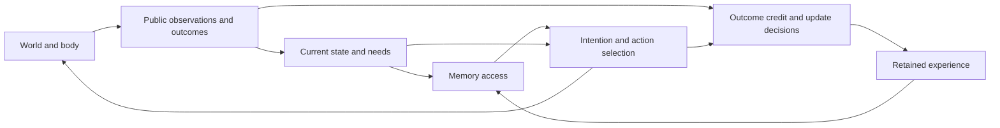

# Encephalon: fruit-fly-inspired organization for Zeus

Phase plan, 2026-09-19. Named Encephalon by the user, who subsequently authorized
its initiation. The first implementation and calibration checkpoint is
[E0-A](encephalon_e0_protocol_20260919.md), with an explicit
[state and credit contract](encephalon_state_and_credit_contract_20260919.md).
LMB6 remains paused. Numerical proposals below become binding only in a
prospective protocol committed before the corresponding experiment; the plan
does not itself change a frozen verdict or establish a capability result.

**First completed checkpoint:** [E0-A independently PASSes](encephalon_e0_review_20260919.md)
its measuring-world calibration, with 12 neural/instrument mechanics checks.
This is not learned-agent qualification. The
[E1 training handoff](encephalon_e1_training_design_draft_20260919.md) identifies
the remaining campaign preparation before fitting.

## Destination

**Build a continuing agent whose bodily needs regulate its use of experience,
whose own actions acquire that experience, and whose outcomes change what it
remembers and does next. Demonstrate that this organization helps it remain
functional when its circumstances change.**

In plain language: Zeus should find out what it needs to know, use that knowledge
when it matters, correct itself when the world changes, and keep operating without
someone choosing its next activity. Its experience should accumulate across
meaningful cycles instead of being reconstructed by our experiment script.

Encephalon's endpoint is a causally demonstrated adaptive controller in a declared
virtual environment. It is a substantial foundation for the full Zeus goal, not
a replacement definition of that goal. Legible expression, the full six-pillar
battery and the live human session remain explicit obligations afterward.

### Language boundary

E0–E6 use structured sensory observations and non-linguistic actions. They do not
train or qualify language comprehension, language generation or conversational
ability. An observer translating internal telemetry into words is not evidence
that Zeus has produced or authored those words.

The state/interface contract should preserve access to the operative state,
retained experience and action history for a later expression mechanism. That
later stage must demonstrate grounded language, raw free-run legibility and
fixed-history causal attribution to the functioning agent, while checking that
communication and self-maintenance coexist. A working controller does not prove
that a language module can simply be attached without further learning or testing.
Language remains a separate, explicit program obligation after Encephalon.

## Starting position and the biological lead

The current lineage already has a protected store, a learned memory gate and a
recurrent actor. LCM5 qualified a reader in its declared setup. LBT2/LMB5 did not
qualify the intended inherited-memory operation, and LMT1 failed long maintenance.
LMB6 is prepared but paused. Encephalon inherits useful instruments and lessons;
it does not inherit a capability verdict or require old weights.
See the [roadmap](zeus_remaining_problems_20260912.md),
[native acquisition boundary](native_acquisition_boundary_notes_20260913.md), and
[research evidence note](fruit_fly_connectome_research_notes_20260919.md).

Four findings motivate the proposal:

- Internal state can regulate expression of already acquired memories
  ([Senapati et al.](https://doi.org/10.1038/s41593-019-0515-z)).
- Memory compartments differ in acquisition, retention and revision dynamics
  ([Aso and Rubin](https://doi.org/10.7554/eLife.16135)).
- Structured persistent dynamics can coexist with learned sensory calibration
  ([Fisher et al.](https://doi.org/10.1038/s41586-019-1772-4)).
- Memory output participates in feedback to learning circuits and connections
  toward navigation and action systems
  ([Li et al.](https://doi.org/10.7554/eLife.62576)).

These are biological motivations for engineering hypotheses. They do not establish
the cause of Zeus's failures. The central proposal is coordination between
specialized processes, with the simplest successful implementation preferred.

## Proposed organization

Introduce these interfaces in a small, functioning loop early. Later stages earn
claims about the interfaces rather than assembling separately qualified modules
only at the end.

| Process | Affordance we engineer | What must be learned or demonstrated |
|---|---|---|
| Current state and needs | Public body sensors, sensory correction, persistent state and explicit update timing | Useful state estimates that stay responsive to current evidence while retaining relevant history |
| Experience storage | Finite capacity, public provenance, protected contents between declared updates | What to encode, retain, replace and revise; protection alone earns no selectivity claim |
| Memory access | A route by which needs and context can affect retrieval or memory influence | Appropriate content-dependent action across competing needs |
| Intention and action | A common action interface, optional persistent intention, real action costs | Which activity to start, sustain, interrupt and replace |
| Outcome credit | Access to experienced consequences and declared temporal credit mechanisms | Earlier information gathering and writes improve later choices |
| Selective adaptation | Bounded plastic state and candidate update timescales | Useful revision without destroying unrelated useful experience |

This is a functional diagram, not a gradient graph or a literal fly circuit.
Use a ring only for a genuinely periodic variable. The present bounded line world
does not require a compass ring. Sparse expansion, distinct update timescales and
an explicit intention state are candidates, not mandatory decorations. CDT and
adaptive dimensionality remain optional hypotheses when a measured problem
justifies them.

## Causal boundaries that apply to every stage

1. **Environment versus agent.** The world determines physics, costs and available
   observations. The agent chooses actions. No hidden safe-site label, private
   world state, seed, future event or evaluator annotation enters the policy.
   A public-observation reference controller calibrates feasibility; it never
   silently supplies evaluation actions or emergency rescues.
2. **Current need versus remembered content.** A changed need can change which
   memory is used without changing the stored fact. Test storage, access and
   downstream action separately. Need alone cannot identify an unknown resource.
3. **Physical feedback versus learning credit.** An action changing the next
   observation closes a physical loop. It does not prove that a later outcome can
   train the earlier action, retrieval or write. Every intended learning route
   gets its own credit audit, including detach and truncation boundaries.
4. **Training versus operation.** Offline optimization may learn base parameters
   and update rules. During held-out operation, base parameters remain fixed;
   only preregistered recurrent state, memory, eligibility traces or plastic
   synapses may change. These adaptive quantities are logged and treated as
   organism state. No analyst runs an optimizer on the test results.
5. **Engineered affordance versus observed organization.** Label fixed rules,
   explicitly taught behavior and unprescribed patterns separately. Viability
   rewards and architecture are engineered. Their existence does not disqualify
   emergent organization inside them, or establish it automatically.
6. **Intervention versus architectural necessity.** Acute disruption identifies
   dependence in the trained agent and can create unfamiliar states. Separately
   trained, matched controls test whether a proposed mechanism adds value.
   Neither alone establishes that every successful agent needs that mechanism.
7. **Cycle versus reset.** Ordinary activity cycles do not reset the agent.
   Logging windows and save/load boundaries preserve all declared state. A
   separate successor-body experiment resets only its named components and
   receives actual acquired memory. Death is terminal for that lifetime; a
   successor's success cannot be counted as uninterrupted survival.

## Stages and their exit expectations

### E0 — Specify the organism and qualify the measuring world

**Plain language:** Make sure the setting genuinely rewards remembering,
prioritizing and repairing, and make clear what Zeus is allowed to know and change.

**Technical work:** Adapt the audited small world into the minimum environment
with two competing needs, multiple learnable facts, costly inspection, finite
storage, and stable as well as changing conditions. Energy/food and wear/repair
are the starting pair. Preserve a bounded geometry initially. Specify every
observation, action, state variable, learning route, reset and resource cost.

**Causal tests:** Public reference policies establish that survival is achievable.
Disabling effective repair must matter in repair-dependent conditions; forgetting
must matter in information-scarce conditions; a stale map must be disadvantaged
after an unannounced change. Stable worlds must reward preserving valid facts.
Include fixed-route and reactive baselines to expose shortcuts. If public
reinspection makes memory unnecessary everywhere, the memory ruler is inadequate.

**Exit:** A frozen environment/information contract, complete forward and learning
graphs, calibrated controls, numerical gates, data roles, compute budget and
failure rules. This is instrument qualification, not an agent achievement.

### E1 — Establish a small working body-control loop

**Plain language:** Zeus must reliably act on its present condition and sustain
itself before we attribute more elaborate organization to it.

**Technical work:** Build a fresh, small agent with the interfaces above and train
on its own trajectories in a fully observable qualification setting. Begin with
fixed resource facts. Use an explicitly documented viability objective; do not
award action-specific bonuses merely for pressing INSPECT or MAINTAIN. Keep a
simple recurrent controller as the matched baseline.

**Causal tests:** Trace sampled action to physical transition and returned public
observation. Change an action and replay its consequences. Verify intended losses
reach their trainable modules, then verify updates change subsequent behavior.
Contrast intact sensory correction with declared controls; inspect failures
across initial needs, including low-energy starts and repair demands.

**Exit:** Raw policy actions sustain operation across the registered basic need
conditions with valid physical accounting. Current-state correction is useful
only if its comparison supports that claim. A competent reactive baseline is a
valid result and a demanding reference for later memory claims.

**Boundary:** This earns a body-control prerequisite. It does not establish
selective memory, initiative, or learning from delayed experience.

### E2 — Make memory influence action according to need

**Plain language:** Knowing where food is should matter when energy is scarce;
knowing how to repair should matter when damage is the urgent problem.

**Technical work:** Isolate retrieval and action coordination using explicitly
supplied, provenance-labelled memories at first. Cross memory content with actual
body need while holding the external scene and available facts matched. Compare
need-conditioned memory access with fixed access and a simpler joint controller,
using matched information, capacity and training budgets.

**Causal tests:** Exchange valid memory contents, erase them, and block or shuffle
their access route. In natural valid bodies, changing needs should change which
content appropriately affects action. Separately clamp the internal need signal
to localize its influence; treat this sensor/state mismatch as a diagnostic.
Execute resulting policies over trajectories: an immediate action flip is not a
survival result. Wrong-content donors must be plausible and differ in the target
fact rather than arbitrary corruption.

**Exit:** Content and need jointly influence appropriate actions, with a
registered functional benefit in the conditions that require this interaction.
If an ungated controller does equally well, retain the simpler mechanism and
reject the claim that an explicit gate was necessary.

**Boundary:** Supplied knowledge proves a use pathway only. Its acquisition is
not authored by the agent; need modulation need not itself emerge unprescribed.

### E3 — Acquire experience through its own actions and close delayed credit

**Plain language:** Remove the supplied answers. Zeus must decide to investigate,
pay for doing so, and later benefit from what it actually discovered.

**Technical work:** Begin with no prepared task-specific memory. Let the policy
choose inspection and storage actions. Carry its actual resulting state forward.
During training, connect later consequences to earlier acquisition and write
decisions through a declared learning mechanism. Use policy-gradient credit for
discrete decisions or another explicitly justified estimator; differentiation
through the physical simulator is not required.

**Causal tests:** Audit gradients or eligibility/advantage credit at the intended
earlier decisions, including across the declared delay. Disable that credit route
in a matched training control. Disable writes before acquisition in a separate
control; freezing an already useful memory is not equivalent. Compare actual
experience with acute erasure, content exchange and trained forgetting. Allow
reinspection and charge its real costs. Acquisition deaths remain in denominators.

**Exit:** Self-selected acquisition creates retained information that improves
later function; the declared delayed learning route works and has its claimed
training effect. A nonzero gradient alone cannot pass this stage. If a route is
detached at a boundary, no across-boundary credit claim is allowed.

**Boundary:** Choosing an inspection and benefiting from it is bounded causal
authorship. It is not yet utility-based retention of competing experiences.

### E4 — Select, consolidate and revise without wiping useful history

**Plain language:** Zeus should keep what matters, replace what becomes wrong,
and avoid losing everything else when learning something new.

**Technical work:** Introduce more facts than available storage, irrelevant recent
events, contradictory evidence and changes affecting only part of the world.
Compare selective updates and multiple timescales with a uniform-update memory
at matched capacity. Any sparse addressing scheme receives a separate comparison
when addressing interference is the measured bottleneck.

**Causal tests:** Compare learned retention with quantity-matched random, recency
and forgetting controls. Freeze revision after acquisition to isolate adaptation;
erase everything to expose the cost of indiscriminate replacement. Intervene on
specific retained facts and test their later use. Evaluate changed and unchanged
facts together in both stable and changing worlds. Measure utility independently;
an evaluator must not select the agent's memories using future test outcomes.

**Exit:** The agent's selection and revision improve later function under limited
storage while preserving still-useful knowledge. Repeated recovery of this
behavior after further changes is required. Multiple timescales earn a separate
mechanistic claim only if their matched comparison supports it.

**Boundary:** Protected addresses, low representation overlap and readable
contents are measurements of machinery, not selective-memory completion.

### E5 — Initiate useful activity and recover through its own control

**Plain language:** Zeus should investigate uncertainty or prepare a repair before
failure, then adapt when its usual actions stop working as expected.

**Technical work:** Vary actuator effectiveness, resource availability and damage
within calibrated recoverable ranges. Test a learned action-consequence predictor
and persistent intention where justified. Provide ordinary observations and
experienced outcomes, not a message announcing which disturbance occurred.
Use stable matched contexts to measure needless inspection and repair too.

**Causal tests:** Hold current urgency and external scene matched while changing
relevant acquired history. Test whether expected future need changes activity
onset appropriately. Compare intact memory/forecast/commitment with registered
interventions and a trained reactive controller. Disabling useful repair must
remove recovery in the calibrated repair cases. The world may deliver a
disturbance; it must not deliver the compensating action or reset the controller.

**Exit:** The agent initiates appropriate, beneficial investigations or maintenance
without action prompts, and recovers through its permitted activity across the
declared disturbances. Repeatable internal rhythms or state changes alone do
not satisfy this gate. Capability prediction must change useful behavior, not
merely achieve low prediction error.

Define activity onset separately from the policy's ordinary execution clock.
Calling the policy every tick is infrastructure, not evidence of initiation.

**Boundary:** This is evidence for bounded initiation, resilience and endogenous
prioritization. The needs and overall objective were still supplied by us.

### E6 — Demonstrate the integrated lifetime and retained continuity

**Plain language:** The same Zeus must do all of this together for a sustained
period, and useful experience must genuinely carry into later cycles.

**Technical work:** Freeze one complete candidate and its controls. Run independent
lineages on fresh combinations of needs, facts, changes and actuator conditions,
with declared longer delays and horizons. All memory is acquired by the agent;
no helper reconstructs a prepared store. Preserve actual state at ordinary cycle
boundaries and verify exact save/load continuation. Separately test successor-body
inheritance using the preceding acquisition's actual selected memory.

**Causal tests:** Apply the registered component and route interventions to this
integrated candidate, with matched trained controls where architectural claims
are made. Verify content-specific benefits, selective revision, recovery and
activity initiation in the same operating architecture. Distinguish loss caused
by a nonspecific destructive intervention from loss of the targeted information.
For successors compare intact transfer, erasure, wrong-content transfer, disabled
earlier writes and matched trained forgetting; publish acquisition and successor
outcomes separately as well as the full lineage outcome.

**Exit:** All required capabilities and functional contrasts pass together, with
independent replay/audit and the full negative-result ledger. A collection of
passes from incompatible checkpoints cannot be combined into Encephalon PASS.

## Numerical contract, decision rules and stopping

The following are **proposed starting bars for E0 to calibrate**, not measurements
or already frozen thresholds:

| Item | Proposed contract |
|---|---|
| Final replication | Eight independent training initializations; exact deterministic repeats verify reproducibility and do not double the independent sample count. |
| Sustained function | At least 90% survival through 4,096 active steps in every registered final lineage/regime cell, with repair actually necessary in its designated cells. Passing this finite horizon does not mean indefinite survival. |
| Required memory/selection benefit | In the designated information-limited families, the lower simultaneous 95% confidence bound for the primary survival contrast exceeds 5 percentage points against each required control. |
| Adaptation and initiation | Freeze recovery deadlines, unchanged-fact performance floors, useful activity-onset contrasts and unnecessary-action cost limits from independent world calibration. These cannot remain unspecified at launch. |
| Data and budget | Freeze training, development, calibration and held-out families, per-cell body counts, update budgets, horizon, checkpoint selection and maximum compute before agent fitting. Exposed test families are retired from confirmation. |

E0 must establish that the proposed margins are measurable and attainable by
public references within the available budget, using simulations or references
separate from learner selection. If they are not, revise the prospective design
openly before training and retain the reason. Do not lower them after seeing a
learner's endpoint. Sampling precision and power determine final cell counts.

Use lineage-clustered paired analysis with separate environment and policy random
streams and registered simultaneous intervals for the primary contrasts. Ticks,
repeated readouts and deterministic twins are not independent replicates. Report
every lineage and required regime; aggregate success cannot hide a failed required
cell. Costs and decoder accuracy are secondary: they cannot rescue a failed
survival-memory claim. Any different primary utility requires its own prospective
definition, not a post-hoc metric substitution.

- **PASS:** Valid evidence meets every registered requirement for the named claim.
- **FAIL:** Valid evidence misses any required bar within the declared budget.
  A wide interval fails the claim for this experiment; it does not prove absence.
- **VOID:** An integrity defect prevents the declared test from being interpreted.
  Preserve the artifact and defect. Instrument invalidity is not biological or
  model incapability, and it does not authorize relabelling a failure.

Keep capability qualification separate from mechanism attribution. A simpler
controller may qualify while a biological analogy fails its comparison. Freeze
candidate-selection priority before testing; do not select a flattering
explanation afterward.

Each stage has bounded development, one frozen confirmation campaign and a full
diagnosis on failure. Allow at most one materially justified successor campaign
per stage under a fresh protocol and fresh evidence. A second failure triggers
a design review before further experiments. Do not hide extra attempts in seed,
reward, threshold or horizon sweeps. Tests that isolate one route are followed
by a short integrated check before expanding the environment.

## What Encephalon completion buys, and what remains

The collective endpoint is **one reproducible system that acquires, selects,
uses, revises and carries forward experience while coordinating competing needs
and maintaining itself through its own consequential actions**. The claim is
limited to its declared world and disturbances.

| Zeus obligation | Encephalon contribution | Still required for the full program |
|---|---|---|
| Selective memory | Complete acquisition → selection → consolidation → useful later use/inheritance, with forgetting/content controls | Broader transfer beyond the declared environment |
| Causal state authorship | Agent-selected actions and writes causally shape later internal state and useful action outputs | Authorship of a future legible expression route |
| Intrinsic resilience | Sustained maintenance and recovery through the agent's own control | Generalization to additional declared disturbances |
| Endogenous consequential action | Need- and history-dependent priorities with actual physical consequences | Wider integrated six-pillar evaluation |
| Unsolicited initiation | Appropriate useful activity onset without an activity-selecting prompt or scheduler | Generalization and the full registered initiation battery |
| Legible expression | Inspectable traces can explain our measurements | A genuinely new grounded expression mechanism, raw free-run qualification, and the live human session; an analyst's dashboard is not the agent speaking |

No phase result establishes subjective experience. The existing failed mouth is
not reopened by this planning document. The full goal in the
[program charter](retention_phase_charter.md) remains intact.

## Discovery stays open throughout

Maintain two distinct records: required functional claims and unexpected observed
properties. Admit small, neutral or harmful patterns to the discovery record
without requiring immediate utility. Record source identities, reproducibility,
conditions, imposed mechanisms, directly taught targets, unspecified features,
causal evidence and alternative explanations using the
[affordance classification](emergence_affordance_classification_20260913.md).

For example, a stable intention, spontaneous useful alternation between activities,
an unexpected memory partition, a persistent internal timescale or history-specific
anticipation could merit investigation. These are examples of what to notice,
not training targets or predictions that they will occur. New discoveries earn a
separate diagnosis or fresh experiment, not an altered gate in an exposed one.

## First implementation checkpoint

The first authorized work package is **E0 plus the smallest E1 loop**:
write the state/observation/action and learning-credit contracts; calibrate
the smallest environment that distinguishes the intended claims; choose and
freeze the baseline, candidate and budgets; then build and qualify the complete
small loop. Prioritize need-dependent memory use next. Add differentiated
plasticity only when its stage has a measurable comparison.

Reuse the physical accountant, replay instruments and useful test infrastructure
where their assumptions still hold. Revalidate them for changed equations and
interfaces. Keep Encephalon sources and manifests separate from LMB6; the paused
campaign and all closed failures remain unchanged.
