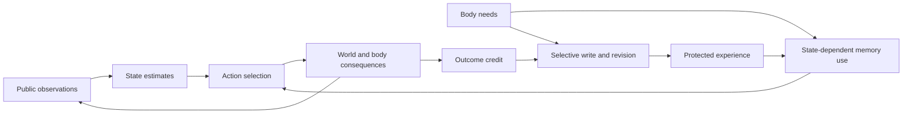

# Fruit-fly circuit organization: evidence and implications for Zeus

Research note, 2026-09-19. The user paused LMB6 to reconsider architecture using
the adult Drosophila connectome. This note neither resumes the campaign nor
changes its frozen sources, thresholds or permissions. No new mechanism is built.
Biological findings motivate hypotheses; they do not diagnose Zeus by analogy.

## Main assessment

The evidence favors specialized representations coordinated by structured
recurrence, feedback, selective plasticity and internal-state modulation.
It does not support four isolated modules as a sufficient brain blueprint.
For Zeus, the most relevant new question is how bodily need changes the influence
of retained information on action, and how experienced outcomes selectively
change future memory use and writing. This is an engineering inference.

The user's engineering/emergence distinction remains appropriate. Supplying an
affordance does not disqualify organization that develops within it. Nevertheless,
prescribed controllers and teacher targets must be identified separately from
unprescribed representations, strategies and measured functional contributions.

## Access and evidence method

Undermind was used for bibliographic lookup, semantic search, full-text questions
and a completed broader search. Elicit was attempted but returned
`api_access_denied`: the connected account's plan does not provide API access.
No Elicit-generated findings are attributed here.

The [Undermind search](https://app.undermind.ai/projects/fbf82008-a5d5-4404-88c2-b4b5a42054aa?path=/Fruit%20fly%20circuit%20organization%20and%20adaptive%20behavior)
returned261 relevant papers. This is a discovery collection, not261 fully reviewed
papers or a systematic-review completeness claim. Its summary uses abstracts and
metadata. The entries below distinguish original-paper evidence from inference.

Full-text extraction was obtained for twelve papers: Dorkenwald, Green, Mussells
Pires, Westeinde, Lin2014, Aso, Dolan, Shiu, Senapati, Tsao, Fisher and Li. Key claims and limitations
were additionally checked in publisher HTML, including Hulse's central-complex
paper. Undermind's Lin2024 PDF reading failed twice; the quantitative network
statement below was checked against published-paper search excerpts, not a
successfully read PDF. Connector extraction is a reading aid: Tsao's upstream
connections were overstated by the extractor, and the primary discussion's
qualification is preserved below. Undermind's Pir22/Wes22 keys retain2022 metadata;
the PDFs and journal DOIs identify the published2024 papers.

## What the connectome establishes

**Anatomy.** Dorkenwald et al. reconstructed139,255 neurons and approximately54.5
million chemical synapses from one adult female brain, including central brain
and optic lobes. This is a structural snapshot, not a measurement of synaptic
efficacy, learning rules or moment-to-moment computation. Electrical synapses,
important extrasynaptic signaling and the complete body/VNC are outside its
scope. The paper's traversal analysis is not a measurement of physiological
latency. [Paper](https://doi.org/10.1038/s41586-024-07558-y), Fig.1 and information-
flow analysis/limitations.

**Integration.** Lin et al. report93.3% of neurons in one strongly connected
component: directed paths connect every pair within that component. This supports
extensive network recurrence, not equal communication strength, globally shared
activity, consciousness or an optimal architecture. Hulse et al. describe multiple
levels of recurrence within and across central-complex structures, including
feedback through regions outside the CX. Functional roles assigned to many of
those motifs remain hypotheses.
[Network analysis](https://doi.org/10.1038/s41586-024-07968-y), Fig.1;
[CX connectome](https://doi.org/10.7554/eLife.66039), Fig.2, Figs.56–58 and discussion.

## Circuit findings and transfer limits

| Circuit/process | Evidence from flies | Engineering hypothesis and limit |
|---|---|---|
| Persistent heading | Green et al. identify shifted recurrent connections and velocity-related activity. Blocking P-EN output impairs heading tracking; localized activation shifts the represented heading. Error accumulates in darkness and visual landmarks correct it. | Structured dynamics can preserve and update a meaningful variable. A biological ring is not noiseless, constant-energy or indefinitely accurate by construction. Use circular geometry for periodic variables, not automatically for every internal state. [Green2017](https://doi.org/10.1038/nature22343), Figs.2,4,5 and extended data. |
| Heading-to-action conversion | Mussells Pires et al. relate EPG heading, FC2 goal and PFL3 steering. FC2 activation imposes directions; PFL3 activation/silencing changes steering and memory-guided navigation. | Separate estimates of current and desired state from their motor conversion. The model uses shifted population inputs and nonlinear responses; literal Cartesian vector subtraction is an abstraction. Goal selection and action execution remain different problems. [Mussells Pires2024](https://doi.org/10.1038/s41586-023-07006-3), Figs.2,4–6. |
| Steering gain | Westeinde et al. distinguish PFL3 directional correction and PFL2 recruitment for large deviations. Physiology and perturbations support complementary control roles. | Commitment/gain and steering direction can be separately represented. The proposed gain/salience model does not demonstrate a universal crisis override or explain how every goal is chosen. [Westeinde2024](https://doi.org/10.1038/s41586-024-07039-2), Figs.2–5. |
| Sparse sensory coding | Blocking KC–APL feedback increases response overlap and impairs discrimination of similar odors more than dissimilar ones. | Sparse expansion and feedback inhibition are useful addressing hypotheses. Literal top-k, exactly5% activity, immutable keys and zero interference are not established biological guarantees. [Lin2014](https://doi.org/10.1038/nn.3660), Figs.3–5,7. |
| Selective memory updates | Aso and Rubin manipulate identified DANs and odor/reinforcement timing. Compartments differ in acquisition, retention, extinction and updating. Timing can reverse the behavioral valence induced through one DAN type. | Test different credit/update rules for different traces. A uniform reward scalar plus a single decay rate does not capture these findings. Observed changes in conditioned behavior do not universally prove physical deletion of an engram. [Aso2016](https://doi.org/10.7554/eLife.16135), Figs.1–3,5. |
| Learned–innate convergence | Dolan et al. identify LH neurons receiving both sensory and MBON inputs. Silencing affects particular innate attractions and learned recall; their conditioned-odor responses change after training. | Parallel pathways can converge before action. This demonstrates learned influence on LH activity, not the precise location of every plastic synapse. It contradicts an isolated, wholly learning-independent LH controller. [Dolan2018](https://doi.org/10.1016/j.neuron.2018.08.037), Figs.3–7. |

## The strongest new lead: need-dependent use of memory

Senapati et al. identify neuropeptide/DAN mechanisms regulating expression of
water- and sugar-associated memories according to deprivation state. Test-phase
manipulations can permit or suppress the corresponding learned behavior; competing
modulators help select the relevant response. This is stronger evidence for
state-dependent memory use than inferring it from wiring alone. It is not proof
of a generic survival guarantee. Some communication is proposed to operate via
volume transmission, illustrating why a chemical-synapse graph is incomplete.
[Senapati2019](https://doi.org/10.1038/s41593-019-0515-z), Figs.2–5 and discussion.

Tsao et al. show that mushroom-body circuits also participate in hunger-driven
innate food seeking. KC/MBON/DAN perturbations can impair seeking in hungry flies
or promote it in fed flies. Receptor manipulations implicate several state signals,
but the paper explicitly says that identifying upstream neurons and establishing
their functional connections and receptor localization requires further work.
Do not upgrade this to a completely mapped direct pathway.
[Tsao2018](https://doi.org/10.7554/eLife.35264), Figs.2,3,7,10,11 and discussion.

**Zeus inference:** possessing a resource fact, expressing that fact through a
decoder, and letting it control an urgent action are separable achievements.
State-dependent memory access and action competition are therefore justified
design candidates. These fly results do not prove that a missing equivalent is
Zeus's failure cause, or that a threshold-triggered action bypass is the solution.

## Structure and learning interact inside the specialized circuits

Fisher et al. observe experience-dependent reorganization of visual inputs to
compass neurons and persistent changes in their reference frame after altered
visual experience. Specific receptive-field changes are observed; the exact
associative synaptic-depression rule is a proposed explanation. This makes the
transfer hypothesis more interesting than an immutable ring: persistent dynamics
can coexist with learned calibration of what those dynamics mean.
[Fisher2019](https://doi.org/10.1038/s41586-019-1772-4), Figs.4,5 and discussion.

Li et al.'s mushroom-body connectome identifies MBON-to-DAN feedback within and
across compartments, routes linking memory outputs to central-complex and
descending systems, and structure in sensory sampling. Thus fixed uniform random
hashing is a useful engineering approximation to investigate, not a literal
description of every MB input. Suggested critic-like learning roles for particular
feedback motifs are connectivity-derived hypotheses in this paper. Their
existence does not mean that biological learning implements backpropagation.
[Li2020](https://doi.org/10.7554/eLife.62576), Figs.13,14,19,20,25,26 and discussion.

## What the connectome-based simulation adds

Shiu et al. use connectome-derived weights, predicted transmitter signs and a
leaky integrate-and-fire model to make experimentally tested feeding/grooming
predictions. There is no task-specific optimization of every connection, but a
global synaptic-strength parameter is calibrated. The paper reports91% agreement
across164 tested predictions, dropping to84% when a screen dominated by negative
responses is excluded. It omits internal-state regulation, long-range peptides,
gap junctions and realistic basal firing. This demonstrates substantial structural
constraint on selected sensorimotor functions; it is not an autonomous lifetime
or online-learning demonstration. Fixed synapses also do not, by themselves,
rule out transient memory in recurrent activity.
[Shiu2024](https://doi.org/10.1038/s41586-024-07763-9), Figs.1–5, discussion and methods.

## Corrections needed when connecting these papers to Zeus

1. **LBT2's immediate failure is a learned preference, not just sampling noise.**
   The recorded diagnosis has512/512 third-decision argmaxes equal to WAIT at
   energy.12, after every body reaches the safe patch. Greedy selection would
   choose WAIT at those readings. Changing urgency must affect preference or its
   inputs, not merely sampling temperature. See
   [LBT2 review](lbt2_review_20260913.md).
2. **A state intervention is not an attractor diagnosis.** The LMB5 probe shows an
   immediate causal contribution of accumulated state to WAIT preferences, with
   a substantial parent-specific exception. No counterfactual action was executed;
   sustained recovery was not tested. See
   [probe review](lmb5_interior_state_probe_review_20260913.md).
3. **Current Zeus is already partly differentiated.** `NativeBodyAgent` has a
   protected slow store, frozen quality reader, fast recurrence and learned
   reinstatement gate. The question is the adequacy of their learning rules and
   interactions, not simply whether any modules or gates exist.
4. **LCM1's cue decay is not proof of online parameter drift.** The documented
   probe concerns repeated slow-state transformations and loss of cue separation.
   It does not establish that successive optimizer updates changed stored keys
   during those probe transitions. See
   [LCM1 diagnosis](lcm1_development_diagnosis_20260912.md).
5. **The present lifetime world is a bounded line.** Position updates in
   `core/lifetime_world_v2.py` clamp integer positions0..4; they do not wrap around
   a circular track. Navigation abstractions should match that geometry.
6. **Neither fixed random projection nor sparsity guarantees useful memory.**
   Fixed projection preserves addressing only relative to stable input features;
   changing upstream representations can still move keys. Identical observations
   under partial observability still need history to distinguish situations.
   Random k-of-D masks have expected overlap k²/D, not zero. These are mathematical
   and engineering qualifications, not new observations from Zeus.

## Research direction to discuss before implementing

Prioritize the interaction between body-state estimates, protected experience,
state-dependent readout and action selection. Then study whether outcomes regulate
local memory updates on multiple timescales. Add variable-specific geometry where
the task supports it. Keep the controller's learned content and goal choice
distinguishable from any engineered transforms, protection rules or fallback acts.

The following is a proposed dependency diagram, not a literal fly circuit or a
claim that Zeus currently closes every learning link:

A future comparison should independently vary internal need, memory content and
its access route under matched observations and histories. Check whether changing
need changes the *appropriate content-dependent action*, whether that matters
over a full trajectory, and whether learning remains possible when circumstances
reverse. A parallel hardcoded controller, if tested, must have a separate causal
attribution. These are proposed questions, not an unfrozen extension of LMB6.

The user subsequently named this direction **Encephalon**. Its proposed phases,
causal boundaries, technical/plain-language expectations and collective endpoint
are recorded in the [Encephalon plan](encephalon_phase_plan_20260919.md).
This remains planning; LMB6 is paused and no new experiment has launched.
