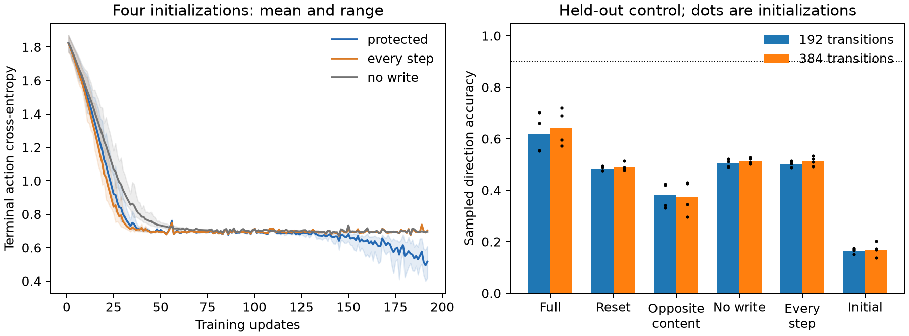

# LCM2: retained information passes; reliable inherited action fails

**Audited qualification FAIL.** The failure is binary under the frozen contract:
no survival integration is earned. Within that failed result, protected storage
and learned quality recall pass both registered lengths. Measurable content-dependent
action benefit also appears, but falls short of every registered effect margin.

## What the endpoint shows

All figures pool four initializations, each evaluated on 512 paired public-cue
episodes. Length is total intervening transitions, with three fast-state resets.

| Endpoint condition | 192 transitions: sampled action accuracy | 384 transitions |
|---|---:|---:|
| Protected full | 61.72% | 64.40% |
| Acute inherited-state reset | 48.44% | 49.02% |
| Opposite-cue donor memory | 37.94% | 37.45% |
| Trained no-write | 50.39% | 51.46% |
| Trained every-step slow GRU | 50.24% | 51.42% |
| Initial protected model | 16.50% | 16.94% |

The initial model samples all six actions, so chance direction accuracy is about
one sixth. Trained reset/no-write conditions learn to restrict behavior mainly to
the two relevant directions, yielding about one half without cue information.
This is why full-versus-initial alone would overstate memory benefit.

Full quality recall is 98.93% and 98.73% pooled, with every initialization at least
94.92%. Reset/no-write recall is 50%; opposite donor recall is about 1%. The store
is exactly unchanged after the evidence write, despite intervening fast activity.
Identity persistence and inspection eligibility are engineered prerequisites;
learning supplies the representation and readouts. None is spontaneous memory
selection, adaptive capacity, intrinsic motivation, survival, or authorship evidence.

| Registered action contrast | Mean improvement at 192 transitions | Paired bootstrap 95% CI | Required margin |
|---|---:|---|---:|
| Full minus reset | 13.28 percentage points | [6.74, 20.07] | 30 |
| Full minus opposite donor | 23.78 points | [13.04, 35.01] | 60 |
| Full minus trained no-write | 11.33 points | [6.05, 17.29] | 30 |

At 384 transitions, full-minus-reset is 15.38 points [9.96, 20.85], donor contrast
26.95 [15.33, 38.92], and no-write contrast 12.94 [6.93, 19.04]. All lower bounds
are positive; every effect gate still FAILS its frozen margin. Full sampled action
accuracy ranges 55.27–71.88% across models/lengths, below the required 90% each.
The donor does not reliably direct action at the required 80% either.

This is evidence of a modest causal action benefit in this supervised synthetic
assay. It is not no-effect evidence, and it is not robust qualification. These
statements coexist without relabeling FAIL as PASS.

## Storage versus readout

The fixed terminal query and full fast/previous-transition reset remove all cue
paths except slow state. Opposite-cue pairs share pre-cue sensors, patch side, all
nuisance sensors and nuisance actions. The sole difference is inspected quality;
their required safe directions are opposite. This controls for nuisance history
and demonstrates that retained content influences the action distribution.

The every-step architecture remains near chance under the same concentrated
supervision. Protected actor loss declines late, after roughly update 140, and
ends at .416–.608 versus .701–.703 for every-step and .696–.697 for no-write.
No continuation or training-length sweep is licensed by that curve.

Frozen-action diagnostic argmax accuracy is 75.39–100%, substantially above
sampled accuracy. In trial1 it is 100% at both lengths, but correct-action probability
averages only .67. Trials2/3 also rank one cue combination incorrectly: inspected
good quality at the right patch receives mean correct-direction probability about
.42/.40. Thus the bottleneck includes both confidence and incomplete use of the
side-quality relation. Argmax does not replace the raw categorical gate.

Separate diagnostic decoders fit on 512 new development cues, then test on 1,024
different cues. The experimental encoders and actors remain unchanged. Linear
decoders of all four trained stores recover quality, patch side and safe direction
with 100% accuracy. Initial stores also encode raw quality/side, but initial linear
safe-direction accuracy varies 78.42–99.51%; a nonlinear decoder can recover it.
Learning has made the task relation more accessible to a linear decoder in this
distribution. Fitted probe success is evidence of available information, not a
new capability of the experimental actor.

Slow-state participation-ratio dimensions are 1.69–2.09 across the protected
encoders on held-out cue encodings. This is a covariance diagnostic over synthetic
cue representations, not natural state-motion dimension, intrinsic dimension,
adaptive allocation, or proof of a minimal sufficient representation.

Present terminal-action gradients reach protected slow input weights (.059–.239)
and reinstatement (.064–.201) after three resets. Every-step slow gradients are
much smaller (.00013–.00278) in the diagnostic. These are endpoint graph probes,
not a reconstruction of historical learning credit. The factorized gated injection
and joint optimization are plausible readout bottlenecks, not separately proven causes.

## Integrity and next decision

The assay froze at commit 3eb30c2 before campaign compute. All 12 exact twin pairs
match complete model/optimizer payloads and input hashes. Independent input
generation verifies 2,304 unique-run training batches. NumPy GRU/readout reconstruction
reproduces 24,576 endpoint action decisions, labels, gates and bootstrap intervals.
Maximum probability discrepancy is 5.96e-7; quality discrepancy 1.19e-7, both below
2e-6. The 92 relevant mechanics/regression tests pass.

LCM2 closes as FAIL without a rescue sweep. It did resolve the earlier disappearance
of public information, under engineered storage protection. The next narrow design
should freeze the learned consolidators and test a direct, normalized memory-to-action
readout against the current gated bridge. It must use fresh training/evaluation data,
all four parents, raw sampling, forgetting/opposite-content controls and unchanged
standards of reliable action. More memory capacity or another survival campaign is
not justified by this result.

Artifacts: lcm2_20260912.json, lcm2_audit_20260912.json, lcm2_diagnosis_20260912.json
and lcm2_readout_probe_20260912.json in zeus_sandbox/universe/reports; frozen sources,
twins and complete endpoint arrays in local runs/lcm2_20260912. A readout design
draft is recorded separately; no new compute follows automatically.
