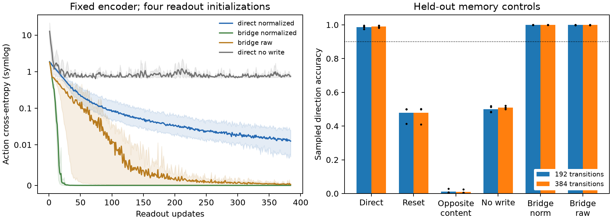

# LCM3: stored information reliably determines later action

**Audited readout qualification PASS.** All fourteen functional gates pass.
Direct-interface attribution FAIL and normalization attribution FAIL are separate
registered outcomes. LCM3 does not prove the direct route necessary or superior.
It qualifies delayed action from protected public memory, not body viability or
any six-pillar claim.

## Held-out function

Four fixed LCM2 parents, 512 paired episodes per parent and length. The total
nuisance spans 192/384 transitions and three fast/previous-transition resets.
Actions are sampled among all six choices, with no argmax or filtering.

| Condition | 192 transitions: sampled direction accuracy | 384 transitions |
|---|---:|---:|
| Direct normalized head | 98.68% | 98.93% |
| Acute raw-memory reset | 47.85% | 47.80% |
| Opposite-cue donor | 1.17% | 1.03% |
| Trained no-write head | 50.00% | 51.03% |
| Normalized gated bridge | 100.00% | 100.00% |
| Raw gated bridge | 99.95% | 99.95% |
| Initial direct head with trained store | 20.95% | 20.70% |

Every direct model exceeds the 90% action bar: per-model endpoints range
97.46–99.61%. Public-quality recall remains 94.92–100%; the encoder and quality head
are unchanged. Full cue-to-inherited state is exactly identical. Opposite donor
memory makes action follow the donor's opposite direction at 96.09–99.61%, above
the required 80% each. The matched pairs have identical nuisance and query inputs.

| Direct action contrast | 192-transition improvement | Paired bootstrap 95% CI | Required mean |
|---|---:|---|---:|
| Full minus reset | 50.83 percentage points | [47.85, 55.52] | 30 |
| Full minus opposite donor | 97.51 points | [95.31, 99.12] | 60 |
| Full minus trained no-write | 48.68 points | [45.51, 51.76] | 30 |

At 384 transitions, the respective means are 51.12, 97.90 and 47.90 points, with
intervals [48.05, 56.45], [96.24, 99.22] and [45.07, 50.78]. All frozen means and
positive-lower-bound requirements pass. This is a strong content-dependent causal
effect on action in the registered synthetic assay.

## What changed, and what the controls eliminate

The learned consolidation weights, eight-dimensional capacity, protected write
rule and public sensor stream did not change. New action heads train on frozen
representations with action cross-entropy only. Normalization statistics come
from training-role cues and remain fixed. The actor no longer learns against a
moving consolidation representation in this stage.

The gated bridge also achieves reliable action, including without normalization.
Direct-minus-normalized-bridge is -1.32 points [-2.44, -.44] at 192 transitions
and -1.07 [-2.00, -.34] at 384. The direct route performs slightly worse here,
and misses its required +10-point attribution margin.

Normalized-minus-raw bridge is +.05 points at both lengths, interval [0, .29],
also far below the attribution bar. These finite-sample outcomes do not prove
formal equivalence, but do not support a material normalization advantage.

Thus the original factorized route is capable in this setting. The hypothesis
that its architecture intrinsically prevents useful memory control is unsupported.
This experiment demonstrates that a separately trained readout on fixed information
suffices. It does not isolate freezing from the changed budget, learning rate and
loss contract relative to LCM2. No singular root-cause claim about joint optimization,
scaling or initialization is licensed.

Readout confidence is now learned: direct correct-action probabilities average
.974–.993 across endpoints. The normalized bridge averages above .99999. Full
inference still uses raw sampling. These probabilities diagnose why sampled
performance improves; they never substitute for observed actions.

One empty-state issue matters for integration. Resetting raw memory yields an
input outside the observed-cue normalization population. Trial0 then places some
probability on irrelevant actions, giving about 41% reset accuracy rather than
50%. The separately trained no-write control remains near 50%, and opposite-cue
donors stay within the observed population yet reverse action. The memory result
therefore does not rest solely on the empty-state shift. A native motor learner
must be trained and tested explicitly with absent/unknown memory.

## Integrity and scope

The campaign froze at commit 0a0145b before compute. All sixteen exact twin pairs
match complete readout/optimizer/log payloads. All four parent models and their
normalization buffers remain unchanged. Independent input generation verifies
6,144 unique-run training batches, and NumPy action/recurrent reconstruction
reproduces all 28,672 endpoint decisions, labels, recalls, gates and bootstrap.
Maximum probability discrepancy is 9.24e-7, below the registered 1e-5 tolerance.
The 99 relevant mechanics/regression tests pass.

The demonstrated loop is public evidence → learned consolidation → protected
inheritance across fast-state resets → learned action selection. Storage protection
and cue eligibility are engineered, the inspection is supplied, and the action
objective is externally supervised. This is not an autonomous world-feedback loop,
learned write selection, intrinsic dimensionality or self-authorship result.

The earned next step is a native-physics integration design. Preserve all four
parents. A gated readout already accepts public body sensors, so it is a sensible
starting architecture; no direct replacement or normalization requirement follows.
Its current query GRU starts from zero and has only seen a fixed terminal context.
It cannot be assumed to move, feed, repair or maintain a body. Qualify public-cue
compatibility and motor competence before opening a lineage survival endpoint.

An additional development physics check exposes a horizon trap. On the same
2,048 development bodies, WAIT survives all 64 decisions with zero feeding.
At 128/256 it survives none, dying at 70. A scripted reference that first inspects
publicly, infers the safe patch from that reading, then feeds below energy .5,
survives all three lengths. It receives no private quality/safe-side input.
Its total feeding counts are 9,216/24,576/57,344, respectively.
This qualifies a feasible motor reference, not a learned model or memory benefit.
The native motor draft therefore proposes 256-step viability rather than counting
survival paid for by initial reserves. Forgetting agents may still recover by
inspection, so native retention utility remains a separate unproved question.

Artifacts: lcm3_20260912.json, lcm3_audit_20260912.json and lcm3_diagnosis_20260912.json
in zeus_sandbox/universe/reports. Local twins, full sampled endpoint arrays, parent
identities and manifest are in runs/lcm3_20260912. The native integration design
is a separate draft, with no automatic survival launch.
The passive/public-reference development receipt is
lcm3_native_horizon_calibration_20260912.json in the same report directory.
