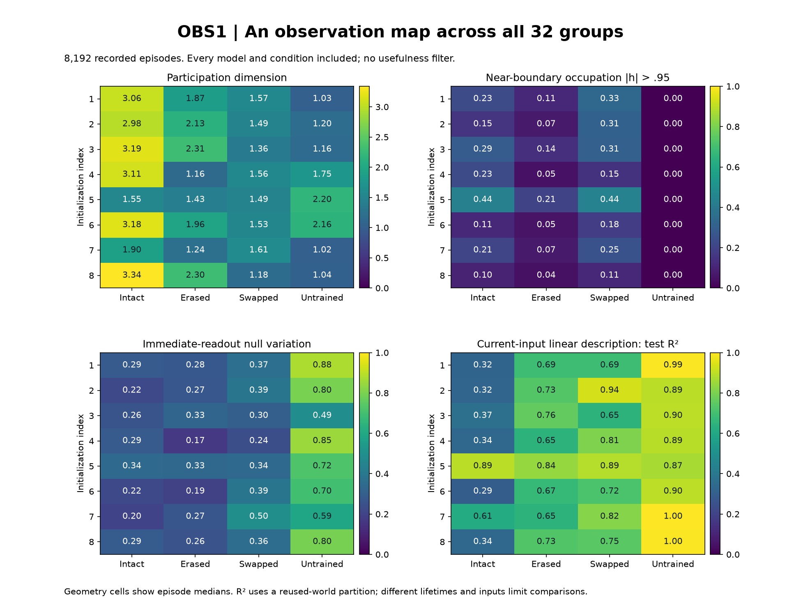
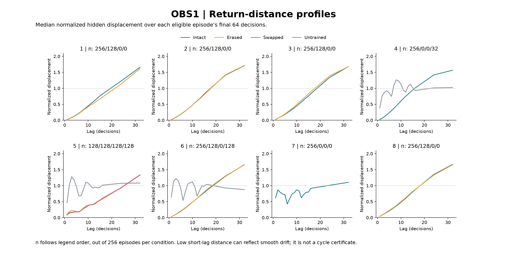
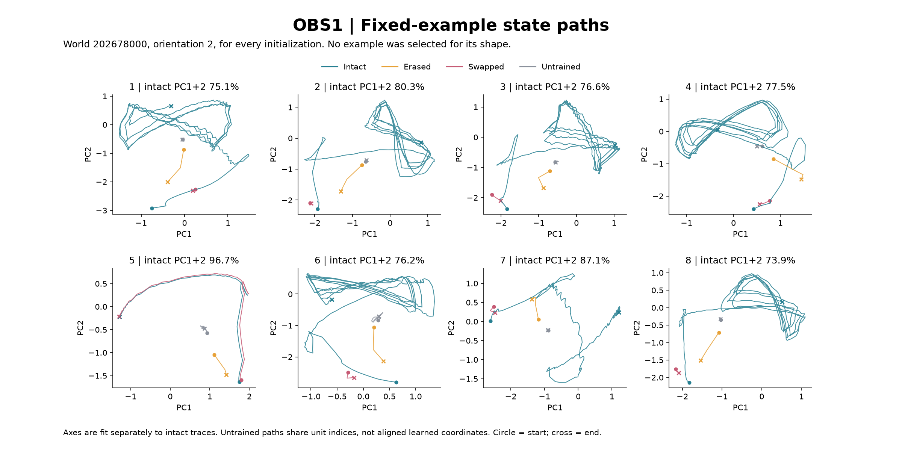

# OBS1: observed recurrent organization, 2026-09-08

Status: **discovery pass complete; nine audit checks pass.** No usefulness gate
was applied. The scope is eight CYC6 GRU memory models, four conditions and8192
saved episodes. This is not a new ZeusCore/mouth experiment or a claim that an
endogenous self has emerged. "Emergent" is the search umbrella requested by the
user; the catalogue first records organization and leaves its function open.

Protocol9249d4a and five-test instrument8c79d5a precede extraction. Prior survival
outcomes were already known. Every initialization/control is included. Twin A is
used once; the exact twin is not extra independent evidence. No new neural
forward pass, training, world simulation or deployment was used by extraction.

## Observation ledger

**O1. Concentrated state variation.** Although the hidden state has32 coordinates,
median covariance participation dimension on intact trajectories ranges1.546 to
3.341 across models. In six models it lies2.980..3.341; two lie1.546 and1.896.
Those two also happened to fail CYC6, but failure was not an admission criterion
and this association is not a causal result. Low participation dimension measures
concentration of linear variance, not an exact-dimensional manifold, a symbolic
representation, or a mechanism discovered by itself. Input repertoire, lifetime
length and supplied control all affect the sampled geometry.

**O2. Near-boundary occupation varies substantially.** Trained intact trajectories
spend median10.1%..43.5% of coordinate-time samples beyond|h|>.95; untrained group
medians are zero. The bounded activation is designed. Its degree of occupation
is measured, not a target in the resource loss. Different trajectory inputs and
durations prevent attributing the whole difference to learned weights here.
The number does not establish persistent individual neurons or an attractor.

**O3. Smooth evolution and partial return rhythms coexist.** Six intact models
choose lag2 in every eligible tail, but lag1 displacement is smaller still and
the median return profile rises with lag. This is consistent with smooth local
evolution/drift, not a detected two-step cycle. Their lag2 hidden-displacement
ratios are.051..078, while corresponding input ratios are approximately.77..81;
the hidden stream is temporally smoother in this normalized comparison.

Model7(initialization20261107) instead selects lag6 in221/256 intact tails.
Across its eligible tails, median best return ratio is.423 versus lag1 .617
and a shuffled-order minimum baseline .835. Median matching-lag action agreement
is.517 and input ratio .621. This is a partial coupled return rhythm, not exact
recurrence or an autonomous oscillator: the world, input and supplied controller
also have structure. The first fixed illustration actually selects lag7, which
is retained rather than replaced by a more attractive lag6 example.

Untrained models also show return structure: model5 favors lag7 in70/128 eligible
tails and model6 favors lag6 in97/128. This keeps initialization and controller-
driven rhythms in the catalogue. Recurrence is not restricted to trained or
successful systems. Only3104/8192 episodes have64 decision rows; omitted tails
are NA with denominators, not absence of structure or exclusion from other metrics.

**O4. State motion occupies directions invisible to the immediate readout.** The
linear32->9 readout has rank9 in every group, so a23-dimensional null space is
structurally guaranteed. Intact trained median fractions of centered movement in
that null space range20.0%..34.1%; untrained medians range49.2%..87.6%. The occupied
fraction is observed. Null-space existence is architectural. Motion invisible
to the present readout can still influence later recurrent states; no hidden
function, protected memory or irrelevance is inferred.

**O5. Historical separation can persist or wash out under identical inputs.**
All4096 intact/erased and intact/swapped comparisons start with the same current
neural input.1152 have at least two consecutive identical inputs. Every one of
those has a smaller final-prefix hidden separation than its initial separation.
This endpoint comparison is not monotonic contraction, a Lyapunov estimate or
proof that every input sequence forgets history.

Model6(initialization20261106) has70 intact/erased pairs with all496 subsequent
neural inputs identical; their median final hidden separation is8.10e-6. Model8
has one such full-length pair but retains separation.14049. These are recorded
differences in response to history, without requiring either preservation or
forgetting to be beneficial. Bodies/actions are not assumed matched merely
because the neural inputs match. Prefix summaries below are derived after
extraction from the audited distance records and are labelled exploratory.

**O6. Current input describes different amounts of hidden variation.** A linear
description from current location/resource has test R2 .294..370 in six intact
models, .895 in model5 and .615 in model7. Adding current body variables and age
raises these scores to.466..570,.973 and.733 respectively. The partition uses
already-observed world seeds, not a new confirmatory dataset. Unexplained linear
variance does not equal stored information, agency or nonlinear independence
from inputs. Near-perfect fits to short trajectories are retained and labelled;
they can reflect limited visited configurations and duplicate sampled rows.

## Alternative explanations and next questions

The small short-lag distances are not cycle evidence; the rank-deficient readout
does not by itself demonstrate emergent storage. GRU gating already permits
smoothing and the activation is bounded. All plots sample an engineered world
under a supplied controller. Those explanations do not erase the observations;
they identify what must be separated to understand how a pattern arises.

Candidate causal questions are: whether the lag6 pattern persists with a matched
or fixed input stream; whether history-sensitive directions affect subsequent
state evolution despite immediate readout invisibility; and which input sequences
preserve or erase initial distinctions. None is admitted or rejected on utility.
No such new intervention was performed or automatically authorized by OBS1.

This pass is bounded, not exhaustive. Full per-episode measurements remain in
the local OBS1 artifacts, including small effects not highlighted here. No
functional verdict is revised; the CYC6 reliability FAIL remains intact.

## Complete group tables

Initialization index1..8 means20261101..20261108. Each group has256 episodes.
Dimension/saturation/null columns are medians across whole episodes, with equal
episode weights. They therefore cover different lifetime lengths. Linear fits
sample16 equally spaced rows per episode, repeating indices for short episodes;
first64 world seeds fit, last64 evaluate. R2 is against the training hidden mean.

| Model | Condition | Dimension | Saturated fraction | Null fraction | Input R2 | Input+body+age R2 |
|---|---|---:|---:|---:|---:|---:|
| 1 | intact | 3.063 | 0.231 | 0.286 | 0.324 | 0.522 |
| 1 | erased | 1.868 | 0.110 | 0.275 | 0.691 | 0.868 |
| 1 | swapped | 1.565 | 0.333 | 0.366 | 0.691 | 0.691 |
| 1 | untrained | 1.026 | 0.000 | 0.876 | 0.994 | 0.994 |
| 2 | intact | 2.980 | 0.149 | 0.220 | 0.325 | 0.519 |
| 2 | erased | 2.131 | 0.071 | 0.271 | 0.731 | 0.881 |
| 2 | swapped | 1.493 | 0.310 | 0.389 | 0.936 | 0.947 |
| 2 | untrained | 1.200 | 0.000 | 0.797 | 0.895 | 0.999 |
| 3 | intact | 3.193 | 0.291 | 0.261 | 0.370 | 0.570 |
| 3 | erased | 2.305 | 0.137 | 0.327 | 0.760 | 0.894 |
| 3 | swapped | 1.358 | 0.307 | 0.304 | 0.646 | 0.655 |
| 3 | untrained | 1.162 | 0.000 | 0.492 | 0.901 | 0.999 |
| 4 | intact | 3.107 | 0.228 | 0.287 | 0.338 | 0.489 |
| 4 | erased | 1.158 | 0.047 | 0.166 | 0.647 | 1.000 |
| 4 | swapped | 1.560 | 0.148 | 0.240 | 0.806 | 0.817 |
| 4 | untrained | 1.754 | 0.000 | 0.852 | 0.893 | 0.924 |
| 5 | intact | 1.546 | 0.435 | 0.341 | 0.895 | 0.973 |
| 5 | erased | 1.433 | 0.206 | 0.332 | 0.841 | 0.928 |
| 5 | swapped | 1.489 | 0.444 | 0.340 | 0.890 | 0.967 |
| 5 | untrained | 2.197 | 0.000 | 0.724 | 0.870 | 0.893 |
| 6 | intact | 3.175 | 0.114 | 0.220 | 0.294 | 0.466 |
| 6 | erased | 1.955 | 0.053 | 0.195 | 0.668 | 0.841 |
| 6 | swapped | 1.533 | 0.181 | 0.391 | 0.715 | 0.717 |
| 6 | untrained | 2.157 | 0.000 | 0.697 | 0.899 | 0.908 |
| 7 | intact | 1.896 | 0.208 | 0.200 | 0.615 | 0.733 |
| 7 | erased | 1.236 | 0.070 | 0.266 | 0.646 | 1.000 |
| 7 | swapped | 1.611 | 0.250 | 0.496 | 0.819 | 0.825 |
| 7 | untrained | 1.021 | 0.000 | 0.587 | 0.999 | 0.999 |
| 8 | intact | 3.341 | 0.101 | 0.290 | 0.338 | 0.564 |
| 8 | erased | 2.300 | 0.044 | 0.257 | 0.728 | 0.890 |
| 8 | swapped | 1.184 | 0.114 | 0.359 | 0.745 | 0.750 |
| 8 | untrained | 1.041 | 0.000 | 0.796 | 0.995 | 0.995 |

Tail ratios normalize mean squared displacement by twice centered hidden energy.
The minimum excludes lag1; inspected lags are1..16,24,32. Action/input entries
are measured at each episode's selected lag. Selection is exploratory, and
the shuffled-order baseline undergoes the same minimum search.

| Model | Condition | Eligible | Modal lag (count) | Lag1 ratio | Best ratio | Input ratio | Action agreement |
|---|---|---:|---|---:|---:|---:|---:|
| 1 | intact | 256/256 | 2 (256/256) | 0.0210 | 0.0512 | 0.8069 | 0.1290 |
| 1 | erased | 128/256 | 2 (128/128) | 0.0188 | 0.0463 | 0.8652 | 0.1290 |
| 1 | swapped | 0/256 | NA | NA | NA | NA | NA |
| 1 | untrained | 0/256 | NA | NA | NA | NA | NA |
| 2 | intact | 256/256 | 2 (256/256) | 0.0200 | 0.0524 | 0.7745 | 0.1290 |
| 2 | erased | 128/256 | 2 (128/128) | 0.0217 | 0.0560 | 0.7860 | 0.1290 |
| 2 | swapped | 0/256 | NA | NA | NA | NA | NA |
| 2 | untrained | 0/256 | NA | NA | NA | NA | NA |
| 3 | intact | 256/256 | 2 (256/256) | 0.0247 | 0.0602 | 0.7886 | 0.1290 |
| 3 | erased | 128/256 | 2 (128/128) | 0.0251 | 0.0609 | 0.8001 | 0.1290 |
| 3 | swapped | 0/256 | NA | NA | NA | NA | NA |
| 3 | untrained | 0/256 | NA | NA | NA | NA | NA |
| 4 | intact | 256/256 | 2 (256/256) | 0.0248 | 0.0643 | 0.7747 | 0.1290 |
| 4 | erased | 0/256 | NA | NA | NA | NA | NA |
| 4 | swapped | 0/256 | NA | NA | NA | NA | NA |
| 4 | untrained | 32/256 | 2 (14/32) | 0.3813 | 0.6815 | 0.6422 | 0.4224 |
| 5 | intact | 128/256 | 2 (83/128) | 0.0860 | 0.1487 | 1.2948 | 0.1935 |
| 5 | erased | 128/256 | 6 (73/128) | 0.1008 | 0.1493 | 0.6924 | 0.4655 |
| 5 | swapped | 128/256 | 2 (86/128) | 0.0789 | 0.1412 | 1.3095 | 0.1774 |
| 5 | untrained | 128/256 | 7 (70/128) | 0.4656 | 0.5860 | 0.5823 | 0.4386 |
| 6 | intact | 256/256 | 2 (256/256) | 0.0255 | 0.0623 | 0.8033 | 0.1290 |
| 6 | erased | 128/256 | 2 (128/128) | 0.0256 | 0.0628 | 0.7992 | 0.1290 |
| 6 | swapped | 0/256 | NA | NA | NA | NA | NA |
| 6 | untrained | 128/256 | 6 (97/128) | 0.6383 | 0.5226 | 0.4851 | 0.6379 |
| 7 | intact | 256/256 | 6 (221/256) | 0.6171 | 0.4226 | 0.6209 | 0.5172 |
| 7 | erased | 0/256 | NA | NA | NA | NA | NA |
| 7 | swapped | 0/256 | NA | NA | NA | NA | NA |
| 7 | untrained | 0/256 | NA | NA | NA | NA | NA |
| 8 | intact | 256/256 | 2 (256/256) | 0.0374 | 0.0782 | 0.7897 | 0.1290 |
| 8 | erased | 128/256 | 2 (128/128) | 0.0378 | 0.0823 | 0.8090 | 0.1290 |
| 8 | swapped | 0/256 | NA | NA | NA | NA | NA |
| 8 | untrained | 0/256 | NA | NA | NA | NA | NA |

Paired history table: the distance ratio uses only prefixes of at least two
identical neural inputs. It compares last-prefix with first-prefix hidden
distance; it does not measure intermediate excursions.

| Model | Comparator | Prefix>=2 | Longest prefix | Median distance ratio | Endpoint growth count | Full496 prefixes |
|---|---|---:|---:|---:|---:|---:|
| 1 | erased | 128/256 | 30 | 0.698668 | 0 | 0 |
| 1 | swapped | 0/256 | 1 | NA | 0 | 0 |
| 2 | erased | 128/256 | 10 | 0.342855 | 0 | 0 |
| 2 | swapped | 0/256 | 1 | NA | 0 | 0 |
| 3 | erased | 128/256 | 10 | 0.347616 | 0 | 0 |
| 3 | swapped | 0/256 | 1 | NA | 0 | 0 |
| 4 | erased | 128/256 | 3 | 0.823359 | 0 | 0 |
| 4 | swapped | 0/256 | 1 | NA | 0 | 0 |
| 5 | erased | 0/256 | 1 | NA | 0 | 0 |
| 5 | swapped | 256/256 | 163 | 0.547911 | 0 | 0 |
| 6 | erased | 128/256 | 496 | 4.25762e-06 | 0 | 70 |
| 6 | swapped | 0/256 | 1 | NA | 0 | 0 |
| 7 | erased | 128/256 | 3 | 0.789322 | 0 | 0 |
| 7 | swapped | 0/256 | 1 | NA | 0 | 0 |
| 8 | erased | 128/256 | 496 | 0.0840222 | 0 | 1 |
| 8 | swapped | 0/256 | 1 | NA | 0 | 0 |

## Figures and evidence

All figures were visually inspected. The fixed examples use world202678000,
orientation2 for every model. PCA axes differ between models. Untrained paths
share raw unit indices with their trained counterpart but are not aligned learned
representations; those distances should not be interpreted semantically.

Nine independent audit checks pass: source/artifact hashes; all8192 episode IDs
and lengths;128 raw geometry/recurrence cases using independent SVD and direct
distance calculations; all4096 input prefixes/null projections; every sampled
array matched to raw trajectories; all64 linear descriptions via independent
SVD; all group aggregates/eligibility; fixed examples; final source integrity.
Extraction and audit exit0. This checks measurement integrity, not emergence.

Canonical catalogue/audit/derived-prefix records are in
zeus_sandbox/universe/reports/obs1_{catalogue,completion_audit,derived_prefix_descriptions}_20260908.json.
Detailed per-episode records and sample arrays remain in runs/obs1_20260908,
with hashes in the catalogue. Frozen source and prior-run hashes are retained.

## Charter interpretation

This is user-authorized Class O discovery, with usefulness evaluated after
identification when appropriate. The designed setup and selection context are
explicit; unexpected amounts or patterns are candidates, not certified
unprogrammed setpoints. Simple recurrent-system explanations remain available;
no special CDT or pillar claim follows. The audit passes. This observational
authorization is complete and purchases no automatic next experiment.
