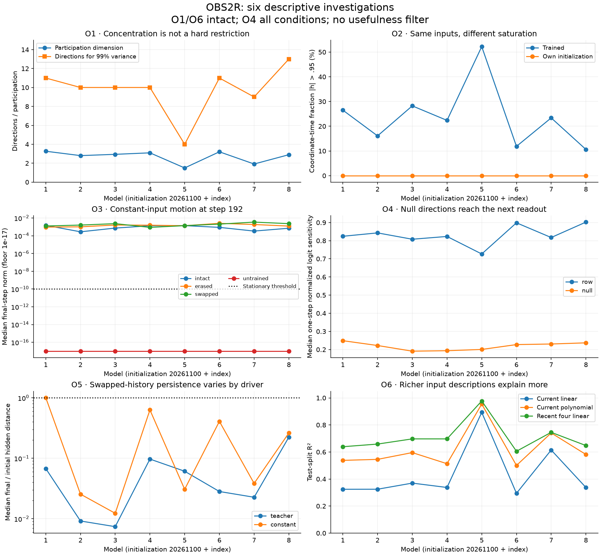

# OBS2R: six observation investigations, 2026-09-08

**Complete: all six investigations and ten audit checks pass.**
The six OBS1 observations have each received a separate diagnostic and note.
These are observations of CYC6's eight GRU memory models, not ZeusCore or the
deployed mouth. We retained patterns without requiring usefulness, novelty or
success in CYC6. Nothing here promotes a consciousness or autonomy claim.

## Notes, in discovery order

| Observation | Result of this investigation | Separate note |
| --- | --- | --- |
| O1: concentrated state motion | All intact pooled covariance matrices have numerical rank 32; participation is 1.50–3.26, and 99% variance requires 4–13 directions. Between-episode offsets are unusually large in model 5. | [Geometry](obs2_o1_state_geometry_note_20260908.md) |
| O2: near-boundary occupation | On identical teacher inputs from zero state, trained saturation is 10.61–52.20%, versus zero at each own initialization. Saturated candidates, not just high retention gates, can sustain occupation. | [Saturation](obs2_o2_saturation_note_20260908.md) |
| O3: smooth evolution and partial rhythms | Under constant input, all 192 trained branches still move at step 192; all 64 untrained branches settle below the numerical threshold. Slow convergence and sustained dynamics remain alternatives. | [Return rhythms](obs2_o3_return_rhythms_note_20260908.md) |
| O4: immediate readout-null motion | Every one of 256 local probes has nonzero next-step logit sensitivity from immediately invisible directions. This establishes recurrent coupling, not useful memory. | [Null directions](obs2_o4_null_directions_note_20260908.md) |
| O5: persistence and washout | All 128 teacher-driven pairs end closer; 6/128 constant-driven pairs end farther apart. Both drivers permit transient growth. Persistence depends on the input sequence. | [History persistence](obs2_o5_history_persistence_note_20260908.md) |
| O6: input descriptions leave residuals | Nonlinear current-input descriptions explain more than linear ones in every intact model. Recent-input descriptions also improve the baseline. A linear-fit residual cannot be equated with memory. | [Input descriptions](obs2_o6_input_descriptions_note_20260908.md) |

Each note includes the measurement design, complete relevant group summaries,
interpretive limits and a concrete next discriminant. Exact per-case curves and
all control results remain in the hashed artifacts. Model indices 1–8 correspond
to initializations 20261101–20261108.

## Execution and preserved corrections

Protocol `1d146f5` and instrument `374e2aa` preceded the original OBS2 attempt.
That attempt stopped before its first scientific result because a proposed
four-state universal window encountered three-state episodes. Its manifest and
`INVALID_STOP` are preserved in `runs/obs2_20260908`. Correction `6b27886` used
the first three states for every episode, changing no other diagnostic. The
original instrument remains frozen; a separate OBS2R wrapper executes it.
All six stages completed sequentially in `runs/obs2r_20260908`.

Offline replays use the four fixed world offsets 0, 1, 126, 127 and both
orientations. There are 256 selected cases across eight models and four
conditions. The gate probe uses 128 trained/initial model-stream replays; the
continuation probe has 256 constant and 100 eligible six-input-motif branches.
Descriptions and covariance comparisons include all 8192 saved episodes.
No training, new world simulation, held-out survival endpoint or deployment ran.

The first independent audit required an exactly matching best-lag label and
stopped on a numerical tie. Diagnosis found eight motif branches whose full
return curves agree but whose best lag changes among near-zero return minima.
The source and failure log are preserved as `completion_audit_first_attempt.py`
and `.log`, with `audit_lag_diagnosis.json` in the result directory. The revised
audit still checks the complete curves, verifies that the recorded label is the
recorded curve's exact argmin, and accepts a different native label only when
the recorded lag is also a native minimum within the existing 1e-10 absolute
comparison tolerance. No experiment output or scientific threshold changed.

## Verification

All ten audit checks pass, recorded in `runs/obs2r_20260908/completion_audit.json`.
The audit checks input/output hashes, all covariance decompositions by independent
SVD, all selected raw replay inputs and all eight teacher streams. It independently
replays all gate, continuation and history cases with native PyTorch, checks
future null propagation on 32 fixed cases with autograd, and independently
refits all 96 weighted descriptions by SVD. The instrument itself also checks
the first local Jacobian in all 256 cases by finite differences.

Limitations of that verification are explicit: it does not assert agreement of
numerical covariance rank near machine precision, does not independently rebuild
every O6 feature array from raw trajectories, and does not compare normalized
return ratios where the final-tail RMS is below 1e-10. Absolute changes and
amplitudes are still checked there. Five synthetic mechanics tests pass. The
six-panel figure was visually inspected.

All 356 continuation branches were independently replayed. Sixty-four settled
profiles have below-resolution amplitudes, and eight motif branches have tied
best-lag labels. Canonical JSON copies are committed under
`zeus_sandbox/universe/reports/obs2r_*_20260908.json`, including the six results,
completion, audit, original invalid stop and lag-tie diagnosis. Large replay
arrays remain local with hashes in the completion record.

## What to investigate next

The most discriminating next question is O3's remaining constant-input motion:
**does it decay slowly, or persist as a stable dynamic pattern?** A separate,
fixed longer-horizon probe should track amplitude and decay, compare distinct
starts under the same constant input, and check stability to small perturbations.
That question follows the observed machine behavior without presuming usefulness.

O4 and O5 supply a second connected question: whether currently invisible state
differences survive long enough to become accessible later, and which inputs
preserve or erase them. O1's small-variance directions belong in that probe rather
than being discarded as noise. These are proposed follow-ups, not launched runs.
The bounded six-investigation request ends with these notes; previous functional
verdicts remain unchanged.
