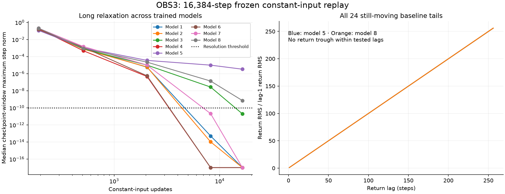

# OBS3: the constant-input movement is predominantly long relaxation

Completed 2026-09-09. **Eight audit checks pass.** Protocol and instrument were
frozen in commit `2922409` before measurement. This follows
[OBS2 O3](obs2_o3_return_rhythms_note_20260908.md) using the same 256 cases.

## Finding

Of 192 trained baseline branches, **138 settle**, **30 meet the declared decay
criterion**, and **24 remain moving at the horizon**. All 64 untrained baseline
branches settle. Thus the 192-step movement mostly resolves into long relaxation
when extended to 16,384 steps. No stable cycle was identified by these diagnostics.

The remaining 24 cases belong to models 5 and 8 (initializations 20261105 and
20261108). Their last checkpoint-window motion is still falling: the ratio of
final to 8192-step maximum step norm ranges **0.1204–0.7597**. They miss the
predefined tenfold-reduction criterion rather than showing an observed amplitude
plateau. Every one of their final-tail return profiles rises with tested lag
(1–64,128,256), with no return trough. That favors continuing slow drift over
a resolved short-period orbit. Longer periods and later behavior remain untested.

## What the comparisons add

Each case held its final recorded input constant under the same frozen weights,
starting from its recorded endpoint, zero, and two opposite perturbations of
norm 1e-5 in one fixed direction. This gives 1024 branches, labelled as follows:

| Starting states included | Settled | Decaying | Persistent at horizon |
| --- | --- | --- | --- |
| Recorded baseline only | 202 | 30 | 24 |
| All four starts | 804 | 124 | 96 |

Among the 197 cases whose baseline and zero-start branches both settle, the
largest endpoint separation is **1.63e-09**. None exceeds the 1e-6
distinct-endpoint candidate threshold. Every plus/minus perturbation is smaller
at the final horizon than at the start; the largest final/initial ratio is
**0.111633**. These are endpoint comparisons, not claims of
monotonic contraction, all-direction stability or a unique global attractor.

The largest final-state Jacobian spectral radius over all branches is about
**0.999966633**. Values near one are compatible with very slow local relaxation.
This is supporting local derivative evidence, not proof that a moving endpoint
is an equilibrium or that its future evolution must converge. No spectral-radius
result substitutes for the measured residual and trajectory.

## Labels and limits

SETTLED means every successive step in the final 1024-state tail has norm
at most 1e-10. DECAYING requires both final-window maximum step and centered RMS
to be at most one tenth of their 8192-step values. PERSISTENT_AT_HORIZON is the
remaining category; it explicitly includes slower decay. These finite-horizon
labels were fixed in the [protocol](obs3_constant_input_protocol_20260908.md).

Checkpoint windows contain the last 256 states, except the 192-step checkpoint,
which contains states 0–192. The plot uses checkpoint windows; final labels use
the 1024-state tail for settlement. Summary ranges, monotone return counts and
group tables are labelled post-extraction descriptions of these frozen measures.

The models are CYC6 GRU memory components, not ZeusCore S/H or the deployed voice.
Held inputs are an offline forcing intervention, not a physically evolving body.
Models 5 and 8 differ in prior CYC6 outcome, and all cases are retained regardless
of usefulness. We have not discovered a self-maintaining cycle, demonstrated
semantic memory, or changed a functional verdict.

## All baseline groups

Model indices map to initializations 20261101–20261108. Maximum final step uses
the 1024-state tail. Local radius is measured at the endpoint. Perturbation ratio
is the larger final plus/minus separation divided by the initial norm 1e-5.

| Model | Condition | Cases | Settled | Decaying | Persistent at horizon | Max final step | Max local radius | Max perturbation ratio |
| --- | --- | --- | --- | --- | --- | --- | --- | --- |
| 1 | intact | 8 | 8 | 0 | 0 | 0 | 0.997253957 | 0 |
| 1 | erased | 8 | 4 | 4 | 0 | 6.79e-09 | 0.999257904 | 8.98e-07 |
| 1 | swapped | 8 | 4 | 4 | 0 | 6.32e-09 | 0.999257905 | 9.09e-07 |
| 1 | untrained | 8 | 8 | 0 | 0 | 0 | 0.682606154 | 8.56e-12 |
| 2 | intact | 8 | 8 | 0 | 0 | 1.11e-16 | 0.997832796 | 0 |
| 2 | erased | 8 | 8 | 0 | 0 | 0 | 0.996650183 | 0 |
| 2 | swapped | 8 | 8 | 0 | 0 | 2.6e-16 | 0.998074556 | 0 |
| 2 | untrained | 8 | 8 | 0 | 0 | 0 | 0.637424922 | 7.66e-12 |
| 3 | intact | 8 | 6 | 2 | 0 | 5.94e-10 | 0.999208973 | 3.71e-07 |
| 3 | erased | 8 | 3 | 5 | 0 | 1.7e-10 | 0.999166594 | 1.93e-07 |
| 3 | swapped | 8 | 8 | 0 | 0 | 8.23e-11 | 0.999039993 | 1.99e-08 |
| 3 | untrained | 8 | 8 | 0 | 0 | 6.89e-17 | 0.650984469 | 1.13e-11 |
| 4 | intact | 8 | 8 | 0 | 0 | 1.11e-16 | 0.998003623 | 0 |
| 4 | erased | 8 | 8 | 0 | 0 | 0 | 0.994398914 | 0 |
| 4 | swapped | 8 | 4 | 4 | 0 | 1.09e-09 | 0.999066418 | 1.77e-07 |
| 4 | untrained | 8 | 8 | 0 | 0 | 6.21e-17 | 0.669625330 | 9.14e-12 |
| 5 | intact | 8 | 4 | 0 | 4 | 7.31e-06 | 0.999940024 | 0.0658 |
| 5 | erased | 8 | 2 | 0 | 6 | 1.88e-05 | 0.999939491 | 0.063 |
| 5 | swapped | 8 | 4 | 0 | 4 | 6.66e-06 | 0.999940107 | 0.066 |
| 5 | untrained | 8 | 8 | 0 | 0 | 8.1e-17 | 0.654243338 | 9.25e-12 |
| 6 | intact | 8 | 8 | 0 | 0 | 3.8e-12 | 0.998780565 | 3.61e-10 |
| 6 | erased | 8 | 8 | 0 | 0 | 6.94e-18 | 0.995891974 | 0 |
| 6 | swapped | 8 | 8 | 0 | 0 | 0 | 0.995123030 | 0 |
| 6 | untrained | 8 | 8 | 0 | 0 | 6.25e-17 | 0.672749827 | 9.52e-12 |
| 7 | intact | 8 | 8 | 0 | 0 | 0 | 0.994186260 | 0 |
| 7 | erased | 8 | 0 | 8 | 0 | 1.75e-08 | 0.999352901 | 3.99e-06 |
| 7 | swapped | 8 | 8 | 0 | 0 | 0 | 0.997873120 | 0 |
| 7 | untrained | 8 | 8 | 0 | 0 | 0 | 0.608964922 | 6.85e-12 |
| 8 | intact | 8 | 4 | 3 | 1 | 1.06e-06 | 0.999966633 | 0.112 |
| 8 | erased | 8 | 3 | 0 | 5 | 1.77e-05 | 0.999950063 | 0.0704 |
| 8 | swapped | 8 | 4 | 0 | 4 | 1.16e-05 | 0.999955971 | 0.0859 |
| 8 | untrained | 8 | 8 | 0 | 0 | 7.15e-18 | 0.644186745 | 6.61e-12 |

## Verification and artifacts

All 256 baseline continuations agree with OBS2R's 192-step final change. The
independent audit checks all 1024 saved branch summaries, return curves, labels,
endpoint residuals and Jacobian spectra, all starting inputs/states, and all
256 separation curves. Sixteen fixed baseline trajectories (one per model and
weight kind) were independently replayed for all 16,384 steps with the manual
GRU formula, including full final-tail comparison. Their final Jacobians were
also checked using native autograd.

Maximum manual/native checkpoint difference: 1.73e-14.
Maximum analytic/autograd Jacobian difference: 2.22e-16.
Source and artifact hashes pass before and after. Three synthetic mechanics
tests passed before freezing. The audit recomputes all saved final Jacobian
spectra with the analytic formula; its independent autograd check covers the
16 declared baseline cases, not all 1024 branches.

Exact local outputs: `runs/obs3_20260908/results.json`, `completion.json`,
`completion_audit.json`, and the hashed per-model arrays. Canonical compact JSON
copies reside under `zeus_sandbox/universe/reports/obs3_*_20260909.json`.
Instrument: `tools/obs3_constant_input_20260908.py`; audit:
`tools/obs3_completion_audit_20260909.py`.

## Next question

The 192-step motion is insufficient evidence of a self-sustaining cycle: most
cases resolve into relaxation, and no short-period return was identified in the
remaining tails. This does not establish that cycles are globally impossible.
The more concrete lead is **why the learned recurrence has such long relaxation
times, and whether those slow directions overlap the directions that influence
future outputs in O4**. A next bounded probe could compare matched-input trained
and initial Jacobians, then perturb slow directions and measure later readout
effects. That would connect the dynamics to accessible information before any
separate usefulness test. It is proposed here and has not been launched.

## Subsequent authorized result: OBS4

The user subsequently approved this follow-up. [OBS4 is complete](obs4_slow_readout_review_20260909.md):
219/256 trained-weight cases pass the fixed persistent-readable-marker criterion
at 512 steps, versus 0/256 matched initial-weight cases. The marker starts in
the immediate readout null space. All eight audit checks pass. This establishes
an injected causal route to delayed output; naturally formed history content
and usefulness remain separate questions.
