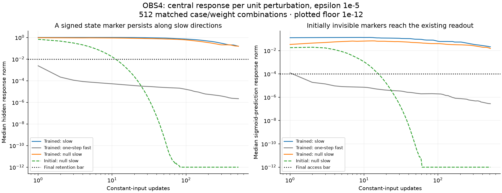

# OBS4: a persistent state marker can reach the readout later

Completed 2026-09-09. **The declared marker test passes in 219/256 trained-weight
cases and 0/256 matched initial-weight cases. Eight audit checks pass.** Protocol
and three-test instrument were frozen in commit `b070a80` before measurement.

## What this establishes

We placed a controlled signed difference in the immediate readout's null space.
It initially changes no linear readout value, to numerical precision. In 219
trained-weight cases, the difference remains large enough in hidden state and
becomes detectable in the existing sigmoid prediction head after 512 identical
inputs. Both perturbation sizes give consistent signed final response vectors.
This is evidence of a **causal route for persistence and delayed output access**.

It is not a demonstration that the model naturally stores a meaningful fact,
selects what to remember, or uses memory to improve survival. "Readable" here
means a measured difference in the model's existing nine-value prediction head,
not legible language or a demonstrated external decoder. No new readout was fitted.
The marker is an experimenter-supplied plus/minus state displacement.

## Design and scope

All 256 OBS3 baseline endpoints and constant inputs were retained, including the
64 originally generated by untrained weights. Each endpoint/input was tested with
both its trained checkpoint and its own initialization, giving 512 combinations.
The model's starting state and input are matched across weights; perturbation
directions are recomputed under each weight set by the same selection rule.
Thus this is a comparison of each package's selected local directions, not an
identical-vector intervention across packages. Some starts are outside the other
weight set's native trajectory.

The slow direction maximizes hidden retention in the frozen local J^64 map.
The null-slow direction does the same while constrained to the immediate
readout's 23-dimensional null space. Neither is selected for later readout gain.
The fast control minimizes one-step hidden gain in J; it is not guaranteed to
decay fastest over the entire 512-step replay. The local J^64 approximation need
not equal the actual Jacobian product along a changing state trajectory.

Each combination has 13 branches: baseline and plus/minus displacements along
three directions, at epsilon 1e-4 and 1e-5. All branches receive identical
constant inputs within the combination. We measure central signed response
(plus-minus)/(2 epsilon), saving whole gain curves and actual checkpoint states.

## Magnitude and failed cases

At epsilon 1e-5, trained-weight median final hidden responses are:

| Direction | Hidden response at 512 | Sigmoid prediction response at 512 |
| --- | --- | --- |
| Slow | .153834 | .0210792 |
| One-step fast control | 2.167e-6 | 2.790e-7 |
| Initially invisible, slow | .155257 | .0153036 |

These are responses per unit initial perturbation. The null-slow median
corresponds to an actual plus/minus prediction distance of about **3.06e-7** at
epsilon 1e-5, not a large behavioral change. Initial-weight median responses
are numerically zero by step 512 for all three direction types.

The narrow pass criterion requires hidden response >=.01 and sigmoid response
>=1e-4 at step 512, at both perturbation sizes, with vector agreement within
max(1e-6, 1% of the larger norm). Of 37 trained failures, all miss the retention
bar; 16 also miss the output bar. None fails the two-size consistency check.
All 256 trained null-slow markers reach output response >=1e-4 at some earlier
or final step; the 512-step persistence requirement is what removes cases.
Failing this convention is not a claim of literally zero remaining information.

Immediate null logit response never exceeds 1.29e-10 at epsilon 1e-5;
the exact linear null residual is independently below 1e-12. Later effects follow
recurrence through the unchanged model. Neither the signal convention nor a pass
is a semantic-memory, survival, autonomy or consciousness bar.

## Complete model and endpoint-origin accounting

Models 1–8 map to initializations 20261101–20261108. There are 32 endpoints per
model, eight per original condition. These counts are a fixed repeated-case
description, not independent trials estimating a population success probability.

| Model | Trained pass / 32 | Initial pass / 32 |
| --- | --- | --- |
| 1 | 32 | 0 |
| 2 | 18 | 0 |
| 3 | 32 | 0 |
| 4 | 20 | 0 |
| 5 | 32 | 0 |
| 6 | 21 | 0 |
| 7 | 32 | 0 |
| 8 | 32 | 0 |

| Endpoint origin | Trained pass / 64 | Initial pass / 64 |
| --- | --- | --- |
| intact | 58 | 0 |
| erased | 49 | 0 |
| swapped | 60 | 0 |
| untrained | 52 | 0 |

All 64 model/weight/origin group summaries, plus exact continuous values, are in
the canonical derived JSON; every case is retained in the full result record.

## Verification

The audit independently replays **all 6656 branches** with a batched manual GRU
formula, exceeding the protocol's minimum of 16 complete case/weight replays.
It checks every saved response curve, checkpoint, unit direction, singular-value
selection, null identity, input/state identity, pass/fail decision and summary.
Sixteen fixed starting Jacobians also match native autograd. Recorded first-max
steps are checked against the stored complete gain curves; the independent replay
checks those curves numerically without demanding identical tie labels.

Maximum independent state difference: 1.83e-14.
Maximum response-gain difference: 5.07e-10.
Maximum analytic/autograd Jacobian difference: 2.22e-16.
Source/artifact hashes pass before and after. Three synthetic tests passed before
freezing. The summary figure was visually inspected. Group counts, ranges and
failure breakdowns are explicitly post-extraction descriptions of frozen measures.

Local evidence: `runs/obs4_20260909/results.json`, `completion.json`,
`completion_audit.json` and hashed per-model arrays. Compact canonical copies:
`zeus_sandbox/universe/reports/obs4_*_20260909.json`. Protocol:
[OBS4 slow readout](obs4_slow_readout_protocol_20260909.md). The models remain CYC6
GRU components, not ZeusCore S/H or the deployed mouth. No training, world
simulation, deployment or prior functional verdict change occurred.

## Next discriminant

We now have a persistent, initially invisible route into later output. The next
question is whether **naturally occurring history differences use that route**.
A bounded next probe could hold current and subsequent inputs fixed, compare
states produced by different real preparation histories, and selectively remove
their slow/null components. The loss of a later history-dependent output effect
would connect the artificial marker result to naturally formed state differences.
Usefulness would still require its own subsequent diagnosis. No such follow-up
has been launched here.
