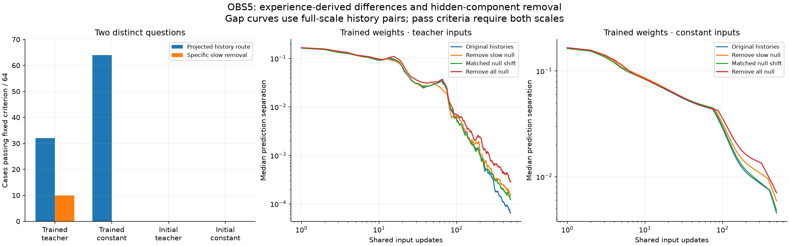

# OBS5: actual history differences reach later output, but one slow direction is insufficient

Completed 2026-09-09. **All nine audit checks pass.** Protocol and three-test
instrument were frozen in commit `6512d36` before measurement. This follows
[OBS4's artificial marker result](obs4_slow_readout_review_20260909.md).

## Result: separate sufficiency from selective reduction

| Weights and shared input driver | History-derived null route PASS | Selective slow-null reduction PASS | Cases |
| --- | --- | --- | --- |
| Trained, teacher sequence | 32 | 10 | 64 |
| Trained, constant input | 64 | 0 | 64 |
| Initial, teacher sequence | 0 | 0 | 64 |
| Initial, constant input | 0 | 0 | 64 |

**A history-derived null component can carry a later output effect.** When we
retain only the readout-null part of the difference between two experience-formed
states, it starts invisible to the readout but passes the final persistence/access
test in 96/128 trained combinations. This replaces the arbitrary OBS4 marker with
a component actually present in the recorded-history difference. The projected
states themselves are still counterfactual interventions, not original states.

**The single selected slow-null direction explains only a limited subset.**
Removing it reduces the original final output separation by the required margin
and beats a norm-matched control in only 10/128 trained combinations, all under
teacher input. This fails to support a general explanation of the original
history effect by that one selected direction. The two criteria are independent:
only three cases pass both, so their denominators must not be conflated.

## A further observation: removal often increases the history effect

At both tested scales, removing the slow-null component increases final output
separation in **33/64 teacher** and **40/64 constant** trained cases. Removing
the entire null component increases it in **46/64 teacher** and **48/64 constant**
cases. These outcomes are retained, not discarded because the reduction test fails.

At full scale, median fractional reductions from slow-null removal are
**-.0449** (teacher) and **-.6415** (constant). Removing all null components gives
medians **-.6466** and **-1.3226**. Negative reduction means a larger later
prediction difference after removal. Thus some hidden components may counteract
or reshape history effects rather than simply amplify them. That is a candidate
explanation; finite interventions and nonlinear interactions remain alternatives.
Larger output separation is not automatically better memory or worse behavior.

## What was actually compared

Two states were reconstructed from the first16 recorded observations of opposite
preparation orientations, from zero, under each trained or initial weight set.
They therefore originate in actual supplied experience. They do not establish
that the model chose those experiences or decided what to remember.

The eight models, eight fixed preparations, two weight sets and two input drivers
give256 combinations. Both members of every pair receive exactly the same later
inputs. The teacher driver uses the remaining496 recorded inputs; the constant
driver repeats the first of them496 times. No new physical world episode ran.

At the pair midpoint, J^64 selects a single slow direction inside the immediate
readout null space. It is a local approximation, not a subspace fitted to future
outputs or a comprehensive inventory of slow dynamics. Its component has median
norm about6.08% of the full initial history difference. Its relevance to a finite
pair can differ from its relevance to a small local perturbation.

Six difference arms are replayed around the same midpoint: original, remove
slow-null, norm-matched null shift, remove all null, only null, and erase the
difference. Each uses scales1 and.5 and both signs:6144 branches. Full-scale
original states are the reconstructed actual-history pair. The edited and
half-scale states are explicit interventions without clipping.

The norm-matched control shifts in a fixed null direction orthogonal to the slow
direction. Its size matches slow-component removal, but it is not necessarily
removal of an existing component and can overshoot that directional projection.
The three null-removal/shift arms preserve the original immediate logit difference.
Their later changes therefore arise through recurrent evolution. The only-null
and erased pairs have initially identical outputs; erased states remain identical.

## Exact criterion meanings and failures

NULL_HISTORY_ROUTE requires initial null-difference norm>=1e-8; at both scales,
final hidden separation retains>=1% of its initial size and final sigmoid output
separation per unit initial size is>=1e-4. It tests sufficiency in the edited
only-null states, not necessity within the untouched original state pair.

SLOW_NULL_REDUCTION requires original final output separation>=scale*1e-5;
slow-null removal reduces it by>=25%; and that reduction exceeds the matched
null-shift reduction by>=10 percentage points, at both scales. Thirteen teacher
cases miss the original-gap resolution requirement;51 pass it. Thirteen meet
the two-scale25% reduction bar;24 meet the specificity margin. Only10 meet all
requirements together. Under constant input, all64 original gaps are resolved,
but none meets the two-scale25% reduction bar. No threshold was changed.

Median original full-scale final prediction gaps are **6.69e-5** under teacher
input and **.00453** under constant input for trained weights; initial-weight
medians are numerically zero. These are distances in the existing nine-value
sigmoid prediction head, not language quality, action quality or decoded meaning.
Full results and reduction signs are recorded, including failures and amplification.

## All model groups

Models1–8 map to initializations20261101–20261108. Paired orientations and reused
worlds are related cases; counts are not independent population-probability
estimates. Reduction medians use full scale and are post-extraction descriptions.

| Model | Weights | Driver | Cases | Null route PASS | Slow reduction PASS | Median original output gap | Median slow reduction |
| --- | --- | --- | --- | --- | --- | --- | --- |
| 1 | final | teacher | 8 | 0 | 6 | 0.000311 | 0.3239 |
| 2 | final | teacher | 8 | 0 | 1 | 7.67e-06 | -1.4570 |
| 3 | final | teacher | 8 | 8 | 3 | 5.1e-05 | 0.2207 |
| 4 | final | teacher | 8 | 5 | 0 | 0.000113 | -0.3610 |
| 5 | final | teacher | 8 | 3 | 0 | 0.00061 | -0.0769 |
| 6 | final | teacher | 8 | 0 | 0 | 1.91e-06 | 0.0747 |
| 7 | final | teacher | 8 | 8 | 0 | 5.53e-05 | -2.5745 |
| 8 | final | teacher | 8 | 8 | 0 | 0.00907 | -0.0151 |
| 1 | final | constant | 8 | 8 | 0 | 0.396 | 0.0027 |
| 2 | final | constant | 8 | 8 | 0 | 7.32e-05 | -7.8637 |
| 3 | final | constant | 8 | 8 | 0 | 0.000117 | -15.0557 |
| 4 | final | constant | 8 | 8 | 0 | 0.0615 | 0.0380 |
| 5 | final | constant | 8 | 8 | 0 | 0.000538 | -1.5802 |
| 6 | final | constant | 8 | 8 | 0 | 0.00692 | 0.0511 |
| 7 | final | constant | 8 | 8 | 0 | 0.00239 | -1.2582 |
| 8 | final | constant | 8 | 8 | 0 | 0.0116 | -0.0258 |
| 1 | initial | teacher | 8 | 0 | 0 | 0 | NA (zero original gap) |
| 2 | initial | teacher | 8 | 0 | 0 | 0 | NA (zero original gap) |
| 3 | initial | teacher | 8 | 0 | 0 | 0 | NA (zero original gap) |
| 4 | initial | teacher | 8 | 0 | 0 | 0 | NA (zero original gap) |
| 5 | initial | teacher | 8 | 0 | 0 | 0 | NA (zero original gap) |
| 6 | initial | teacher | 8 | 0 | 0 | 0 | NA (zero original gap) |
| 7 | initial | teacher | 8 | 0 | 0 | 0 | NA (zero original gap) |
| 8 | initial | teacher | 8 | 0 | 0 | 0 | NA (zero original gap) |
| 1 | initial | constant | 8 | 0 | 0 | 0 | NA (zero original gap) |
| 2 | initial | constant | 8 | 0 | 0 | 0 | NA (zero original gap) |
| 3 | initial | constant | 8 | 0 | 0 | 0 | NA (zero original gap) |
| 4 | initial | constant | 8 | 0 | 0 | 0 | NA (zero original gap) |
| 5 | initial | constant | 8 | 0 | 0 | 0 | 1.0000 |
| 6 | initial | constant | 8 | 0 | 0 | 1.11e-16 | 1.0000 |
| 7 | initial | constant | 8 | 0 | 0 | 1.11e-16 | 1.0000 |
| 8 | initial | constant | 8 | 0 | 0 | 0 | NA (zero original gap) |

## What this says about authorship

The current-state/next-input explanation alone is insufficient: a difference
formed by previous observations can affect output after hundreds of shared
inputs, and hidden-component interventions can alter that effect while keeping
immediate outputs unchanged. This is experience-mediated causal influence.

It still does not show self-selected encoding, selective retention goals,
endogenous action, useful content or authorship of Zeus's speech. The worlds and
preparation histories are supplied, and these are CYC6 GRU memory components.
The result advances the causal-mechanism question without passing the authorship
pillar. No training, deployment or prior functional verdict change occurred.

## Verification and artifacts

The independent audit replays all128 preparation histories and all6144 intervention
branches with a batched manual GRU. It verifies every saved state checkpoint,
all gap curves, initial-output controls, component/control geometry, decisions
and summaries. Sixteen fixed midpoint Jacobians match native autograd. Source
and artifact identity checks pass before and after.

Maximum independent state difference: 3.44e-15; gap difference:
1.1e-14; Jacobian difference: 2.22e-16.
History reconstruction differs from original float32 cached states by at most
3.33e-07, below the predeclared1e-5 tolerance.
Three synthetic tests passed before freezing. Figure visually inspected. Counts,
medians and amplification breakdowns are labelled post-extraction descriptions.

Protocol: [OBS5](obs5_natural_history_protocol_20260909.md). Exact local artifacts:
`runs/obs5_20260909/results.json`, `completion.json`, `completion_audit.json`, and
hashed per-model arrays. Canonical compact copies:
`zeus_sandbox/universe/reports/obs5_*_20260909.json`.

## Next discriminant

The newly observed amplification deserves investigation before assuming all
persistent components merely store a payload. A bounded next test could separate
linear cancellation between readout-row and readout-null history components from
nonlinear effects of editing the state, using a fixed amplitude ladder and signed
output-vector decomposition. That would test whether some hidden history routes
counteract other routes. Any usefulness or authorship diagnosis remains separate.
This investigation is complete; that next probe has not been launched.
