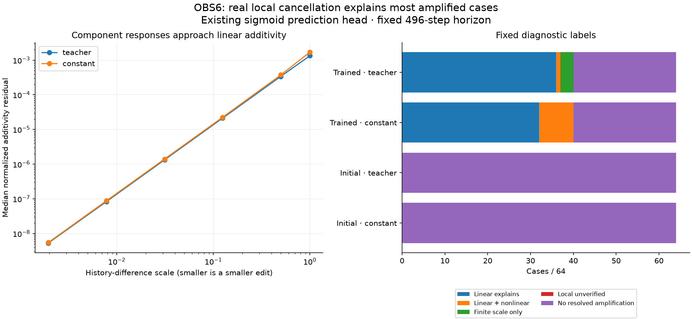

# OBS6: hidden history effects really can counteract one another

Completed 2026-09-09. **All eight audit checks pass.** Protocol and three-test
instrument were frozen in commit `c9f5935` before compute. This investigates the
amplification observed in [OBS5](obs5_natural_history_review_20260909.md).

## Main result

Of128 trained combinations,80 meet the fixed full-scale amplification criterion:
removing the history difference's readout-null component increases the final
prediction-response norm by at least10%, above the resolution floor.

* **68/80:** the actual local linear response explains all three full-scale
  component response vectors within the declared5% tolerance.
* **9/80:** local cancellation is present, with additional finite-size nonlinear
  effects beyond that tolerance.
* **3/80:** amplification appears at finite scale without meeting the local
  cancellation criterion.

There are no unverified small-scale comparisons: all256 combinations meet the
two-smallest-amplitudes agreement check, including128 initial-weight cases whose
final response is below resolution. Those controls have no resolved amplification
or local cancellation at496 steps; this does not say they never cancel earlier.

The result supports **counteracting history effects as the main explanation in
the amplified cases**, rather than amplification being predominantly an artifact
of making a large state edit. It does not establish deliberate inhibition,
useful forgetting, an internal goal, or an authorship pillar.

## What "counteracting" means here

The original history difference is decomposed into two orthogonal parts in hidden
state: one visible to the immediate readout (row), and one initially invisible
(null). After recurrent evolution, their output effects need not remain orthogonal.
Here they often point in opposing directions, so their combined output effect is
smaller than the visible-part effect alone. Removing the hidden part removes some
of that opposition and can make the later prediction difference larger.

For the amplified trained cases, median local row/null output cosine is about
**-.99994** under teacher input and **-.99708** under constant input. A cosine
near-1 means opposite output directions. Median full-scale row/full response
ratios within those amplified subsets are **4.90** and **9.68** respectively.
These are subset descriptions, not typical ratios across every tested case.

Local tangent additivity itself is a mathematical property of differentiation,
not a discovered emergent property. The empirical findings are the opposition,
its magnitude, its persistence through the recurrent system, and agreement with
the actual finite paired replays. Signed output-vector geometry is measured;
there is no claim that the model intends to balance or suppress anything.

## Diagnostic accounting

| Weights / input driver | Cases | Full-scale amplified | Local cancellation | Linear explains full scale | Linear core + nonlinear | Finite scale only |
| --- | --- | --- | --- | --- | --- | --- |
| Trained / teacher | 64 | 40 | 39 | 36 | 1 | 3 |
| Trained / constant | 64 | 40 | 48 | 32 | 8 | 0 |
| Initial / teacher | 64 | 0 | 0 | 0 | 0 | 0 |
| Initial / constant | 64 | 0 | 0 | 0 | 0 | 0 |

The local-cancellation flag is independent of full-scale amplification:87 trained
cases have local cancellation, including10 without resolved full-scale amplification.
The remaining48 trained combinations have no resolved full-scale amplification;
they are retained in all accounting. OBS5 used increase-at-both-scales counts;
OBS6 instead requires>=10% amplification at full scale plus a1e-6 response floor,
so its80 cases should not be substituted for OBS5's94 cases.

## How the test separates the explanations

All256 OBS5 midpoints, history differences and496-step input streams are reused.
No case is selected for an earlier positive result. For full, row and null history
differences, paired replays use scales1,.5,.125,.03125,.0078125,.001953125. A midpoint
baseline adds one branch:37 per combination,9472 in total. First two levels match
the corresponding OBS5 state checkpoints within the audit tolerance.

The local prediction is calculated through the actual evolving midpoint trajectory,
propagating history directions through each successive Jacobian and through the
existing sigmoid head. It does **not** assume the initial Jacobian stays constant.
The paired signed response is (plus-minus)/scale, so changing scale does not
trivially shrink the measured quantity.

At both smallest scales every F/R/N response vector agrees with its local tangent
within5% of max(tangent norm,1e-6). At full scale this holds in44/64 trained teacher
and32/64 trained constant cases; the exclusive label also requires resolved
amplification and opposing components. Initial cases pass numerical agreement
near zero without qualifying as positive cancellation evidence.

For the trained groups, median normalized additivity residual falls from
**.00133/.00170** at full scale to **5.31e-9/5.51e-9** at the smallest scale
(teacher/constant). A small additivity residual alone is insufficient: components
can each change nonlinearly with amplitude while remaining approximately additive.
That is why the decision also compares each signed vector with the actual tangent.

## All model groups

Models1–8 correspond to initializations20261101–20261108. Reused worlds and paired
orientations are related observations, not independent population trials. All
counts, medians and subset summaries are labelled post-extraction descriptions.

| Model | Weights | Driver | Cases | Amplified | Local cancellation | Linear explains | Linear + finite nonlinear | Finite scale only |
| --- | --- | --- | --- | --- | --- | --- | --- | --- |
| 1 | final | teacher | 8 | 4 | 1 | 0 | 1 | 3 |
| 2 | final | teacher | 8 | 8 | 8 | 8 | 0 | 0 |
| 3 | final | teacher | 8 | 8 | 8 | 8 | 0 | 0 |
| 4 | final | teacher | 8 | 8 | 8 | 8 | 0 | 0 |
| 5 | final | teacher | 8 | 0 | 0 | 0 | 0 | 0 |
| 6 | final | teacher | 8 | 0 | 2 | 0 | 0 | 0 |
| 7 | final | teacher | 8 | 8 | 8 | 8 | 0 | 0 |
| 8 | final | teacher | 8 | 4 | 4 | 4 | 0 | 0 |
| 1 | final | constant | 8 | 0 | 8 | 0 | 0 | 0 |
| 2 | final | constant | 8 | 8 | 8 | 8 | 0 | 0 |
| 3 | final | constant | 8 | 8 | 8 | 8 | 0 | 0 |
| 4 | final | constant | 8 | 0 | 0 | 0 | 0 | 0 |
| 5 | final | constant | 8 | 8 | 8 | 8 | 0 | 0 |
| 6 | final | constant | 8 | 0 | 0 | 0 | 0 | 0 |
| 7 | final | constant | 8 | 8 | 8 | 8 | 0 | 0 |
| 8 | final | constant | 8 | 8 | 8 | 0 | 8 | 0 |
| 1 | initial | teacher | 8 | 0 | 0 | 0 | 0 | 0 |
| 2 | initial | teacher | 8 | 0 | 0 | 0 | 0 | 0 |
| 3 | initial | teacher | 8 | 0 | 0 | 0 | 0 | 0 |
| 4 | initial | teacher | 8 | 0 | 0 | 0 | 0 | 0 |
| 5 | initial | teacher | 8 | 0 | 0 | 0 | 0 | 0 |
| 6 | initial | teacher | 8 | 0 | 0 | 0 | 0 | 0 |
| 7 | initial | teacher | 8 | 0 | 0 | 0 | 0 | 0 |
| 8 | initial | teacher | 8 | 0 | 0 | 0 | 0 | 0 |
| 1 | initial | constant | 8 | 0 | 0 | 0 | 0 | 0 |
| 2 | initial | constant | 8 | 0 | 0 | 0 | 0 | 0 |
| 3 | initial | constant | 8 | 0 | 0 | 0 | 0 | 0 |
| 4 | initial | constant | 8 | 0 | 0 | 0 | 0 | 0 |
| 5 | initial | constant | 8 | 0 | 0 | 0 | 0 | 0 |
| 6 | initial | constant | 8 | 0 | 0 | 0 | 0 | 0 |
| 7 | initial | constant | 8 | 0 | 0 | 0 | 0 | 0 |
| 8 | initial | constant | 8 | 0 | 0 | 0 | 0 | 0 |

## Verification and scope

The audit independently replays all9472 branches with the manual GRU formula,
checking all saved response curves and state checkpoints. It verifies component
provenance, prior-run agreement, all analytic tangent paths and additivity, all
signed metrics and labels. Sixteen fixed complete496-step midpoint maps are
independently differentiated end to end by native forward-mode automatic
differentiation, for both logits and
sigmoid predictions. Other tangent paths are checked against analytic propagation;
the independent automatic-differentiation audit is the specified16-case subset.

The slow initial audit used a dense reverse-mode Jacobian; it was replaced by
forward-mode directional derivatives of the same complete map along the three
required history directions. Further inspection found repeated NPZ decompression
inside the checking loop; materializing each group's arrays once removed that
bottleneck. Both stopped audit implementations and their logs were preserved.
The frozen experiment, numerical tolerances and scientific results were unchanged.
The stopped audit sources/logs and `audit_execution_note.json` remain in the result
directory; this was an audit implementation optimization, not a scientific retry.

Maximum independent state error: 3.44e-15; response error:
4.88e-12; end-to-end tangent error:
1.04e-16; OBS5 checkpoint difference:
0. Source identities pass before/after.
Three synthetic tests passed before freezing. The figure was visually inspected.

These remain frozen CYC6 GRU components with histories produced by the supplied
preparation procedure, not ZeusCore or its deployed speech. Trained/initial cases
use each weight set's experience-formed states; they are not identical-state
weight interventions. No training, new world episode, deployment, usefulness
gate or functional verdict change occurred.

Protocol: [OBS6](obs6_cancellation_protocol_20260909.md). Exact arrays and results:
`runs/obs6_20260909/`; canonical compact JSON:
`zeus_sandbox/universe/reports/obs6_*_20260909.json`.

## Next question

We have now localized a reproducible counteracting effect. The next useful
diagnosis is **whether that opposition improves prediction accuracy, or merely
reduces differences between histories**. That requires comparing edited and
original predictions against a specified factual target, with matching controls.
It should not be called useful regulation merely because cancellation exists.
This investigation is complete; no such functional probe has been launched.

## Subsequent authorized result: OBS7

The factual-accuracy diagnosis is [complete](obs7_factual_accuracy_review_20260909.md).
Both positive-benefit criteria fail: retaining the actual null-history component
does not improve the registered late unobserved-cell score. Removal slightly
reduces mean error by3.35e-6 MSE (about.0845% of original loss); its advantage
over the equal-size control is not established by the resampling bounds. All
eight audit checks pass. The cancellation finding remains valid, with factual
usefulness unqualified on this test.
