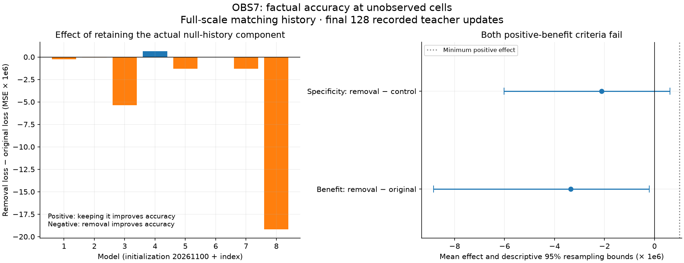

# OBS7: no factual-accuracy benefit from retaining the counteracting component

Completed 2026-09-09. **FACTUAL_BENEFIT: FAIL. SPECIFIC_BENEFIT: FAIL. All eight
audit checks pass.** Protocol and three-test instrument were frozen in commit
`72016f8` before scoring. This tests usefulness of the component investigated in
[OBS6](obs6_cancellation_review_20260909.md), without changing earlier results.

## Main result

On the fixed primary score, keeping the actual readout-null history component
does not improve factual resource prediction. Removing it slightly improves
the mean late unobserved-cell MSE in these recorded teacher trajectories:

| Full-scale matching-history arm | Primary MSE |
| --- | --- |
| Original state | .003967194 |
| Remove actual null component | .003963841 |
| Equal-size null control shift | .003965956 |

Benefit is defined as removal loss minus original loss, so positive favors keeping
the component. The measured mean is **-3.35284e-6 MSE**, with descriptive95%
two-axis resampling bounds **[-8.84938e-6, -2.14636e-7]**. Removal's improvement is
about **0.0845% of original MSE**: small, not a large performance change.

Specificity is removal loss minus matched-control loss. Its mean is **-2.11483e-6**,
with bounds **[-6.01652e-6, +6.20627e-7]**. That interval spans zero, so this probe
does not establish a reliably distinct removal advantage over the equal-size
control either. Both registered positive-benefit criteria fail. No target, time
window, threshold or favorable subset was substituted after exposure.

This is not a claim that memory generally harms prediction. It concerns one
component of a particular history-pair difference, removed through a specified
finite edit in already studied models and worlds. The persistence and cancellation
mechanisms remain measured facts; the proposed accuracy benefit did not qualify.

## What was scored

For eight fixed preparations and eight models, both trained and initial weights
were replayed on the recorded496-step teacher input sequence. Primary scoring
uses the PLUS side of the full-scale pair: the original history matching the
world being scored, or its edited counterpart. Donor-history MINUS and half-scale
states are retained as diagnostics; they are not extra correct-history samples.

The factual target is all nine true resource amounts in each recorded
resources_before field, before the logged action. The model consumes that row's
current observation, then predicts. Current-cell identity, resource value, tick,
field continuity and boundary/final state were checked. The primary score excludes
the currently observed cell and averages the other eight over the final128 updates
(ages384–511). This is late factual prediction, not agreement with a taught proxy.

These GRUs were trained to imitate a scripted resource-cache estimator, which uses
assumed recovery dynamics. Their training target is not necessarily the true
resource field. Factual accuracy is therefore a deliberate independent diagnosis,
not a retrospective replacement for the original training objective.

The synthetic constant-input branches from earlier probes were not scored:
there is no corresponding recorded evolving world truth. They remain valid
dynamical observations but cannot supply an invented accuracy endpoint.

## Control and decision

Six OBS5 arms were retained at both scales, with both signs, and a seventh
equal-size null shift was added. It has the same norm as full-null removal but
lies in a null direction orthogonal to the actual null-history difference.
It preserves immediate readout outputs. It is a counterfactual displacement,
not deletion of another genuine history component. This corrects the size mismatch
that would result from using OBS5's smaller slow-component control for this test.

FACTUAL_BENEFIT requires mean benefit>=1e-6 MSE and lower resampling bound>0.
SPECIFIC_BENEFIT additionally requires the same conditions for specificity.
The1e-6 floor is a preregistered diagnostic convention, not a universal usefulness
threshold. Initial-weight late effects are numerically zero, and their criteria
also fail to qualify. Trained effects are small but above numerical replay error.

Orientations are averaged within each model/world, giving8x4 paired matrices.
The10000 fixed-seed resamples draw both model and world indices with replacement.
These percentile bounds describe a small fixed reused set; they are not a new
holdout or confirmatory population confidence interval. Every matrix cell,
model/world mean and index draw remains available in the artifacts.

## Heterogeneity and secondary observations

Removal improves the primary score in41/64 trained cases; keeping the component
is better in23/64. Seven of eight model means favor removal, while model4 favors
retention by about6.58e-7, below the positive-effect floor. The half-scale mean
benefit is also negative, -1.80351e-6. OBS6-amplified and other cases both have
negative mean benefit (-3.29033e-6 across40 cases and -3.45703e-6 across24).
These declared secondary descriptions do not rescue or replace the primary result.

| Model | Benefit: removal − original | Specificity: removal − control |
| --- | --- | --- |
| 1 | -2.48844687e-07 | -4.56892196e-07 |
| 2 | -4.22207809e-08 | 1.41049621e-07 |
| 3 | -5.37612031e-06 | -6.61714981e-06 |
| 4 | 6.57836705e-07 | 7.867278e-07 |
| 5 | -1.29670111e-06 | 8.39981339e-07 |
| 6 | -2.18352103e-08 | -1.45896604e-07 |
| 7 | -1.32606413e-06 | 1.14735834e-06 |
| 8 | -1.91687909e-05 | -1.26137862e-05 |

The other arms and whole-trajectory scores remain diagnostics. In particular,
removing only the selected slow direction has different late and whole-trajectory
effects. That does not authorize changing the preregistered primary component
or window to obtain a positive result.

| Arm | Late unobserved-cell MSE | Whole-trajectory unobserved-cell MSE |
| --- | --- | --- |
| original | 0.003967194 | 0.004839770 |
| remove_slow_null | 0.003967341 | 0.004834260 |
| matched_null_shift | 0.003967217 | 0.004840341 |
| remove_all_null | 0.003963841 | 0.004837017 |
| only_null | 0.003976548 | 0.004885816 |
| erase_difference | 0.003972459 | 0.004891593 |
| matched_full_null_shift | 0.003965956 | 0.004848745 |

Per-cell signed error and MSE changes for all seven arms are saved in the derived
JSON. Those cellwise late diagnostics include all nine cells; they are distinct
from the primary eight-unobserved-cell score. The full raw predictions and masks
permit inspection without treating a post-hoc slice as a confirmatory endpoint.

## Verification

All eight independent audit checks pass: source identity; every raw target and
timing; all3584 manual branch replays and OBS5 agreement; predictions, all loss
curves and summaries; control geometry and output invariance; every paired effect
and stratum; independent reconstruction of the fixed two-axis bootstrap and
decisions; final source identity. Arrays are materialized once per group to avoid
the repeated-decompression bottleneck found in the preceding audit.

Maximum independent state error: 3.39e-15; loss error:
2.64e-16; prior checkpoint difference:
0. Three synthetic tests passed before
freezing, and the figure was visually inspected. Secondary means, counts and
cellwise summaries are labelled post-extraction descriptions.

Protocol: [OBS7](obs7_factual_accuracy_protocol_20260909.md). Exact evidence:
`runs/obs7_20260909/` (targets, masks, predictions, loss curves, checkpoint/late
states, bootstrap indices and hashes). Canonical compact JSON:
`zeus_sandbox/universe/reports/obs7_*_20260909.json`.

## Consequence and next question

These results do not establish this component as useful regulation. The effect
is small and measured on reused trajectories. No policy rollout, training,
deployment, survival verdict or authorship pillar changed.

The remaining mechanistic question is whether the opposition primarily reflects
the scripted estimator the model was taught, rather than more accurate world
knowledge. Comparing those two targets could explain the discrepancy, but would
not retroactively turn this failed factual-benefit test into a pass. This bounded
diagnosis is complete; no additional test has been launched.

## Subsequent authorized comparison

[OBS8 is now complete](obs8_target_mismatch_review_20260909.md). The specific
estimator-fidelity explanation fails to qualify: estimator benefit, specific
benefit and target tradeoff all FAIL. The estimator and factual targets disagree,
but retaining the component does not qualify as beneficial against either.
All seven independent checks pass; the OBS7 factual verdict remains unchanged.
