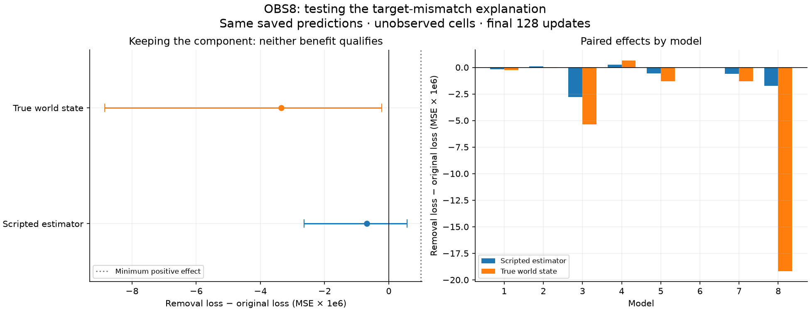

# OBS8: the target-tradeoff explanation fails to qualify

Completed 2026-09-09. **PROXY_BENEFIT: FAIL. PROXY_SPECIFIC_BENEFIT: FAIL.
TARGET_TRADEOFF: FAIL. All seven independent audit checks pass.** Protocol and
three synthetic tests were committed in `51226f0` before new scores were computed.

## Plain-English finding

We tested whether keeping the counteracting history component helps the memory
model imitate its teaching estimator, even though it did not improve factual
accuracy in OBS7. That proposed explanation fails this registered comparison.
Keeping the component does not meet the benefit criterion for either target.
Removal slightly lowers both mean errors. The estimator effect's resampling
bounds span zero, so a reliable estimator advantage from removal is not established.

The two targets do disagree, and that disagreement changes the size of the
measured effect. It does not turn this component into a demonstrated useful
estimator memory. Its measured persistence, later influence and cancellation
remain observations. Neither prediction usefulness nor authorship follows.

## Frozen comparison and results

This analysis makes zero new neural forward passes. It rescores the saved OBS7
predictions in all 128 model/preparation/weight combinations, seven arms, two
scales and two signs: 3584 cached branches. Primary scoring remains full-scale
PLUS (matching history), eight currently unobserved cells, final 128 updates.
The same 8 models, 4 worlds and 2 orientations are reused; these are not new
held-out samples. Orientations are averaged before the fixed 10000 two-axis
model/world bootstrap. Bounds are descriptive, not fresh confirmatory inference.

| Primary comparison | Mean MSE effect | Descriptive 95% bounds | Benefit criterion |
| --- | --- | --- | --- |
| Estimator: removal minus original | -6.85577e-7 | [-2.63414e-6, +5.67274e-7] | FAIL |
| Estimator: removal minus matched control | -6.55270e-7 | [-2.11694e-6, +2.75568e-7] | FAIL |
| World truth: removal minus original (unchanged OBS7) | -3.35284e-6 | [-8.84938e-6, -2.14636e-7] | FAIL |

Positive effects favor keeping the component. Benefit requires mean >= 1e-6 and
lower bound > 0. Specific benefit additionally requires those conditions against
the equal-size control. TARGET_TRADEOFF requires estimator benefit plus factual
disadvantage (mean <= -1e-6, upper bound < 0). Its estimator condition fails.
These FAIL labels mean failure to qualify under the frozen bars; they do not
prove exact zero effect or exclude every possible training-target explanation.
Initial-weight late effects are numerically zero and all three criteria fail.

## The target and the exact accounting

The original training script teaches a resource-cache estimator, using only the
recorded local observations. At each tick it updates the visited cell. A known
cell's estimate relaxes from its last observed resource value toward .575 with
factor .992 per elapsed tick, clipped to [0,1]; an unseen cell gets .40. This is
an approximation to actual world dynamics. We reconstruct the original helper's
targets, retaining its intended float64 values rather than adding float32
quantization. Its 513 valid rows and all 496 scored input rows are checked.

Every intervention is scored against the same matching-world estimator history.
Donor states do not get donor-defined targets. World truth and observation masks
are unchanged from OBS7. All secondary branches and whole-trajectory results
remain available without replacing the primary window or target.

Let p be prediction, T the estimator target, and W world truth. For the same
mask and time window, the independently checked identity is:

`MSE(p,W) = MSE(p,T) + MSE(T,W) + 2 mean[(p-T)(T-W)]`.

| Arm | Estimator MSE | Target disagreement | Signed cross term | Factual MSE |
| --- | --- | --- | --- | --- |
| original | 0.002356321520 | 0.001228190223 | 0.000382682449 | 0.003967194192 |
| remove_all_null | 0.002355635943 | 0.001228190223 | 0.000380015184 | 0.003963841350 |
| matched_full_null_shift | 0.002356291213 | 0.001228190223 | 0.000381474740 | 0.003965956176 |

The final column is the sum of the preceding three columns (up to rounding).
The cross term is signed and depends on the predictions; these terms are not
exclusive percentages of error or a causal attribution of learning.

For removal R and original state 0, a second identity gives:

`benefit_T - benefit_W = 2 mean[(pR-p0)(W-T)]`.

Its mean right-hand side is **+2.66726509e-6**. This exactly accounts for why the
negative factual effect is larger than the negative estimator effect. It is an
algebraic score difference, not evidence that target mismatch caused the learned
component or that replacing the teaching target will fix it.

## Variation across cases

Estimator agreement favors retention in 27/64 trained cases and removal in 37/64.
Only two model means are positive; both are below the 1e-6 benefit floor.
Six individual cases have positive estimator benefit and negative factual
benefit. This heterogeneous subset does not rescue the failed overall criterion.
All counts here are post-extraction descriptions of the frozen full case set.

| Model | Estimator benefit | Factual benefit |
| --- | --- | --- |
| 1 | -1.62142893e-07 | -2.48844687e-07 |
| 2 | 8.30022137e-08 | -4.22207809e-08 |
| 3 | -2.77372662e-06 | -5.37612031e-06 |
| 4 | 2.73519117e-07 | 6.57836705e-07 |
| 5 | -5.48181673e-07 | -1.29670111e-06 |
| 6 | -9.2380097e-09 | -2.18352103e-08 |
| 7 | -5.93676773e-07 | -1.32606413e-06 |
| 8 | -1.75417502e-06 | -1.91687909e-05 |

## Independent verification and evidence

The audit rebuilds all eight estimator streams from raw initial/exposure/teacher
observations using independent last-visit arrays and the explicit scalar formula.
It compares every target to both the original teaching helper and saved targets,
then recomputes every cached branch's losses, signed decomposition, window
summary, primary effect, model/world matrix, bootstrap bounds and decision.
The factual OBS7 conclusion and consumed source hashes are verified unchanged.

All seven checks pass. Maximum recomputed loss discrepancy: 0.
Maximum loss identity residual: 8.5e-17; paired
target-gap residual: 2.06e-18, below the
registered absolute 1e-12 tolerance. Three synthetic tests passed before scoring.

Protocol: [OBS8](obs8_target_mismatch_protocol_20260909.md). Raw evidence and
hashes: `runs/obs8_20260909/`. Canonical compact results, completion, independent
audit and derived descriptions: `zeus_sandbox/universe/reports/obs8_*_20260909.json`.
Review figure is visually inspected before closure.

## Consequence and proposed next discriminant

The specific claim that this component trades factual accuracy for better
imitation of its teaching estimator fails to qualify. Target disagreement exists,
but it is not a demonstrated usefulness explanation. Retargeting training is
not justified as a repair by this result alone. This probe concerns the CYC6 GRU
resource-memory components, not ZeusCore's spoken output or an authorship gate.

The next useful distinction is whether this internal influence changes choices
and outcomes when the model's predictions actually drive the agent. Recorded
teacher inputs cannot answer that feedback question. A separately frozen,
closed-loop intervention test could compare original state, null removal and
matched control, keep weights fixed, and score decisions and survival on a
prespecified world set. That would test practical consequences of the mechanism
without claiming that prediction MSE already establishes them.

This diagnosis is complete. No training, policy rollout, new world simulation,
deployment, survival-verdict change or authorship promotion occurred, and the
proposed next experiment has not been launched.
