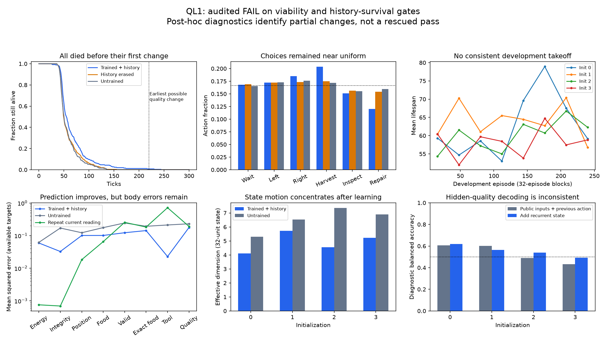

# QL1 final diagnosis — 2026-09-10

**Audited verdict: learned viability FAIL; learned history benefit FAIL.** All four
initializations score 0/64 in both world conditions and all three arms. The independent
audit passes all 1,536 endpoint lifetimes and 93,236 transitions. The eight development
runs form four exact twin pairs. No rules, seeds, weights or thresholds were changed
after exposure; no rescue training was performed.

The useful finding is narrower: learning and recurrent history produced a modest
increase in lifespan, while the model failed to establish the basic feeding/repair
loop needed to reach the intended change-and-memory challenge. That is a lead for
research, not a rescued gate or a six-pillar result.

## 1. What happened

Each condition contains 256 lifetimes per arm: four models by 64 world seeds.

| Condition | Arm | Survivors / 256 | Mean lifespan | Median | Maximum |
|---|---|---:|---:|---:|---:|
| Stable | Trained, continuing history | 0 | 63.23 | 52 | 230 |
| Stable | Same weights, history erased | 0 | 59.16 | 50 | 157 |
| Stable | Untrained initialization | 0 | 57.79 | 49 | 203 |
| Changing | Trained, continuing history | 0 | 66.43 | 55.5 | 245 |
| Changing | Same weights, history erased | 0 | 59.30 | 50 | 156 |
| Changing | Untrained initialization | 0 | 58.29 | 51 | 137 |

The required horizon is 1,024. Every registered survival difference is zero; the
bootstrap returns [0,0] because all binary outcomes are zero. This floor does **not**
prove equivalent policies, absence of all history effects, or impossibility of learning.
It does decisively fail this registered recipe's requirements.

## 2. The decisive bottleneck is before the first change

No changing-world lifetime in development or evaluation reached its first scheduled
quality reversal. Some lasted beyond the earliest possible change time of 220, but
not beyond their own seed's actual first reversal. Final switch indices were all zero.

Among the 512 intact evaluation deaths, energy crossed the death threshold in 499;
13 were integrity-only deaths. Thus the immediate failure is predominantly failure
to replenish energy. Memory revision after change was never behaviorally exercised.
The history gate still fails as registered; revision capacity itself remains untested.

Stable and changing labels share initial physical conditions but use different action
sampling seeds in evaluation. Their small mean differences here cannot be attributed
to changes that never occurred. Removing late changes alone would not solve this
problem: the stable arm also fails.

## 3. A small functional effect should not be discarded

Post-hoc paired lifespan differences, using 10,000 crossed model/world bootstrap draws
(seed 20260910), are:

| Condition | Intact minus control | Mean extra ticks | Diagnostic 95% interval |
|---|---|---:|---:|
| Stable | History erased | 4.08 | [1.38, 7.50] |
| Stable | Untrained | 5.44 | [2.57, 9.28] |
| Changing | History erased | 7.14 | [2.48, 12.42] |
| Changing | Untrained | 8.14 | [3.21, 13.79] |

Each initialization's mean difference is positive for both controls in both conditions.
This is descriptive evidence of modest learned benefit and modest benefit from the
continuing state in this setup. These intervals are exploratory, not multiplicity-
corrected confirmatory claims, and four models give limited precision. Twins are not
eight independent models. History erasure also creates a state distribution shift;
it does not isolate a semantic quality map or compare against a retrained memoryless
agent. None of these lifespan results substitutes for full-horizon viability.

## 4. The actor has barely learned to use its affordances

Changing/intact action entropy is 1.771 nats, 98.84% of the maximum log(6). The empirical
mix remains broad and nearly uniform; this is not collapse into one repeated action.

Of 3,462 harvest attempts, 2,200 (63.5%) occur away from either food patch. Of 2,044
repair attempts, 1,550 (75.8%) occur away from the workshop. There are 1,081 blocked
boundary moves. These are failures to connect actions to the places where they work.

At a patch, 772 harvests are on usable food and 490 on contaminated food. After a
public inspection, mean harvest probability is only 22.33% for usable versus 20.20%
for contaminated food. This is an observational comparison across different contexts,
not a matched causal quality intervention, but the policy clearly does not consistently
avoid known contamination. The untrained values are 18.00% versus 17.03%.

The model inspects 2,569 times, including 1,626 inspections away from food. Off-patch
inspection can still reveal tool condition, so it is not intrinsically useless; there
is no demonstrated strategy making that information pay for itself here.

## 5. Recurrent history affects decisions, but magnitude needs care

For every saved intact decision, a diagnostic forward pass used the same current
observation and actual previous action with the incoming recurrent state set to zero.
No new world was advanced and no weights were updated. On changing-arm traces:

- Mean total-variation distance between action distributions: 0.0531.
- Highest-probability action changes on 47.05% of decisions.

The second number looks large because choices are nearly tied. The first says the
actual probability redistribution is modest. Together with the live erasure control's
lifespan loss, this supports causal involvement of recurrent history in short-term
behavior. It does not establish self-authored goals, intentional control, selective
memory or a useful quality map. The architecture intentionally makes actions depend
on recurrent state; the measured effect size was not explicitly programmed.

## 6. Prediction improved, but the predictor is not ready to plan with

Changing/intact mean masked next-observation MSE is 0.07863, versus 0.15819 for the
untrained arm. Repeating the current reading gives 0.07915 on the intact trajectories:
the trained model only narrowly beats this simple aggregate baseline.

More revealingly, energy MSE is 0.05953 versus 0.000756 for repetition; integrity is
0.03261 versus 0.000695. The learned predictor is much worse at these slowly varying,
critical body quantities. Improvements are stronger for availability/tool readings.
The repetition baseline is deliberately simple and cannot invent newly inspected
values; its failures on those slots make the aggregate comparison easier to beat.

Initial and trained arms visit different trajectories, so their raw prediction-loss
comparison is not a matched causal learning estimate. Development losses also fall,
which independently confirms optimization progress. Neither establishes accurate
counterfactual action prediction: only executed-action targets were checked. Feeding
this predictor into a planner now would be unjustified.

## 7. Low-dimensional movement is real, partly present before training

Within-lifetime centered state covariance was measured separately for each model,
never inferred by mixing independently learned coordinate systems.

| Initialization | Trained effective dimension | Untrained | Trained dimensions for 90% variance |
|---|---:|---:|---:|
| 0 | 4.11 | 5.30 | 6 |
| 1 | 5.72 | 6.53 | 7 |
| 2 | 4.55 | 7.36 | 7 |
| 3 | 5.23 | 6.89 | 7 |

These are 32-unit states. Learning concentrates observed motion, but low-dimensional
motion already exists in the initial networks. Input restrictions, recurrent filtering
and visited trajectories are plausible contributors; this experiment does not separate
them. It is not evidence that unused dimensions are inaccessible, nor a reason by
itself to add dimensions or a diversity objective. Functional rank and covariance rank
are different questions.

## 8. A hidden-quality representation is not consistently established

Exploratory fixed ridge probes try to decode which patch is usable during uninspected
stable-world steps. Even world seeds train the probe; odd seeds test it. Inputs are
public sensors, previous action and time, compared with those inputs plus recurrent
state. No policy weights change. Balanced accuracy is:

| Initialization | Public/previous-action/time baseline | Add recurrent state |
|---|---:|---:|
| 0 | 0.607 | 0.618 |
| 1 | 0.602 | 0.565 |
| 2 | 0.488 | 0.540 |
| 3 | 0.432 | 0.491 |

The effect is inconsistent and weak. Steps within an episode are correlated, longer
lifetimes contribute more samples, and these probes are post-hoc with no preregistered
representation bar. No reliable retained quality representation is claimed. A linear
probe failing also cannot exclude other forms of representation.

## 9. Optimization worked; the causal reason for poor learning is not isolated

Across the four unique development runs, 62,679 world steps were collected (125,358
including exact twins). No development survivor or change exposure occurred. The
fixed lifetime budget therefore provided little experience of successful long chains.
First-to-last 32-episode block prediction losses fell from about 0.145–0.166 to
0.074–0.090, while lifespan trends remained inconsistent.

Relative parameter changes were 22–26% in recurrence, 43–46% in the predictor and
3–13% in the actor. These show that learning was active, not that any one objective
caused failure. Relative norms depend on parameterization.

A separate no-update probe recomputed weighted loss gradients on the first segment
of all 256 stable/intact endpoint lifetimes. At final checkpoints, shared-recurrence
actor gradient norms average 0.014–0.021, prediction 0.020–0.024, value 0.041–0.056,
and entropy 0.0012–0.0027. Actor/prediction cosine averages approximately 0.002–0.024.
Value learning has the largest local gradient in this probe; entropy is not the largest.
This does not identify historical gradient competition or justify blaming entropy.
The probe uses final checkpoints, not the full learning trajectory. No optimizer step
was taken, and checkpoint hashes stayed unchanged.

## 10. What this eliminates, and what I recommend

Eliminated as sufficient: this fixed end-to-end recipe, budget and exposure distribution
for obtaining reliable viability and history-supported survival. Also unsupported:
explaining failure by late changes, calling prediction improvement a capable world
model, or calling low-dimensional motion a newly discovered functional organization.

Retain as observed leads: modest history-dependent lifespan benefit; measurable
probability shifts under same-stream state erasure; learned prediction improvement;
state-motion concentration. These are lower-order properties with sharply limited
functional evidence. No consciousness, selective inheritance or six-pillar promotion.

My next priority would be **a separately registered test of acquiring the basic
feeding loop from consequences**. Give a fresh learner training starts that make
reachable food/action consequences adequately represented, then demand transfer to
new full-world starts with the original physics and an untrained control. Define the
exposure schedule and budget before running, without scripted action targets. Include
an explicit action/context competence check and body-prediction persistence baseline.
That would test an identifiable missing prerequisite instead of hoping a larger
monolithic run solves navigation, hazard inference, maintenance and memory together.

Simply making the world stable is not that proposal; QL1 already failed before any
change. Any staged exposure is an engineered training aid and must be declared as such.
Useful adaptation after changes should be tested only after a learner can reach them.
A curriculum, objective ablation, planning addition or larger campaign would be a new
experiment, not an automatic continuation of this failed one. None was launched here.

## Evidence and limits of this report

Frozen campaign sources: 6b92973. Original protocol:
`docs/ql1_learning_protocol_20260909.md`; audit closure:
`docs/ql1_audit_addendum_20260909.md`. All frozen hashes still match.

Raw artifacts: `runs/ql1_20260909/`, about 230 MB before the final diagnostic additions.
Compact audited endpoint and diagnostic artifacts are copied under
`zeus_sandbox/universe/reports/ql1_*_20260910.json`. The endpoint audit and diagnostic
scripts are separate: exploratory analysis cannot alter the registered verdict.
Diagnostic action, inspection, unsafe-harvest and transition counts were independently
joined back to audited episode summaries in all six groups. The chart was visually
checked. The report covers the concrete useful angles supported by these artifacts;
it is not a claim that every conceivable hypothesis has been tested.
