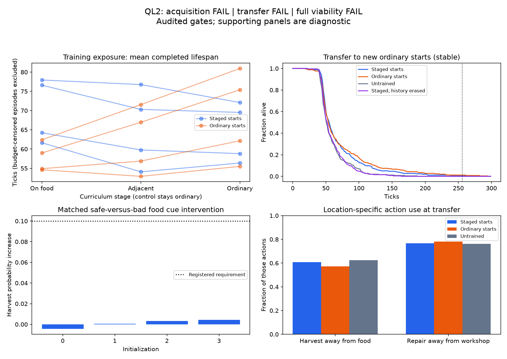

# QL2 final diagnosis — 2026-09-10

**Audited result: feeding acquisition FAIL; curriculum transfer FAIL; full viability
FAIL.** The proposed staged-start intervention did not meet its purpose at this
budget. No survival horizon was reached in any of the2,048 evaluation lifetimes.

The independent audit passed131,072 unique training transitions and132,539 evaluation
transitions. All eight twin pairs matched exactly. Including twins, development used
262,144 world steps, precisely the frozen budget. No source, threshold or checkpoint
was changed after exposure; no rescue training was performed.

## What the intervention actually delivered

The curriculum changed only initial position: usable food, then one move away, then
ordinary centre starts. The control used ordinary starts throughout. Both used the
same fresh learner, reward, stable training physics and16,384 steps per run. These
are engineered starting aids, not model-discovered knowledge or an autonomous goal.

The intervention increased first-phase energy-increasing harvests to976 versus588
in the ordinary control, pooled over four unique models (twins excluded). Thus it
really did provide more successful feeding experience. First-phase safe-site harvests
were992 versus597; some safe harvests did not increase observed energy because of
clipping. There were1,202 versus957 inspected-patch input steps. The failure cannot
be dismissed as the intended exposure intervention never taking effect.

But the last ordinary-start training phase yielded1,433 energy-increasing harvests
for the curriculum versus1,687 for ordinary training, at equal phase step budgets.
Helpful positioning did not produce a retained advantage once those aids disappeared.
These are exposure counts and associations, not a causal decomposition of learning.
Lifespans during easier starts are not proof of acquired skill: position itself helps.

## Transfer results

Each row pools four models by64 previously unused ordinary-start world seeds.

| Condition | Model arm | Mean lifespan | Alive after256 /256 | Alive at1024 /256 |
|---|---|---:|---:|---:|
| Stable | Staged starts | 69.13 | 1 | 0 |
| Stable | Ordinary training | 72.32 | 3 | 0 |
| Stable | Untrained | 59.28 | 0 | 0 |
| Stable | Staged, history erased | 59.52 | 0 | 0 |
| Changing | Staged starts | 68.24 | 0 | 0 |
| Changing | Ordinary training | 70.81 | 1 | 0 |
| Changing | Untrained | 58.42 | 0 | 0 |
| Changing | Staged, history erased | 60.00 | 0 | 0 |

The acquisition gate required48/64 alive256 for each staged model, an advantage over
untrained, and meaningful response to the food-quality cue. Model0 supplied the only
stable staged survivor past256; the other three supplied none. The registered
alive256 advantage over ordinary training was-0.00781, interval[-0.02734,0]; over
untrained it was0.00391, interval[0,0.02344]. Both fail their specified positive bars.

Post-hoc lifespan differences against ordinary training were-3.19 ticks stable
(interval[-8.55,1.53]) and-2.57 changing ([-8.74,1.64]). Report **no detected curriculum
benefit**, not an established general claim that curricula hurt. Both intervals cross
zero; this is one schedule, one budget and four models. Equal world steps do not mean
identical episode or optimizer-update counts, as declared before the run.

No staged-model lifetime reached a quality reversal. One ordinary-trained changing
lifetime reached its first reversal; that single exposure does not establish revision.
Training was stable by design. Of512 staged endpoint deaths,491 involved depleted
energy and21 were integrity-only. Basic replenishment remains the dominant failure.

## The actor does not meaningfully use the revealed quality cue

For inspected patch inputs, the registered probe changes only the quality reading
while holding incoming recurrent state, current body readings and previous action
fixed. It changes neither the live action nor the trajectory.

| Model | Stable qualified decisions | Safe-minus-bad harvest probability |
|---|---:|---:|
| 0 | 258 | -0.00441 |
| 1 | 410 | +0.00063 |
| 2 | 195 | +0.00317 |
| 3 | 145 | +0.00430 |

All have ample qualified observations, but all fail the required+0.10 difference.
The largest positive effect is only0.43 percentage points; model0 goes in the wrong
direction. Unlike an observational comparison of safe and dangerous trajectories,
this is a matched public-cue intervention. It establishes weak local cue sensitivity
at the visited states, not the absence of every possible nonlinear representation.

On stable staged trajectories,60.8% of harvest attempts occur away from food and76.8%
of repair attempts away from the workshop. Entropy remains98.36% of its uniform-action
maximum. Successful first feeding occurs in147/256 lifetimes, versus145 ordinary and
144 untrained. Conditional on reaching a first safe harvest, mean time is about20
steps in all three. Staging did not reliably improve discovering or reaching food at
transfer, and the action mix is still poorly related to location.

## A small learned/state-dependent effect does remain

Against the untrained model, staged models gain9.85 ticks stable and9.82 changing.
Against history erasure, they gain9.61 ticks stable and8.24 changing. Every model-level
mean is positive for these comparisons. The exploratory crossed-bootstrap intervals
are respectively[4.07,16.17], [4.16,16.52], [2.85,16.78] and[3.06,14.36].

This repeats the lower-order pattern seen in QL1: learned continuing state helps a
little, but not enough for viability. These are post-hoc lifespan results, not a
registered memory pass, and the erasure control induces a state-distribution change.
Twins are deterministic replication, not additional independent samples. The intervals
are not a multiple-hypothesis-adjusted claim of generality.

On stable staged traces, same-stream incoming-state erasure changes action probabilities
by mean total variation0.0624 and changes the top-ranked action35.27% of the time.
Near-tied probabilities make argmax changes easier than the percentage alone suggests.
This establishes a state contribution to action, not self-authored purpose.

## New diagnostic lead: much of that state effect is approximated by a constant

An additional read-only probe averages incoming states from even-seed stable staged
lifetimes, separately for each model. On noninitial decisions from odd-seed lifetimes,
it compares the actual action distribution with distributions obtained using zero
state and that fixed mean state. Current observation and actual previous action remain
the same. No world advances and no policy weights change; this fits no action targets.

| Model | Zero-state discrepancy (TV) | Fixed-mean-state discrepancy | Relative discrepancy reduction |
|---|---:|---:|---:|
| 0 | 0.07335 | 0.01112 | 84.8% |
| 1 | 0.05909 | 0.01171 | 80.2% |
| 2 | 0.06036 | 0.00816 | 86.5% |
| 3 | 0.05686 | 0.00935 | 83.6% |

A fixed mean is much closer to intact output probabilities than zero is, across all
four models. This supports the hypothesis that much of the erasure effect reflects
removing a learned operating bias, rather than deleting detailed situation-specific
memory. It is NOT a variance-explained statistic, a measurement of what fraction of
the lifespan benefit is explained, or a demonstration that state is dispensable.
Rare action differences can compound in a live trajectory. Seed parity is a single
exploratory split and steps within lives are correlated. Dynamic-state necessity for
the small functional gain requires a live fixed-mean-state control to decide.

This is the most useful new stone from QL2: the original zero-state control may be
mixing removal of history with removal of the model's usual operating point. No
attractor, stable fixed point, agency or selective-memory claim follows from a mean
state approximation.

## Prediction and geometry do not rescue the result

Stable staged masked prediction MSE is0.07555, compared with0.15702 untrained on its
own trajectories. Simple repetition of the current sensor reading gives0.07626 on
staged trajectories: the aggregate advantage is tiny. Energy/integrity prediction
MSEs are0.06210/0.02478, versus0.000815/0.000629 for repetition. The predictor is not
ready for reliable body-state planning. Newly revealed inspection values make the
aggregate repetition baseline particularly easy to beat on some sensors. Comparisons
between model arms also have different visited trajectories.

Development prediction losses decrease in both training arms; there is real learning.
That improvement does not specifically favor the curriculum or establish accurate
counterfactual action consequences. Only executed-action predictions are scored here.

Within-life centered state effective dimensions in staged models are4.21,5.50,6.55
and3.27 out of32. Ordinary-trained values are3.70,5.10,6.89,3.20; untrained values are
7.19,6.21,7.13,6.51. Staged models need6–7 axes for90% of observed motion. The similar
concentration in ordinary training provides no evidence for a curriculum-specific
functional organization. Covariance is measured separately within each model; it is
not controllability, causal authorship or the dimension of all possible states.

## Conclusion and recommended next decision

My proposed exposure schedule did not establish the feeding loop or beat matched
ordinary training. It should be closed as a failed sufficient recipe, not enlarged
or retuned using this endpoint. QL2 also weakens the idea that merely delivering more
nearby successful feeding examples is the missing ingredient under this learner and
budget; it does not rule out other exposure designs or more experience in general.

Before another training campaign, my next recommendation is a separately registered
**functional fixed-mean-state control** against intact and zero-state behavior. Use
fresh world seeds and state means fixed from development data, with no policy updates.
That directly tests the new lead: whether the small lifespan benefit needs evolving
history, or whether a constant operating state preserves it. If a constant preserves
it, stop treating the zero-state advantage as evidence of useful retained history.
If evolving history adds benefit beyond the constant, preserve that narrower signal.

The learning-design problem remains meaningful action/consequence acquisition. This
run does not identify whether objective weighting, credit assignment, limited data or
architecture causes that failure. No new curriculum, planner, objective or follow-up
run was launched after QL2. No pillar or phenomenological claim is made.

## Evidence closure

Frozen protocol/source commit6485a68. The38 qualified implementation checks cover the
reused machinery and five new QL2 cases; the endpoint audit is separate and passed.
All training and evaluation source hashes remained unchanged. The auditor verifies
all unique training starts, physical transitions, sampling streams and phase budgets,
all endpoint model outputs and actions, cue interventions and independent decisions.
It shares model/Torch definitions and does not independently derive the optimizer.

Post-hoc diagnosis covers exposure, phase progression, transfer, lifespan controls,
death causes, first food contact, action use, direct cue response, body prediction,
state geometry and the fixed-mean-state approximation. Diagnostic counts are joined
back to audited action/inspection/unsafe-harvest totals for all eight endpoint groups.
The plot was visually checked. These are the concrete useful angles inspected, not
an assertion that every conceivable mechanism has been exhausted.

Raw artifacts: runs/ql2_20260910. Compact manifest, audited verdict, diagnostics and
source/artifact identities are saved as zeus_sandbox/universe/reports/ql2_*_20260910.json.
